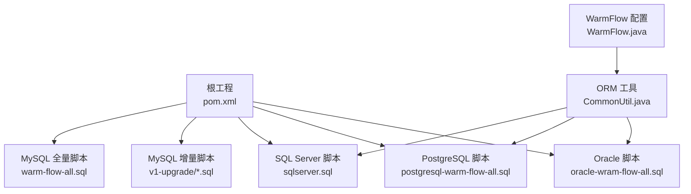
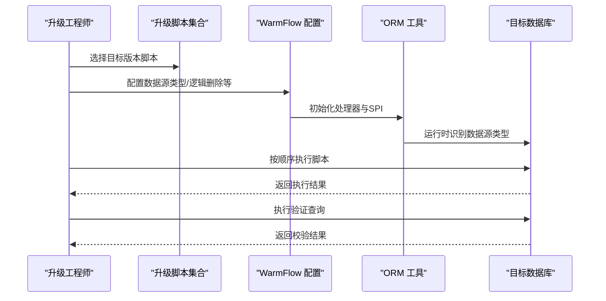
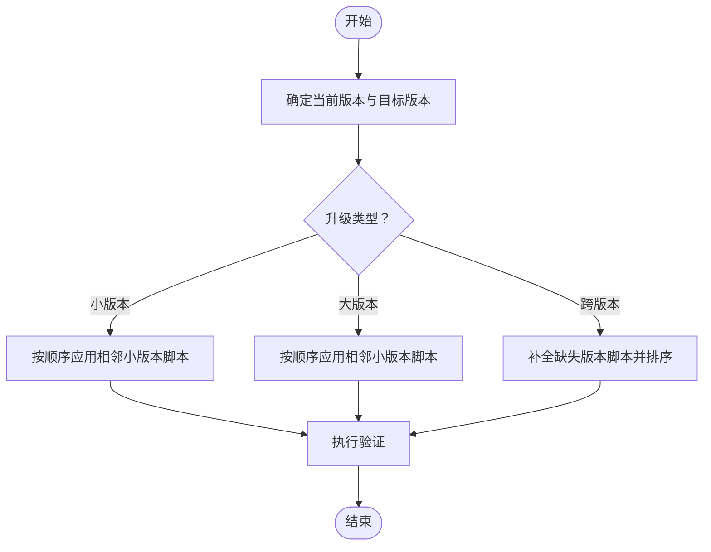
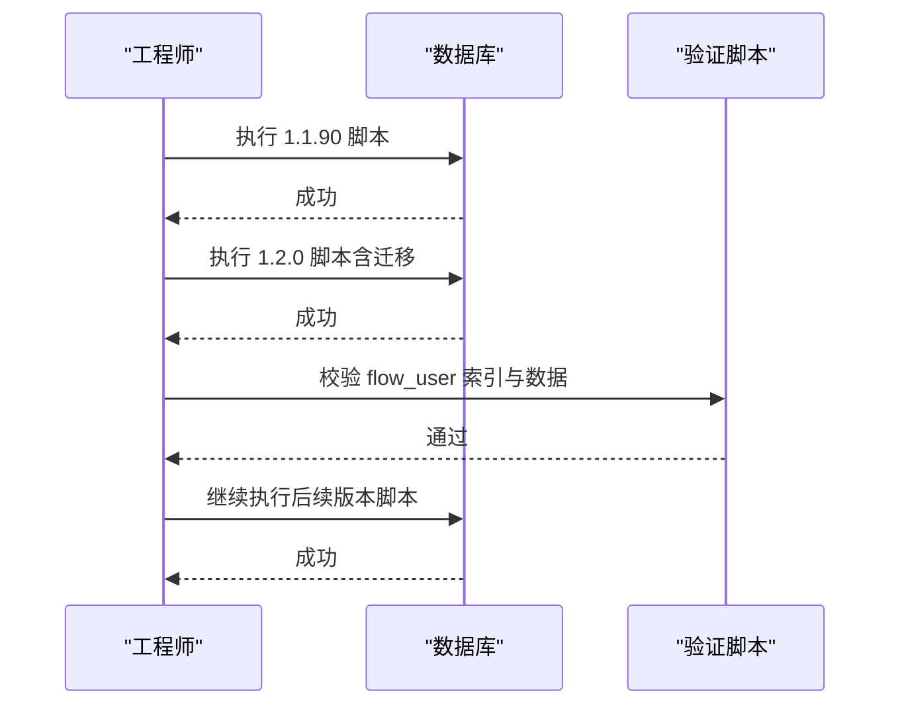
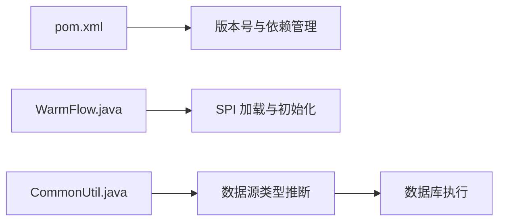

# 数据库升级

<cite>
**本文引用的文件**
- [warm-flow-all.sql](file://sql/mysql/warm-flow-all.sql)
- [warm-flow_1.1.90.sql](file://sql/mysql/v1-upgrade/warm-flow_1.1.90.sql)
- [warm-flow_1.2.0.sql](file://sql/mysql/v1-upgrade/warm-flow_1.2.0.sql)
- [warm-flow_1.3.0.sql](file://sql/mysql/v1-upgrade/warm-flow_1.3.0.sql)
- [warm-flow_1.6.0.sql](file://sql/mysql/v1-upgrade/warm-flow_1.6.0.sql)
- [warm-flow_1.7.0.sql](file://sql/mysql/v1-upgrade/warm-flow_1.7.0.sql)
- [warm-flow_1.8.0.sql](file://sql/mysql/v1-upgrade/warm-flow_1.8.0.sql)
- [warm-flow_1.8.4.sql](file://sql/mysql/v1-upgrade/warm-flow_1.8.4.sql)
- [pom.xml](file://pom.xml)
- [CommonUtil.java](file://warm-flow-orm/warm-flow-mybatis/warm-flow-mybatis-core/src/main/java/org/dromara/warm/flow/orm/utils/CommonUtil.java)
- [WarmFlow.java](file://warm-flow-core/src/main/java/org/dromara/warm/flow/core/config/WarmFlow.java)
- [FlowUserMapper.xml](file://warm-flow-orm/warm-flow-mybatis/warm-flow-mybatis-core/src/main/resources/warm/flow/FlowUserMapper.xml)
- [sqlserver.sql](file://sql/sqlserver/sqlserver.sql)
- [postgresql-warm-flow-all.sql](file://sql/postgresql/postgresql-warm-flow-all.sql)
- [oracle-wram-flow-all.sql](file://sql/oracle/oracle-wram-flow-all.sql)
</cite>

## 目录
1. [简介](#简介)
2. [项目结构](#项目结构)
3. [核心组件](#核心组件)
4. [架构总览](#架构总览)
5. [详细组件分析](#详细组件分析)
6. [依赖关系分析](#依赖关系分析)
7. [性能考量](#性能考量)
8. [故障排查指南](#故障排查指南)
9. [结论](#结论)
10. [附录](#附录)

## 简介
本文件面向 Warm-Flow 的数据库升级管理，基于仓库内提供的 SQL 升级脚本与核心配置，构建一套可落地的升级策略与流程规范。内容覆盖版本升级策略（小版本、大版本、跨版本）、升级前准备、执行流程、升级后验证、回滚与应急处理，以及常见问题排查。

## 项目结构
- 数据库脚本集中在 sql 目录，按数据库类型划分，MySQL 的全量建表脚本与版本化增量脚本均在其中；SQL Server、PostgreSQL、Oracle 提供各自全量脚本。
- 核心配置类 WarmFlow 负责初始化与运行期行为控制，ORM 层工具 CommonUtil 负责识别数据源类型以适配不同方言。
- Maven 父工程 pom.xml 统一管理版本与模块，便于在升级过程中统一版本号与依赖。

**图表来源**
- [pom.xml:1-535](file://pom.xml#L1-L535)
- [warm-flow-all.sql:1-160](file://sql/mysql/warm-flow-all.sql#L1-L160)
- [sqlserver.sql:40-1019](file://sql/sqlserver/sqlserver.sql#L40-L1019)
- [postgresql-warm-flow-all.sql](file://sql/postgresql/postgresql-warm-flow-all.sql)
- [oracle-wram-flow-all.sql](file://sql/oracle/oracle-wram-flow-all.sql)
- [WarmFlow.java:1-174](file://warm-flow-core/src/main/java/org/dromara/warm/flow/core/config/WarmFlow.java#L1-L174)
- [CommonUtil.java:1-61](file://warm-flow-orm/warm-flow-mybatis/warm-flow-mybatis-core/src/main/java/org/dromara/warm/flow/orm/utils/CommonUtil.java#L1-L61)

**章节来源**
- [pom.xml:1-535](file://pom.xml#L1-L535)
- [warm-flow-all.sql:1-160](file://sql/mysql/warm-flow-all.sql#L1-L160)
- [sqlserver.sql:40-1019](file://sql/sqlserver/sqlserver.sql#L40-L1019)

## 核心组件
- 版本与升级脚本
  - MySQL 全量脚本包含所有表结构定义，用于全新部署或对比校验。
  - v1-upgrade 下的增量脚本按版本递增，体现从旧版本到新版本的变更序列。
- 配置与运行时
  - WarmFlow 提供启动初始化、逻辑删除、UI 开关、数据源类型等配置项。
  - ORM 工具 CommonUtil 在运行时根据连接元数据推断数据源类型，保证 SQL 方言适配。
- 多数据库支持
  - 提供 MySQL、SQL Server、PostgreSQL、Oracle 的脚本，满足不同生产环境需求。

**章节来源**
- [warm-flow-all.sql:1-160](file://sql/mysql/warm-flow-all.sql#L1-L160)
- [WarmFlow.java:36-174](file://warm-flow-core/src/main/java/org/dromara/warm/flow/core/config/WarmFlow.java#L36-L174)
- [CommonUtil.java:34-61](file://warm-flow-orm/warm-flow-mybatis/warm-flow-mybatis-core/src/main/java/org/dromara/warm/flow/orm/utils/CommonUtil.java#L34-L61)

## 架构总览
下图展示升级流程的关键参与者与交互：版本脚本、配置初始化、ORM 方言识别、数据库执行与验证。

**图表来源**
- [WarmFlow.java:130-157](file://warm-flow-core/src/main/java/org/dromara/warm/flow/core/config/WarmFlow.java#L130-L157)
- [CommonUtil.java:34-61](file://warm-flow-orm/warm-flow-mybatis/warm-flow-mybatis-core/src/main/java/org/dromara/warm/flow/orm/utils/CommonUtil.java#L34-L61)

## 详细组件分析

### 版本升级策略
- 小版本升级（如 1.1.x → 1.2.x）
  - 采用增量脚本逐次应用，避免跨版本复杂度。
  - 示例：1.1.90 → 1.2.0 引入 flow_user 表并迁移历史数据，同时清理过时字段。
- 大版本升级（如 1.x → 1.(x+1))
  - 优先应用相邻小版本脚本，确保中间状态一致。
  - 示例：1.6.0 → 1.7.0 → 1.8.0 的连续升级路径。
- 跨版本升级（跳过多个版本）
  - 严格遵循“相邻版本”原则，按顺序执行缺失版本的全部脚本。
  - 若目标版本较新，需补充缺失版本的脚本后再执行。

**图表来源**
- [warm-flow_1.1.90.sql:1-28](file://sql/mysql/v1-upgrade/warm-flow_1.1.90.sql#L1-L28)
- [warm-flow_1.2.0.sql:1-51](file://sql/mysql/v1-upgrade/warm-flow_1.2.0.sql#L1-L51)
- [warm-flow_1.6.0.sql:1-30](file://sql/mysql/v1-upgrade/warm-flow_1.6.0.sql#L1-L30)
- [warm-flow_1.7.0.sql:1-12](file://sql/mysql/v1-upgrade/warm-flow_1.7.0.sql#L1-L12)
- [warm-flow_1.8.0.sql:1-9](file://sql/mysql/v1-upgrade/warm-flow_1.8.0.sql#L1-L9)

**章节来源**
- [warm-flow_1.1.90.sql:1-28](file://sql/mysql/v1-upgrade/warm-flow_1.1.90.sql#L1-L28)
- [warm-flow_1.2.0.sql:1-51](file://sql/mysql/v1-upgrade/warm-flow_1.2.0.sql#L1-L51)
- [warm-flow_1.3.0.sql:1-3](file://sql/mysql/v1-upgrade/warm-flow_1.3.0.sql#L1-L3)
- [warm-flow_1.6.0.sql:1-30](file://sql/mysql/v1-upgrade/warm-flow_1.6.0.sql#L1-L30)
- [warm-flow_1.7.0.sql:1-12](file://sql/mysql/v1-upgrade/warm-flow_1.7.0.sql#L1-L12)
- [warm-flow_1.8.0.sql:1-9](file://sql/mysql/v1-upgrade/warm-flow_1.8.0.sql#L1-L9)
- [warm-flow_1.8.4.sql:1-4](file://sql/mysql/v1-upgrade/warm-flow_1.8.4.sql#L1-L4)

### 升级前准备工作清单
- 数据备份
  - 使用数据库官方备份工具导出全库或指定表，确保可回滚。
- 环境检查
  - 确认目标数据库版本与驱动兼容性。
  - 检查存储空间与事务日志大小。
- 依赖确认
  - 确认 WarmFlow 配置项（如逻辑删除、数据源类型）与业务需求一致。
  - 确认 ORM 方言识别正常，避免 SQL 方言不匹配导致失败。
- 权限与网络
  - 确保执行账号具备 DDL/DML 权限与网络连通性。
- 业务影响评估
  - 评估停机窗口与业务影响面，提前通知相关方。

**章节来源**
- [WarmFlow.java:58-108](file://warm-flow-core/src/main/java/org/dromara/warm/flow/core/config/WarmFlow.java#L58-L108)
- [CommonUtil.java:34-61](file://warm-flow-orm/warm-flow-mybatis/warm-flow-mybatis-core/src/main/java/org/dromara/warm/flow/orm/utils/CommonUtil.java#L34-L61)

### 升级执行流程
- 停机维护窗口安排
  - 选择业务低峰时段，预留足够时间进行回滚与验证。
- 脚本执行顺序
  - 严格按版本顺序执行，确保依赖关系满足。
  - 示例顺序：1.1.90 → 1.2.0 → 1.3.0 → 1.6.0 → 1.6.7 → 1.6.8 → 1.7.0 → 1.8.0 → 1.8.2 → 1.8.4。
- 数据迁移验证
  - 针对涉及数据迁移的脚本（如 1.2.0 的 flow_user 迁移），执行抽样核对与索引校验。
  - 验证 flow_user 表的索引 user_associated 是否存在。

**图表来源**
- [warm-flow_1.1.90.sql:1-28](file://sql/mysql/v1-upgrade/warm-flow_1.1.90.sql#L1-L28)
- [warm-flow_1.2.0.sql:17-36](file://sql/mysql/v1-upgrade/warm-flow_1.2.0.sql#L17-L36)
- [warm-flow_1.6.0.sql:9-30](file://sql/mysql/v1-upgrade/warm-flow_1.6.0.sql#L9-L30)
- [warm-flow_1.7.0.sql:1-12](file://sql/mysql/v1-upgrade/warm-flow_1.7.0.sql#L1-L12)
- [warm-flow_1.8.0.sql:1-9](file://sql/mysql/v1-upgrade/warm-flow_1.8.0.sql#L1-L9)
- [warm-flow_1.8.4.sql:1-4](file://sql/mysql/v1-upgrade/warm-flow_1.8.4.sql#L1-L4)

**章节来源**
- [warm-flow_1.2.0.sql:17-36](file://sql/mysql/v1-upgrade/warm-flow_1.2.0.sql#L17-L36)
- [warm-flow_1.6.0.sql:9-30](file://sql/mysql/v1-upgrade/warm-flow_1.6.0.sql#L9-L30)
- [warm-flow_1.6.8.sql:1-1](file://sql/mysql/v1-upgrade/warm-flow_1.6.8.sql#L1-L1)
- [FlowUserMapper.xml:248-270](file://warm-flow-orm/warm-flow-mybatis/warm-flow-mybatis-core/src/main/resources/warm/flow/FlowUserMapper.xml#L248-L270)

### 升级后验证方法
- 数据完整性检查
  - 对比 flow_definition、flow_node、flow_skip、flow_instance、flow_task、flow_his_task、flow_user 等表结构与索引。
  - 针对新增列（如 del_flag、tenant_id、category、model_value、variable、def_json 等）进行存在性与默认值校验。
- 功能测试
  - 流程发起、审批、退回、终止、完成等关键路径验证。
  - 用户权限与协作方式（会签、票签、加签、减签）验证。
- 性能回归测试
  - 关注 flow_user 表新增索引 user_associated 的查询性能。
  - 对高频查询（按关联任务与权限人）进行压测与慢查询分析。

**章节来源**
- [warm-flow-all.sql:1-160](file://sql/mysql/warm-flow-all.sql#L1-L160)
- [warm-flow_1.1.90.sql:13-28](file://sql/mysql/v1-upgrade/warm-flow_1.1.90.sql#L13-L28)
- [warm-flow_1.3.0.sql:1-3](file://sql/mysql/v1-upgrade/warm-flow_1.3.0.sql#L1-L3)
- [warm-flow_1.8.0.sql:1-9](file://sql/mysql/v1-upgrade/warm-flow_1.8.0.sql#L1-L9)
- [warm-flow_1.6.0.sql:1-30](file://sql/mysql/v1-upgrade/warm-flow_1.6.0.sql#L1-L30)
- [warm-flow_1.6.8.sql:1-1](file://sql/mysql/v1-upgrade/warm-flow_1.6.8.sql#L1-L1)

### 回滚策略与应急处理
- 回滚策略
  - 采用“逆序回滚”：按升级顺序逆向执行对应版本的回滚脚本（若仓库提供）。
  - 若无回滚脚本，优先使用备份恢复；若涉及数据迁移，需结合备份与手工修复。
- 应急处理
  - 快速定位失败脚本与错误信息，必要时暂停服务并隔离故障数据库。
  - 通过 WarmFlow 配置临时关闭逻辑删除或调整监听器，降低影响面。
  - 使用 CommonUtil 的数据源类型兜底逻辑，确保在极端情况下仍可运行。

**章节来源**
- [WarmFlow.java:58-108](file://warm-flow-core/src/main/java/org/dromara/warm/flow/core/config/WarmFlow.java#L58-L108)
- [CommonUtil.java:55-60](file://warm-flow-orm/warm-flow-mybatis/warm-flow-mybatis-core/src/main/java/org/dromara/warm/flow/orm/utils/CommonUtil.java#L55-L60)

### 常见升级问题与排查
- 字段类型不兼容
  - 现象：ALTER COLUMN 修改失败。
  - 排查：确认目标数据库类型与字段长度/精度是否匹配。
- 索引缺失或重复
  - 现象：查询性能下降或唯一约束冲突。
  - 排查：核对 FlowUserMapper.xml 中的插入/更新字段列表与实际表结构一致。
- 数据迁移异常
  - 现象：flow_user 迁移后数据不完整。
  - 排查：检查 1.2.0 脚本中的迁移 SQL 与 mysql.help_topic 使用情况。
- 跳转条件语法变化
  - 现象：跳转条件解析失败。
  - 排查：确认 1.6.0 脚本中对 skip_condition 的替换逻辑是否正确执行。

**章节来源**
- [warm-flow_1.2.0.sql:17-36](file://sql/mysql/v1-upgrade/warm-flow_1.2.0.sql#L17-L36)
- [warm-flow_1.6.0.sql:9-30](file://sql/mysql/v1-upgrade/warm-flow_1.6.0.sql#L9-L30)
- [FlowUserMapper.xml:248-270](file://warm-flow-orm/warm-flow-mybatis/warm-flow-mybatis-core/src/main/resources/warm/flow/FlowUserMapper.xml#L248-L270)

## 依赖关系分析
- 版本与模块
  - 父工程 pom.xml 统一管理 Warm-Flow 版本与各模块依赖，升级时建议同步调整版本号。
- 数据源类型
  - CommonUtil 在运行时根据数据库产品名设置数据源类型，避免硬编码导致的方言错误。

**图表来源**
- [pom.xml:64-102](file://pom.xml#L64-L102)
- [WarmFlow.java:130-157](file://warm-flow-core/src/main/java/org/dromara/warm/flow/core/config/WarmFlow.java#L130-L157)
- [CommonUtil.java:34-61](file://warm-flow-orm/warm-flow-mybatis/warm-flow-mybatis-core/src/main/java/org/dromara/warm/flow/orm/utils/CommonUtil.java#L34-L61)

**章节来源**
- [pom.xml:64-102](file://pom.xml#L64-L102)
- [CommonUtil.java:34-61](file://warm-flow-orm/warm-flow-mybatis/warm-flow-mybatis-core/src/main/java/org/dromara/warm/flow/orm/utils/CommonUtil.java#L34-L61)

## 性能考量
- 索引优化
  - flow_user 新增 user_associated 索引，建议在升级后进行索引使用率与碎片率监控。
- 查询路径
  - 针对按任务与权限人的查询路径进行压测，关注 skip_condition 解析与节点跳转的性能。
- 逻辑删除
  - 启用逻辑删除时，注意查询过滤与统计口径一致性，避免误删或漏删。

## 故障排查指南
- 升级失败定位
  - 依据脚本顺序定位失败版本，查看对应错误码与约束冲突。
- 数据不一致
  - 对照全量脚本与增量脚本，核对字段、索引与默认值差异。
- 方言问题
  - 确认 CommonUtil 的数据源类型识别是否正确，必要时手动设置 dataSourceType。

**章节来源**
- [CommonUtil.java:34-61](file://warm-flow-orm/warm-flow-mybatis/warm-flow-mybatis-core/src/main/java/org/dromara/warm/flow/orm/utils/CommonUtil.java#L34-L61)
- [warm-flow-all.sql:1-160](file://sql/mysql/warm-flow-all.sql#L1-L160)

## 结论
通过严格的“相邻版本”升级策略、完善的升级前准备、规范的执行流程与验证体系，以及清晰的回滚与应急方案，可有效降低 Warm-Flow 数据库升级风险。配合多数据库脚本与运行时方言识别能力，可在不同生产环境下稳定推进升级。

## 附录
- 多数据库脚本位置
  - MySQL 全量与增量脚本：sql/mysql
  - SQL Server：sql/sqlserver
  - PostgreSQL：sql/postgresql
  - Oracle：sql/oracle

**章节来源**
- [sqlserver.sql:40-1019](file://sql/sqlserver/sqlserver.sql#L40-L1019)
- [postgresql-warm-flow-all.sql](file://sql/postgresql/postgresql-warm-flow-all.sql)
- [oracle-wram-flow-all.sql](file://sql/oracle/oracle-wram-flow-all.sql)