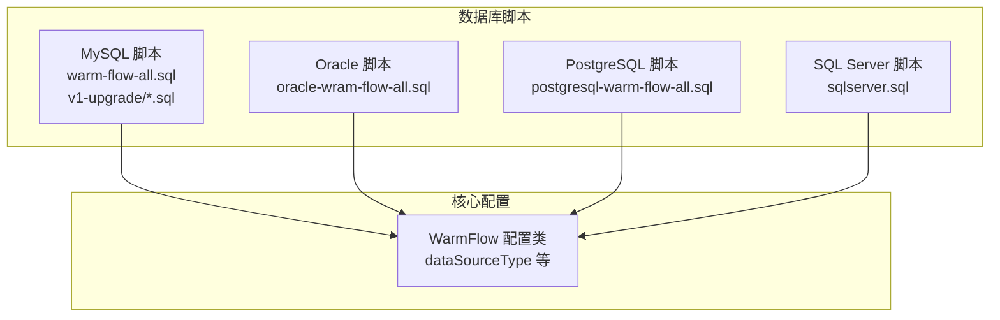
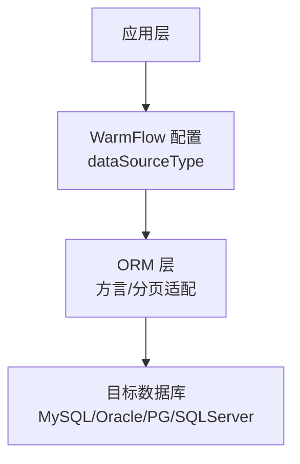
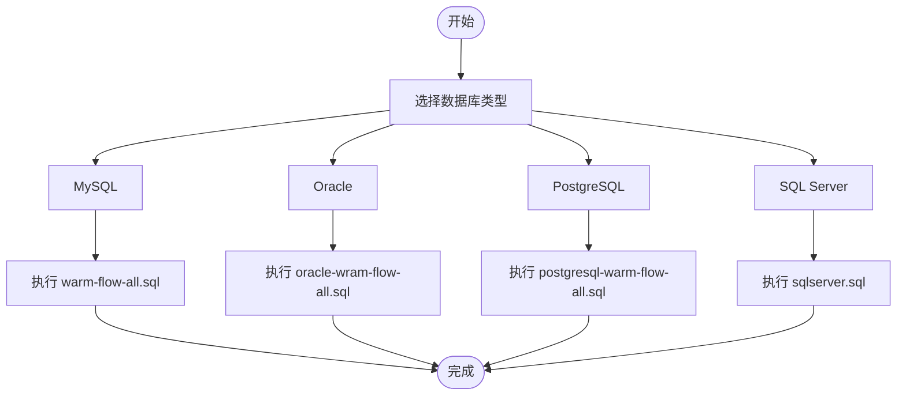
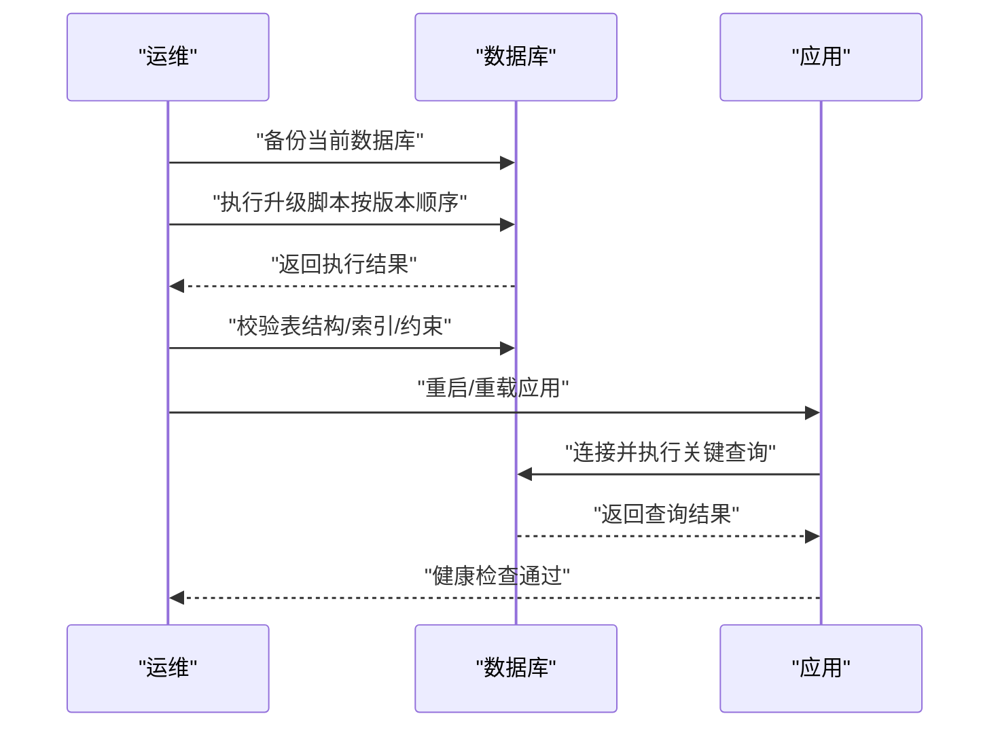
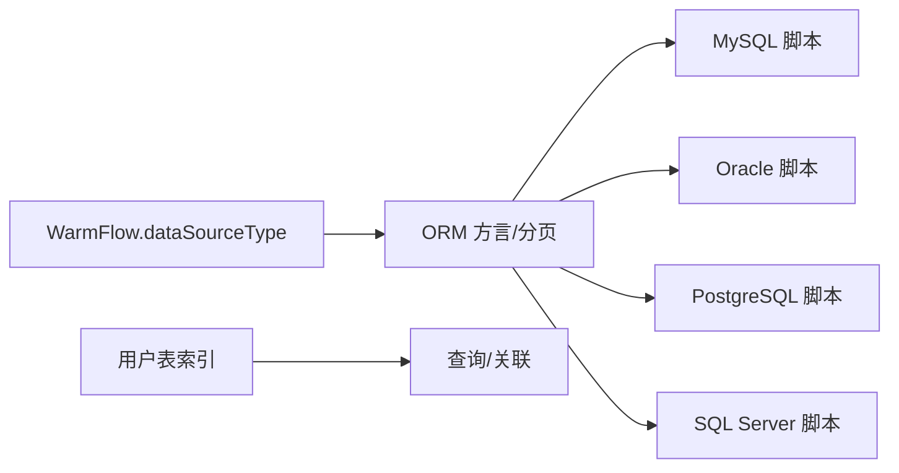

# 数据库管理

<cite>
**本文引用的文件**   
- [WarmFlow.java](file://warm-flow-core/src/main/java/org/dromara/warm/flow/core/config/WarmFlow.java)
- [warm-flow-all.sql(MySQL)](file://sql/mysql/warm-flow-all.sql)
- [oracle-wram-flow-all.sql](file://sql/oracle/oracle-wram-flow-all.sql)
- [postgresql-warm-flow-all.sql](file://sql/postgresql/postgresql-warm-flow-all.sql)
- [sqlserver.sql](file://sql/sqlserver/sqlserver.sql)
- [warm-flow_1.1.90.sql](file://sql/mysql/v1-upgrade/warm-flow_1.1.90.sql)
- [warm-flow_1.8.4.sql](file://sql/mysql/v1-upgrade/warm-flow_1.8.4.sql)
</cite>

## 目录
1. [简介](#简介)
2. [项目结构](#项目结构)
3. [核心组件](#核心组件)
4. [架构总览](#架构总览)
5. [详细组件分析](#详细组件分析)
6. [依赖分析](#依赖分析)
7. [性能考虑](#性能考虑)
8. [故障排除指南](#故障排除指南)
9. [结论](#结论)
10. [附录](#附录)

## 简介
本运维文档面向 Warm-Flow 数据库管理，覆盖数据库初始化、多数据库支持配置、版本升级流程、备份与恢复策略、性能监控与优化建议，以及常见故障排查方法。文档基于仓库内提供的数据库脚本与配置类进行整理，帮助运维人员在不同数据库（MySQL、Oracle、PostgreSQL、SQL Server）上高效部署与维护。

## 项目结构
- 数据库脚本集中于 sql 目录，按数据库类型拆分：
  - MySQL：基础建表脚本与版本升级脚本
  - Oracle：基础建表脚本
  - PostgreSQL：基础建表脚本
  - SQL Server：基础建表脚本
- 核心配置类位于 warm-flow-core，其中 WarmFlow 配置项可影响数据源类型选择与运行行为。

**图表来源**
- [warm-flow-all.sql(MySQL):1-160](file://sql/mysql/warm-flow-all.sql#L1-L160)
- [oracle-wram-flow-all.sql:1-311](file://sql/oracle/oracle-wram-flow-all.sql#L1-L311)
- [postgresql-warm-flow-all.sql:1-296](file://sql/postgresql/postgresql-warm-flow-all.sql#L1-L296)
- [sqlserver.sql:1-800](file://sql/sqlserver/sqlserver.sql#L1-L800)
- [WarmFlow.java:93-98](file://warm-flow-core/src/main/java/org/dromara/warm/flow/core/config/WarmFlow.java#L93-L98)

**章节来源**
- [warm-flow-all.sql(MySQL):1-160](file://sql/mysql/warm-flow-all.sql#L1-L160)
- [oracle-wram-flow-all.sql:1-311](file://sql/oracle/oracle-wram-flow-all.sql#L1-L311)
- [postgresql-warm-flow-all.sql:1-296](file://sql/postgresql/postgresql-warm-flow-all.sql#L1-L296)
- [sqlserver.sql:1-800](file://sql/sqlserver/sqlserver.sql#L1-L800)
- [WarmFlow.java:93-98](file://warm-flow-core/src/main/java/org/dromara/warm/flow/core/config/WarmFlow.java#L93-L98)

## 核心组件
- 数据源类型配置
  - WarmFlow 提供 dataSourceType 字段用于指定数据源类型，若未显式配置，将从数据源中推断，兜底为 MySQL。
  - 该配置直接影响 ORM 层对不同数据库方言与分页语法的适配。
- 表结构与索引
  - MySQL/Oracle/PostgreSQL/SQL Server 均提供完整的建表脚本，包含流程定义、节点、跳转、实例、任务、历史任务、用户等核心表。
  - MySQL 脚本包含索引示例；Oracle/SQL Server 脚本包含索引或主键约束定义；PostgreSQL 脚本包含索引定义。

**章节来源**
- [WarmFlow.java:93-98](file://warm-flow-core/src/main/java/org/dromara/warm/flow/core/config/WarmFlow.java#L93-L98)
- [warm-flow-all.sql(MySQL):1-160](file://sql/mysql/warm-flow-all.sql#L1-L160)
- [oracle-wram-flow-all.sql:1-311](file://sql/oracle/oracle-wram-flow-all.sql#L1-L311)
- [postgresql-warm-flow-all.sql:1-296](file://sql/postgresql/postgresql-warm-flow-all.sql#L1-L296)
- [sqlserver.sql:1-800](file://sql/sqlserver/sqlserver.sql#L1-L800)

## 架构总览
Warm-Flow 在不同数据库上的部署遵循“统一实体模型 + 多数据库脚本”的架构。应用通过 WarmFlow 配置选择数据源类型，ORM 层根据该类型加载对应方言与分页策略，最终在目标数据库上执行建表与升级脚本。

**图表来源**
- [WarmFlow.java:93-98](file://warm-flow-core/src/main/java/org/dromara/warm/flow/core/config/WarmFlow.java#L93-L98)

## 详细组件分析

### 数据库初始化流程
- MySQL 初始化
  - 使用 warm-flow-all.sql 进行全量建表。
  - 包含流程定义、节点、跳转、实例、任务、历史任务、用户等表及索引。
- Oracle 初始化
  - 使用 oracle-wram-flow-all.sql 进行全量建表。
  - 包含主键约束与注释，索引通过 CREATE INDEX 定义。
- PostgreSQL 初始化
  - 使用 postgresql-warm-flow-all.sql 进行全量建表。
  - 包含主键约束与索引定义。
- SQL Server 初始化
  - 使用 sqlserver.sql 进行全量建表。
  - 包含主键约束、列注释扩展属性与索引定义。

**图表来源**
- [warm-flow-all.sql(MySQL):1-160](file://sql/mysql/warm-flow-all.sql#L1-L160)
- [oracle-wram-flow-all.sql:1-311](file://sql/oracle/oracle-wram-flow-all.sql#L1-L311)
- [postgresql-warm-flow-all.sql:1-296](file://sql/postgresql/postgresql-warm-flow-all.sql#L1-L296)
- [sqlserver.sql:1-800](file://sql/sqlserver/sqlserver.sql#L1-L800)

**章节来源**
- [warm-flow-all.sql(MySQL):1-160](file://sql/mysql/warm-flow-all.sql#L1-L160)
- [oracle-wram-flow-all.sql:1-311](file://sql/oracle/oracle-wram-flow-all.sql#L1-L311)
- [postgresql-warm-flow-all.sql:1-296](file://sql/postgresql/postgresql-warm-flow-all.sql#L1-L296)
- [sqlserver.sql:1-800](file://sql/sqlserver/sqlserver.sql#L1-L800)

### 多数据库支持配置方案
- 数据源类型选择
  - WarmFlow.dataSourceType 显式指定数据源类型，避免 ORM 层误判。
- MySQL
  - 使用 InnoDB 引擎，表注释用于描述业务含义。
  - 示例索引：用户表复合索引与关联索引。
- Oracle
  - 使用 NUMBER/VARCHAR2/DATE 类型，主键通过 ALTER TABLE ADD CONSTRAINT 定义。
  - 示例索引：用户表复合索引与关联索引。
- PostgreSQL
  - 使用 int8/varchar/varchar(1)/timestamp 等类型，主键通过 CONSTRAINT 定义。
  - 示例索引：用户表复合索引与关联索引。
- SQL Server
  - 使用 bigint/nvarchar/tinyint/datetime2 等类型，主键通过 CLUSTERED 约束定义。
  - 示例索引：用户表复合索引与关联索引。

**章节来源**
- [WarmFlow.java:93-98](file://warm-flow-core/src/main/java/org/dromara/warm/flow/core/config/WarmFlow.java#L93-L98)
- [warm-flow-all.sql(MySQL):1-160](file://sql/mysql/warm-flow-all.sql#L1-L160)
- [oracle-wram-flow-all.sql:1-311](file://sql/oracle/oracle-wram-flow-all.sql#L1-L311)
- [postgresql-warm-flow-all.sql:1-296](file://sql/postgresql/postgresql-warm-flow-all.sql#L1-L296)
- [sqlserver.sql:1-800](file://sql/sqlserver/sqlserver.sql#L1-L800)

### 数据库版本升级流程
- 升级前准备
  - 备份当前数据库（全量备份），记录当前版本。
- 执行升级脚本
  - MySQL：按版本顺序执行 v1-upgrade 下的 SQL 脚本，如 1.1.90、1.8.4 等。
  - Oracle/PostgreSQL/SQL Server：根据变更需求编写或复用对应数据库的迁移脚本。
- 升级后验证
  - 校验表结构变更（新增列、索引、约束）。
  - 运行关键业务查询与流程实例状态一致性检查。
  - 观察日志与监控指标，确认服务正常。

**图表来源**
- [warm-flow_1.1.90.sql:1-28](file://sql/mysql/v1-upgrade/warm-flow_1.1.90.sql#L1-L28)
- [warm-flow_1.8.4.sql:1-4](file://sql/mysql/v1-upgrade/warm-flow_1.8.4.sql#L1-L4)

**章节来源**
- [warm-flow_1.1.90.sql:1-28](file://sql/mysql/v1-upgrade/warm-flow_1.1.90.sql#L1-L28)
- [warm-flow_1.8.4.sql:1-4](file://sql/mysql/v1-upgrade/warm-flow_1.8.4.sql#L1-L4)

### 数据库备份与恢复策略
- 全量备份
  - MySQL：使用逻辑导出工具生成 warm-flow-all.sql 或物理备份。
  - Oracle：使用 RMAN 或 expdp 导出。
  - PostgreSQL：使用 pg_dump。
  - SQL Server：使用完整备份或导出工具。
- 增量备份
  - MySQL：启用二进制日志并定期备份 binlog。
  - Oracle：启用归档日志并定期备份归档日志。
  - PostgreSQL：启用 WAL 归档并定期备份。
  - SQL Server：启用事务日志备份。
- 时间点恢复（PITR）
  - 结合全量与增量备份，按时间点恢复到目标时刻。
  - 验证恢复后的数据一致性与完整性。

[本节为通用运维实践，不直接分析具体文件，故无“章节来源”]

### 数据库性能监控与优化建议
- 索引优化
  - MySQL：用户表存在复合索引与关联索引，建议结合慢查询日志分析热点查询并补充必要索引。
  - Oracle/PostgreSQL/SQL Server：确保常用过滤与连接列建立合适索引，并定期维护统计信息。
- 查询优化
  - 避免 SELECT *，仅查询必要列。
  - 对大表进行分区或分片（视业务场景）。
  - 使用 EXPLAIN/执行计划分析慢查询。
- 连接池配置
  - 控制最大连接数、空闲超时、连接生命周期。
  - 针对不同数据库调整驱动参数与网络超时。
- 监控指标
  - 连接数、锁等待、慢查询数量、缓冲池命中率、WAL/日志写入延迟等。

[本节为通用运维实践，不直接分析具体文件，故无“章节来源”]

### 故障排除指南
- 常见错误处理
  - 字段类型不匹配：核对目标数据库的数据类型映射（如 MySQL tinyint 与 Oracle NUMBER）。
  - 索引/约束冲突：检查重复索引或违反唯一性约束的插入。
  - 字符集/排序规则：确保数据库与表的字符集一致，避免排序异常。
- 性能问题诊断
  - 使用数据库自带的性能分析工具定位慢查询与高负载时段。
  - 检查索引使用情况与缺失索引。
- 数据一致性检查
  - 对比升级前后关键表的数据条数与关键字段值。
  - 校验流程状态字段与业务状态是否一致。

[本节为通用运维实践，不直接分析具体文件，故无“章节来源”]

## 依赖分析
- WarmFlow 配置对 ORM 方言的影响
  - WarmFlow.dataSourceType 决定 ORM 选择的数据源类型，从而影响分页与方言适配。
- 表结构与索引依赖
  - 用户表存在复合索引与关联索引，查询与关联操作依赖这些索引。
- 升级脚本依赖
  - MySQL 升级脚本按版本顺序执行，依赖前一版本的结构。

**图表来源**
- [WarmFlow.java:93-98](file://warm-flow-core/src/main/java/org/dromara/warm/flow/core/config/WarmFlow.java#L93-L98)
- [warm-flow-all.sql(MySQL):1-160](file://sql/mysql/warm-flow-all.sql#L1-L160)
- [oracle-wram-flow-all.sql:1-311](file://sql/oracle/oracle-wram-flow-all.sql#L1-L311)
- [postgresql-warm-flow-all.sql:1-296](file://sql/postgresql/postgresql-warm-flow-all.sql#L1-L296)
- [sqlserver.sql:1-800](file://sql/sqlserver/sqlserver.sql#L1-L800)

**章节来源**
- [WarmFlow.java:93-98](file://warm-flow-core/src/main/java/org/dromara/warm/flow/core/config/WarmFlow.java#L93-L98)
- [warm-flow-all.sql(MySQL):1-160](file://sql/mysql/warm-flow-all.sql#L1-L160)

## 性能考虑
- 选择合适的数据库类型与版本，确保驱动与连接池参数优化。
- 基于实际业务查询模式设计索引，定期评估与重构。
- 对大表进行分区或冷热分离，减少扫描范围。
- 监控慢查询与锁竞争，及时调整 SQL 与索引策略。

[本节为通用指导，不直接分析具体文件，故无“章节来源”]

## 故障排除指南
- 错误分类与处理
  - 结构不兼容：对照目标数据库脚本修正类型与约束。
  - 权限不足：为应用账号授予必要的 DDL/DML 权限。
  - 编码问题：统一字符集与排序规则。
- 性能问题
  - 分析执行计划，补充缺失索引，优化复杂查询。
- 数据一致性
  - 升级前后对比关键字段与业务状态，确保流程状态与实例状态一致。

[本节为通用指导，不直接分析具体文件，故无“章节来源”]

## 结论
Warm-Flow 提供了多数据库的完整建表脚本与清晰的配置入口。通过 WarmFlow.dataSourceType 明确数据源类型，结合各数据库的脚本与索引设计，可实现稳定高效的数据库初始化与运维。版本升级应严格遵循脚本顺序并做好备份与验证，同时持续关注索引与查询性能，确保系统在高并发场景下的稳定性与可靠性。

## 附录
- 版本升级脚本参考
  - MySQL：warm-flow_1.1.90.sql、warm-flow_1.8.4.sql
- 建表脚本参考
  - MySQL：warm-flow-all.sql
  - Oracle：oracle-wram-flow-all.sql
  - PostgreSQL：postgresql-warm-flow-all.sql
  - SQL Server：sqlserver.sql

**章节来源**
- [warm-flow_1.1.90.sql:1-28](file://sql/mysql/v1-upgrade/warm-flow_1.1.90.sql#L1-L28)
- [warm-flow_1.8.4.sql:1-4](file://sql/mysql/v1-upgrade/warm-flow_1.8.4.sql#L1-L4)
- [warm-flow-all.sql(MySQL):1-160](file://sql/mysql/warm-flow-all.sql#L1-L160)
- [oracle-wram-flow-all.sql:1-311](file://sql/oracle/oracle-wram-flow-all.sql#L1-L311)
- [postgresql-warm-flow-all.sql:1-296](file://sql/postgresql/postgresql-warm-flow-all.sql#L1-L296)
- [sqlserver.sql:1-800](file://sql/sqlserver/sqlserver.sql#L1-L800)