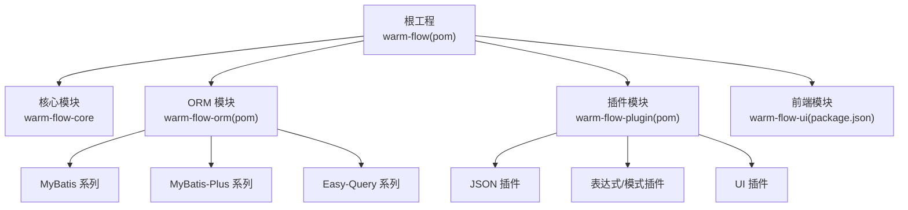
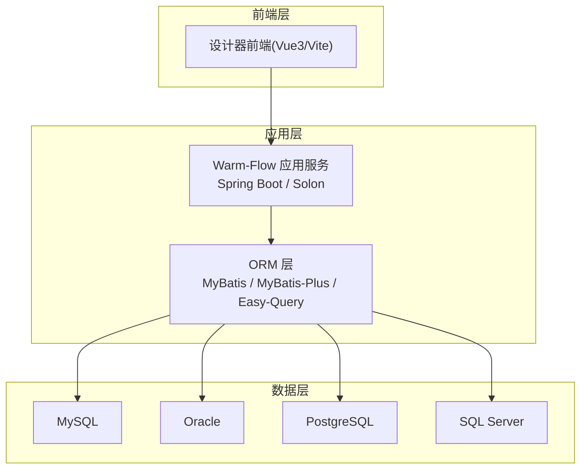
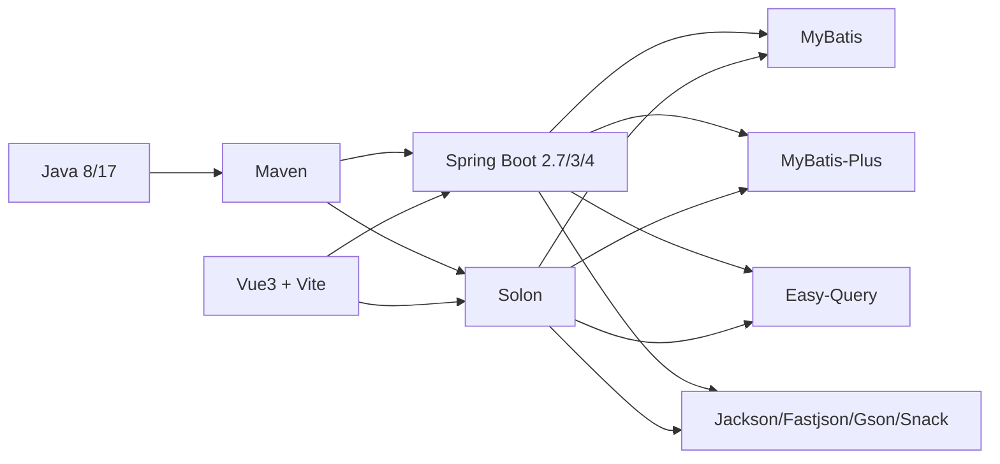

# 环境准备

<cite>
**本文引用的文件**
- [根 POM 文件](file://pom.xml)
- [核心模块 POM](file://warm-flow-core/pom.xml)
- [ORM 模块 POM](file://warm-flow-orm/pom.xml)
- [插件模块 POM](file://warm-flow-plugin/pom.xml)
- [前端包配置](file://warm-flow-ui/package.json)
- [项目总览说明](file://README.md)
- [MySQL 全量脚本](file://sql/mysql/warm-flow-all.sql)
- [Oracle 全量脚本](file://sql/oracle/oracle-wram-flow-all.sql)
- [PostgreSQL 全量脚本](file://sql/postgresql/postgresql-warm-flow-all.sql)
- [SQL Server 全量脚本](file://sql/sqlserver/sqlserver.sql)
</cite>

## 目录
1. [简介](#简介)
2. [项目结构](#项目结构)
3. [核心组件](#核心组件)
4. [架构总览](#架构总览)
5. [详细组件分析](#详细组件分析)
6. [依赖关系分析](#依赖关系分析)
7. [性能考虑](#性能考虑)
8. [故障排查指南](#故障排查指南)
9. [结论](#结论)
10. [附录](#附录)

## 简介
本章节面向 Warm-Flow 在生产环境的准备与落地，围绕“硬件配置要求、软件依赖安装与配置、数据库环境准备、网络配置、容器化部署、环境验证清单与常见问题”展开，帮助读者在 Linux/Windows 服务器上完成从零到一的环境搭建与验证。

## 项目结构
Warm-Flow 采用多模块 Maven 结构，核心模块提供引擎能力，ORM 模块提供多 ORM 框架适配，插件模块提供表达式、UI、JSON 等扩展能力；前端模块提供可视化设计器与页面资源。

图表来源
- [根 POM 文件:58-62](file://pom.xml#L58-L62)
- [ORM 模块 POM:17-21](file://warm-flow-orm/pom.xml#L17-L21)
- [插件模块 POM:17-21](file://warm-flow-plugin/pom.xml#L17-L21)

章节来源
- [根 POM 文件:58-62](file://pom.xml#L58-L62)
- [核心模块 POM:1-35](file://warm-flow-core/pom.xml#L1-L35)
- [ORM 模块 POM:1-24](file://warm-flow-orm/pom.xml#L1-L24)
- [插件模块 POM:1-25](file://warm-flow-plugin/pom.xml#L1-L25)
- [前端包配置:1-42](file://warm-flow-ui/package.json#L1-L42)

## 核心组件
- Java 运行时与构建
  - Java 版本：源码编译级别为 Java 8，同时提供 Java 17 路径与版本属性，建议生产使用 Java 8 或更高版本以兼容多生态。
  - 构建工具：Maven，提供打包与发布命令行参数。
- Spring/Solon 生态
  - Spring Boot 2.7、Spring Boot 3、Spring Boot 4 与 Solon 多框架兼容，便于在不同运行时选择。
- ORM 框架
  - MyBatis、MyBatis-Plus、Easy-Query 等，覆盖主流持久层方案。
- JSON 解析
  - Jackson、Jackson3、Fastjson、Gson、Snack3/4 等，便于在不同场景切换。
- 前端
  - Vue 3 + Vite，提供设计器与页面资源，支持构建与预览。

章节来源
- [根 POM 文件:64-102](file://pom.xml#L64-L102)
- [根 POM 文件:104-432](file://pom.xml#L104-L432)
- [前端包配置:1-42](file://warm-flow-ui/package.json#L1-L42)

## 架构总览
Warm-Flow 的生产部署通常由“应用服务 + 数据库 + 可选前端静态资源”组成。应用服务可基于 Spring Boot 或 Solon 运行，ORM 层根据项目选择 MyBatis/MyBatis-Plus/Easy-Query 中的一种；数据库支持 MySQL、Oracle、PostgreSQL、SQL Server。

图表来源
- [项目总览说明:34-38](file://README.md#L34-L38)
- [项目总览说明:111-118](file://README.md#L111-L118)
- [根 POM 文件:76-79](file://pom.xml#L76-L79)
- [根 POM 文件:94-97](file://pom.xml#L94-L97)

## 详细组件分析

### 硬件配置要求
- CPU
  - 最低：2 核心（单实例最小可用）
  - 推荐：4 核心及以上（高并发、多实例部署）
- 内存
  - 最低：4 GB（单实例最小可用）
  - 推荐：8 GB 及以上（配合 JVM 参数与连接池）
- 存储空间
  - 系统盘：50 GB 可用空间（含 OS、JDK、应用、日志）
  - 数据库：依据业务数据量与备份策略预留 100 GB+（建议使用独立磁盘或云盘）

说明
- 以上为通用建议，实际需结合业务吞吐、并发、数据量与备份策略综合评估。

### 软件依赖安装与配置
- JDK
  - 版本：Java 8（源码编译级别）；同时提供 Java 17 属性与路径，建议优先使用 Java 8 以保证兼容性。
  - 安装：下载对应平台 JDK 并配置 JAVA_HOME 与 PATH。
- Maven
  - 用途：构建后端模块，打包与发布。
  - 建议：配置镜像加速与本地仓库目录，避免网络超时。
- Node.js（用于前端设计器）
  - 版本：项目使用 Vue 3 与 Vite，建议使用 LTS 版本（如 18/20）。
  - 用途：构建设计器前端资源（dist），供后端静态托管或单独部署。
- Git（可选）
  - 用途：拉取源码与脚本，便于自动化部署。

章节来源
- [根 POM 文件:68-71](file://pom.xml#L68-L71)
- [前端包配置:1-42](file://warm-flow-ui/package.json#L1-L42)

### 数据库环境准备
- 支持的数据库
  - MySQL、Oracle、PostgreSQL、SQL Server（以及国产数据库）
- 版本与安装
  - MySQL：使用官方安装包或容器部署，开启字符集 utf8mb4。
  - Oracle：使用 11gR2 及以上版本，确保字符集与时区正确。
  - PostgreSQL：使用 12+ 版本，初始化 UTF8。
  - SQL Server：使用 2016+ 版本，设置排序规则为 SQL_Latin1_General_CP1_CI_AS。
- 初始化脚本
  - 首次导入：执行对应数据库的全量脚本，创建 7 张核心表。
  - 版本升级：按 v1-upgrade 下的增量脚本顺序执行。
- 连接配置
  - 应用侧通过 ORM 框架配置数据源（URL、用户名、密码、连接池），并确保网络可达与防火墙放通。

章节来源
- [项目总览说明:111-118](file://README.md#L111-L118)
- [MySQL 全量脚本:1-160](file://sql/mysql/warm-flow-all.sql#L1-L160)
- [Oracle 全量脚本:1-200](file://sql/oracle/oracle-wram-flow-all.sql#L1-L200)
- [PostgreSQL 全量脚本:1-200](file://sql/postgresql/postgresql-warm-flow-all.sql#L1-L200)
- [SQL Server 全量脚本:1-200](file://sql/sqlserver/sqlserver.sql#L1-L200)

### 网络配置指南
- 端口开放
  - 应用服务：默认 8080（可调整），需在安全组/防火墙放通。
  - 数据库：MySQL 3306、Oracle 1521、PostgreSQL 5432、SQL Server 1433。
- 防火墙设置
  - 仅放通内网或受信任网段，避免暴露公网。
- 域名与反向代理
  - 建议通过 Nginx/Tengine 等反向代理，开启 HTTPS 与压缩。
  - 前端设计器资源可静态托管或由后端统一返回。

章节来源
- [项目总览说明:56-63](file://README.md#L56-L63)

### 容器化部署准备（Docker）
- Docker Engine
  - 安装 Docker 并启动服务，确保版本稳定。
- Docker Compose
  - 安装 docker-compose 或使用 compose 插件，编写 docker-compose.yml。
- 镜像与编排建议
  - 应用镜像：基于 OpenJDK 8/17 的精简镜像，复制构建产物并暴露端口。
  - 数据库镜像：使用官方镜像并挂载持久卷。
  - 前端：可使用 Nginx 镜像托管 dist 目录。
- 环境变量
  - 数据库连接信息（URL、用户名、密码）、应用端口、日志级别等通过环境变量注入。

说明
- 本节为通用容器化实践建议，具体 compose 编排需结合项目实际打包产物与部署策略定制。

### 环境验证清单
- 基础设施
  - 服务器：CPU/内存/磁盘满足最低配置，系统时间同步。
  - 网络：应用端口与数据库端口均可达。
- 软件依赖
  - JDK、Maven、Node.js 版本满足要求，PATH 正确。
  - Maven 可正常构建，前端可构建出 dist。
- 数据库
  - 数据库可连接，7 张核心表存在且结构完整。
  - 初始化脚本执行成功，版本升级脚本按顺序执行。
- 应用服务
  - 应用可启动，日志无致命错误。
  - ORM 连接正常，能读写数据。
- 前端
  - 设计器页面可打开，流程图渲染正常。
- 安全与监控
  - 开启 HTTPS、访问日志与错误日志。
  - 配置健康检查与告警。

### 常见环境问题与解决方案
- 数据库连接失败
  - 检查连接串、账号密码、网络连通性与防火墙。
  - 确认数据库字符集与排序规则符合要求。
- 字符集乱码
  - MySQL 设置 utf8mb4，Oracle 设置 AL32UTF8，PostgreSQL 设置 UTF8。
- 前端无法加载
  - 确认 Node.js 版本与依赖安装，构建产物存在。
  - 反向代理路径与静态资源目录配置正确。
- 应用启动报错
  - 检查 JDK 版本与 JAVA_HOME，确认 Maven 依赖下载完成。
  - 查看日志定位异常堆栈，核对数据库初始化脚本执行情况。

## 依赖关系分析
Warm-Flow 的依赖集中在 Java 生态与数据库，ORM 层通过 Starter/Plugin 与 Spring Boot/Solon 集成，前端通过包管理器与构建工具产出静态资源。

图表来源
- [根 POM 文件:76-97](file://pom.xml#L76-L97)
- [根 POM 文件:104-432](file://pom.xml#L104-L432)
- [前端包配置:17-39](file://warm-flow-ui/package.json#L17-L39)

章节来源
- [根 POM 文件:64-102](file://pom.xml#L64-L102)
- [根 POM 文件:104-432](file://pom.xml#L104-L432)
- [前端包配置:1-42](file://warm-flow-ui/package.json#L1-L42)

## 性能考虑
- JVM 参数
  - 建议设置初始与最大堆大小，启用 G1GC，合理配置元空间与线程栈大小。
- 连接池
  - 使用 HikariCP，合理设置连接数、空闲超时与生命周期。
- 数据库
  - 为关键表建立索引，定期维护统计信息；读写分离与只读副本可提升吞吐。
- 前端
  - 启用 gzip/br 压缩，CDN 加速静态资源，缓存策略合理配置。

## 故障排查指南
- 日志定位
  - 关注应用启动日志、ORM 执行日志与数据库连接日志。
- 快速验证
  - 使用 curl 访问健康检查接口，确认端口与进程状态。
- 数据一致性
  - 核对初始化脚本与升级脚本执行顺序，避免结构不一致导致的异常。

章节来源
- [根 POM 文件:83-83](file://pom.xml#L83-L83)
- [项目总览说明:56-63](file://README.md#L56-L63)

## 结论
Warm-Flow 的生产环境准备以“兼容多框架、多数据库、前后端分离”为核心，建议在满足硬件最低配置的基础上，结合业务规模选择合适的 JDK、ORM 与数据库版本，并通过容器化与反向代理实现稳定、可扩展的部署形态。遵循本文提供的验证清单与排障建议，可有效降低上线风险。

## 附录
- 数据库初始化脚本位置
  - MySQL：[MySQL 全量脚本:1-160](file://sql/mysql/warm-flow-all.sql#L1-L160)
  - Oracle：[Oracle 全量脚本:1-200](file://sql/oracle/oracle-wram-flow-all.sql#L1-L200)
  - PostgreSQL：[PostgreSQL 全量脚本:1-200](file://sql/postgresql/postgresql-warm-flow-all.sql#L1-L200)
  - SQL Server：[SQL Server 全量脚本:1-200](file://sql/sqlserver/sqlserver.sql#L1-L200)