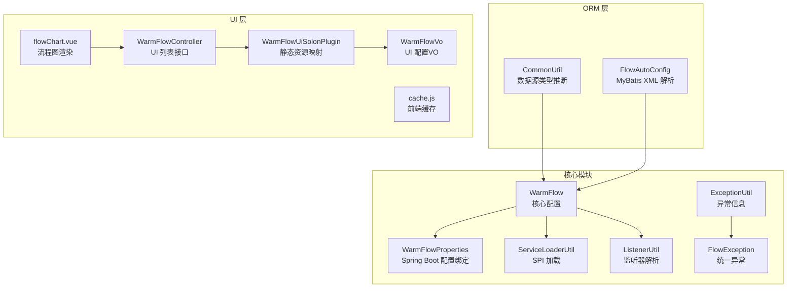
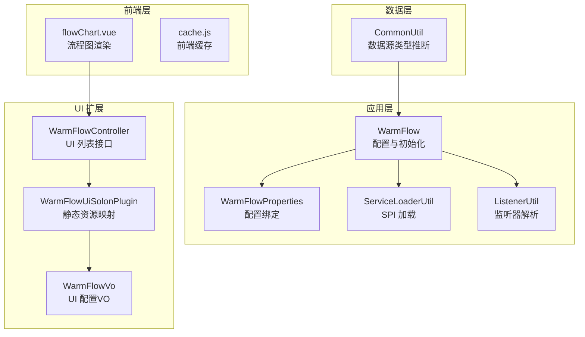
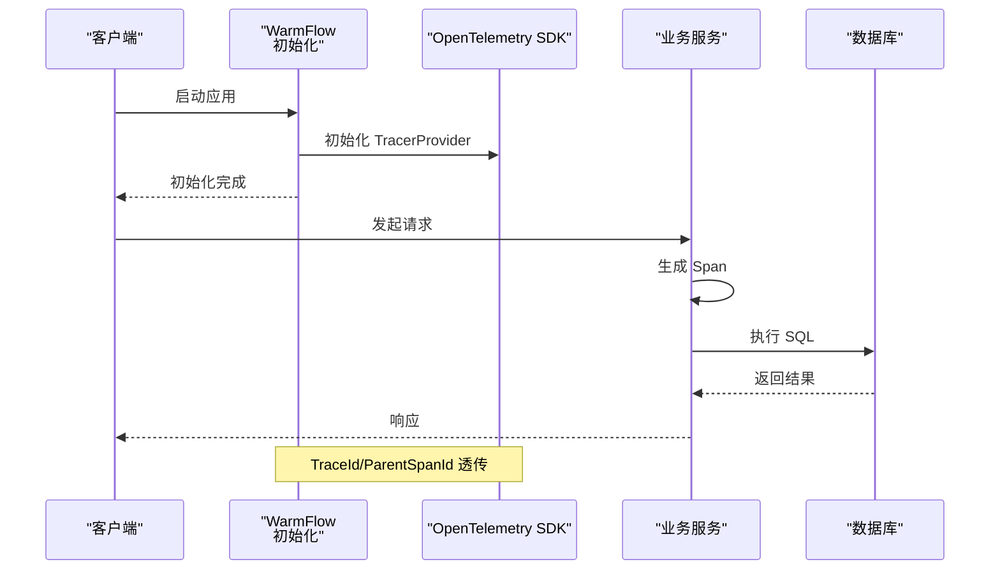
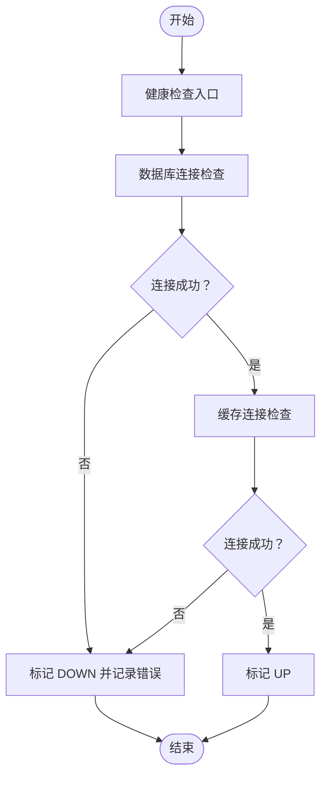
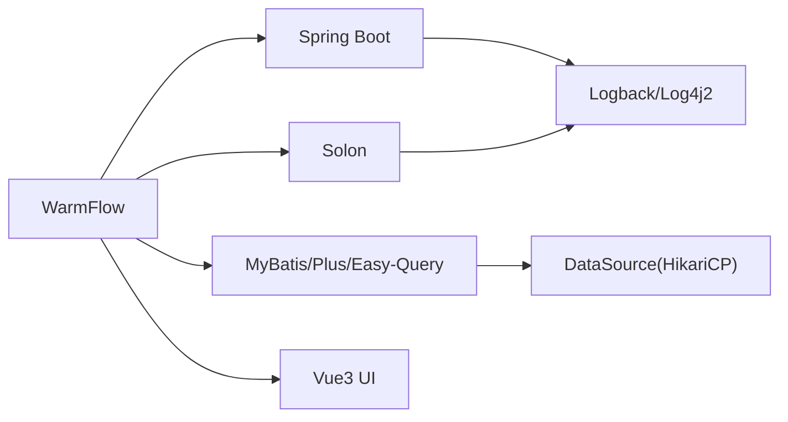
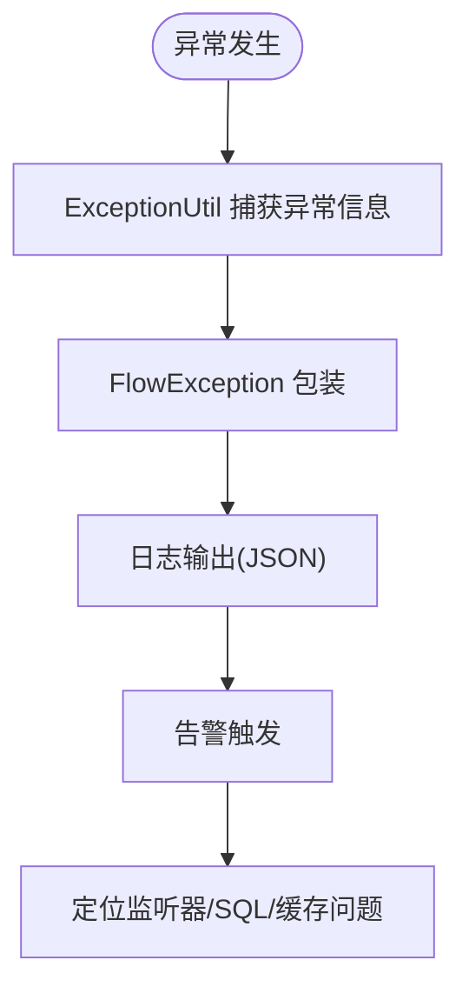

# 监控日志

<cite>
**本文引用的文件**
- [pom.xml](file://pom.xml)
- [WarmFlow.java](file://warm-flow-core/src/main/java/org/dromara/warm/flow/core/config/WarmFlow.java)
- [WarmFlowProperties.java](file://warm-flow-plugin/warm-flow-plugin-modes/warm-flow-plugin-modes-sb/src/main/java/org/dromara/warm/plugin/modes/sb/config/WarmFlowProperties.java)
- [WarmFlowController.java](file://warm-flow-plugin/warm-flow-plugin-ui/warm-flow-plugin-ui-solon-web/src/main/java/org/dromara/warm/flow/ui/controller/WarmFlowController.java)
- [WarmFlowVo.java](file://warm-flow-plugin/warm-flow-plugin-ui/warm-flow-plugin-ui-core/src/main/java/org/dromara/warm/flow/ui/vo/WarmFlowVo.java)
- [WarmFlowUiSolonPlugin.java](file://warm-flow-plugin/warm-flow-plugin-ui/warm-flow-plugin-ui-solon-web/src/main/java/org/dromara/warm/flow/ui/WarmFlowUiSolonPlugin.java)
- [CommonUtil.java](file://warm-flow-orm/warm-flow-mybatis/warm-flow-mybatis-core/src/main/java/org/dromara/warm/flow/orm/utils/CommonUtil.java)
- [flowChart.vue](file://warm-flow-ui/src/views/flow-design/flowChart.vue)
- [cache.js](file://warm-flow-ui/src/plugins/cache.js)
- [ServiceLoaderUtil.java](file://warm-flow-core/src/main/java/org/dromara/warm/flow/core/utils/ServiceLoaderUtil.java)
- [ExceptionUtil.java](file://warm-flow-core/src/main/java/org/dromara/warm/flow/core/utils/ExceptionUtil.java)
- [FlowException.java](file://warm-flow-core/src/main/java/org/dromara/warm/flow/core/exception/FlowException.java)
- [ListenerUtil.java](file://warm-flow-core/src/main/java/org/dromara/warm/flow/core/utils/ListenerUtil.java)
- [FlowAutoConfig.java](file://warm-flow-orm/warm-flow-mybatis/warm-flow-mybatis-sb-starter/src/main/java/org/dromara/warm/flow/spring/boot/config/FlowAutoConfig.java)
</cite>

## 目录
1. [简介](#简介)
2. [项目结构](#项目结构)
3. [核心组件](#核心组件)
4. [架构总览](#架构总览)
5. [详细组件分析](#详细组件分析)
6. [依赖关系分析](#依赖关系分析)
7. [性能考量](#性能考量)
8. [故障排查指南](#故障排查指南)
9. [结论](#结论)
10. [附录](#附录)

## 简介
本运维文档围绕 Warm-Flow 的监控与日志体系，结合现有代码库能力，给出可落地的实施方案与最佳实践。内容覆盖：
- 应用监控：JVM 监控指标、业务指标监控、性能监控
- 日志管理：日志级别配置、日志格式规范、日志轮转策略
- 分布式链路追踪：OpenTelemetry、SkyWalking 集成建议
- 告警机制：阈值设置、告警规则、通知渠道
- 健康检查：服务可用性、数据库连接、缓存状态
- 监控数据分析与报表：辅助运维快速定位问题

说明：当前代码库未内建监控与链路追踪组件，本文提供基于现有能力的扩展建议与落地步骤。

## 项目结构
Warm-Flow 采用多模块聚合工程，核心与监控相关的关键模块与文件如下：
- 核心配置与启动：WarmFlow、WarmFlowProperties
- ORM 与数据源：CommonUtil（数据库类型推断）
- UI 与前端：flowChart.vue（流程图渲染）、cache.js（前端缓存）
- 异常与工具：ServiceLoaderUtil、ExceptionUtil、FlowException
- 监听与扩展：ListenerUtil
- Spring Boot Starter：FlowAutoConfig（MyBatis XML 解析）

**图表来源**
- [WarmFlow.java:130-157](file://warm-flow-core/src/main/java/org/dromara/warm/flow/core/config/WarmFlow.java#L130-L157)
- [WarmFlowProperties.java:24-26](file://warm-flow-plugin/warm-flow-plugin-modes/warm-flow-plugin-modes-sb/src/main/java/org/dromara/warm/plugin/modes/sb/config/WarmFlowProperties.java#L24-L26)
- [ServiceLoaderUtil.java:36-68](file://warm-flow-core/src/main/java/org/dromara/warm/flow/core/utils/ServiceLoaderUtil.java#L36-L68)
- [ListenerUtil.java:146-158](file://warm-flow-core/src/main/java/org/dromara/warm/flow/core/utils/ListenerUtil.java#L146-L158)
- [CommonUtil.java:34-60](file://warm-flow-orm/warm-flow-mybatis/warm-flow-mybatis-core/src/main/java/org/dromara/warm/flow/orm/utils/CommonUtil.java#L34-L60)
- [FlowAutoConfig.java:60-71](file://warm-flow-orm/warm-flow-mybatis/warm-flow-mybatis-sb-starter/src/main/java/org/dromara/warm/flow/spring/boot/config/FlowAutoConfig.java#L60-L71)
- [flowChart.vue:228-281](file://warm-flow-ui/src/views/flow-design/flowChart.vue#L228-L281)
- [cache.js:1-37](file://warm-flow-ui/src/plugins/cache.js#L1-L37)
- [WarmFlowController.java:227-243](file://warm-flow-plugin/warm-flow-plugin-ui/warm-flow-plugin-ui-solon-web/src/main/java/org/dromara/warm/flow/ui/controller/WarmFlowController.java#L227-L243)
- [WarmFlowUiSolonPlugin.java:31-40](file://warm-flow-plugin/warm-flow-plugin-ui/warm-flow-plugin-ui-solon-web/src/main/java/org/dromara/warm/flow/ui/WarmFlowUiSolonPlugin.java#L31-L40)
- [WarmFlowVo.java:32-44](file://warm-flow-plugin/warm-flow-plugin-ui/warm-flow-plugin-ui-core/src/main/java/org/dromara/warm/flow/ui/vo/WarmFlowVo.java#L32-L44)

**章节来源**
- [pom.xml:58-62](file://pom.xml#L58-L62)
- [WarmFlow.java:130-157](file://warm-flow-core/src/main/java/org/dromara/warm/flow/core/config/WarmFlow.java#L130-L157)
- [CommonUtil.java:34-60](file://warm-flow-orm/warm-flow-mybatis/warm-flow-mybatis-core/src/main/java/org/dromara/warm/flow/orm/utils/CommonUtil.java#L34-L60)

## 核心组件
- WarmFlow：核心配置入口，负责初始化租户、数据填充、权限、全局监听器、SPI 加载与 Banner 输出；提供 UI 开关、流程状态颜色等配置项。
- WarmFlowProperties：Spring Boot 配置绑定，将配置前缀 warm-flow 映射到 WarmFlow。
- CommonUtil：在未显式配置数据源类型时，从 DataSource 元数据推断数据库类型，兜底为 mysql。
- ServiceLoaderUtil：SPI 机制加载服务实现，用于 JSON 转换策略等扩展。
- ExceptionUtil/FlowException：统一异常处理与异常信息采集。
- ListenerUtil：解析监听器路径与参数，支持表达式策略扩展。
- FlowAutoConfig：MyBatis XML Mapper 解析，保障 ORM 正常加载。
- flowChart.vue：前端流程图渲染与 UI 交互，包含“Warm-Flow”水印文案。
- cache.js：前端会话级缓存，便于 UI 状态持久化。
- WarmFlowController/WarmFlowUiSolonPlugin/WarmFlowVo：UI 控制器与静态资源映射，提供 UI 列表接口与 UI 配置 VO。

**章节来源**
- [WarmFlow.java:34-157](file://warm-flow-core/src/main/java/org/dromara/warm/flow/core/config/WarmFlow.java#L34-L157)
- [WarmFlowProperties.java:24-26](file://warm-flow-plugin/warm-flow-plugin-modes/warm-flow-plugin-modes-sb/src/main/java/org/dromara/warm/plugin/modes/sb/config/WarmFlowProperties.java#L24-L26)
- [ServiceLoaderUtil.java:36-68](file://warm-flow-core/src/main/java/org/dromara/warm/flow/core/utils/ServiceLoaderUtil.java#L36-L68)
- [ExceptionUtil.java:31-46](file://warm-flow-core/src/main/java/org/dromara/warm/flow/core/utils/ExceptionUtil.java#L31-L46)
- [FlowException.java:25-80](file://warm-flow-core/src/main/java/org/dromara/warm/flow/core/exception/FlowException.java#L25-L80)
- [ListenerUtil.java:146-158](file://warm-flow-core/src/main/java/org/dromara/warm/flow/core/utils/ListenerUtil.java#L146-L158)
- [FlowAutoConfig.java:60-71](file://warm-flow-orm/warm-flow-mybatis/warm-flow-mybatis-sb-starter/src/main/java/org/dromara/warm/flow/spring/boot/config/FlowAutoConfig.java#L60-L71)
- [flowChart.vue:30-31](file://warm-flow-ui/src/views/flow-design/flowChart.vue#L30-L31)
- [cache.js:1-37](file://warm-flow-ui/src/plugins/cache.js#L1-L37)
- [WarmFlowController.java:227-243](file://warm-flow-plugin/warm-flow-plugin-ui/warm-flow-plugin-ui-solon-web/src/main/java/org/dromara/warm/flow/ui/controller/WarmFlowController.java#L227-L243)
- [WarmFlowUiSolonPlugin.java:31-40](file://warm-flow-plugin/warm-flow-plugin-ui/warm-flow-plugin-ui-solon-web/src/main/java/org/dromara/warm/flow/ui/WarmFlowUiSolonPlugin.java#L31-L40)
- [WarmFlowVo.java:32-44](file://warm-flow-plugin/warm-flow-plugin-ui/warm-flow-plugin-ui-core/src/main/java/org/dromara/warm/flow/ui/vo/WarmFlowVo.java#L32-L44)

## 架构总览
下图展示 Warm-Flow 在监控与日志方面的关键交互点与扩展位置：

**图表来源**
- [WarmFlow.java:130-157](file://warm-flow-core/src/main/java/org/dromara/warm/flow/core/config/WarmFlow.java#L130-L157)
- [WarmFlowProperties.java:24-26](file://warm-flow-plugin/warm-flow-plugin-modes/warm-flow-plugin-modes-sb/src/main/java/org/dromara/warm/plugin/modes/sb/config/WarmFlowProperties.java#L24-L26)
- [ServiceLoaderUtil.java:36-68](file://warm-flow-core/src/main/java/org/dromara/warm/flow/core/utils/ServiceLoaderUtil.java#L36-L68)
- [ListenerUtil.java:146-158](file://warm-flow-core/src/main/java/org/dromara/warm/flow/core/utils/ListenerUtil.java#L146-L158)
- [CommonUtil.java:34-60](file://warm-flow-orm/warm-flow-mybatis/warm-flow-mybatis-core/src/main/java/org/dromara/warm/flow/orm/utils/CommonUtil.java#L34-L60)
- [flowChart.vue:228-281](file://warm-flow-ui/src/views/flow-design/flowChart.vue#L228-L281)
- [cache.js:1-37](file://warm-flow-ui/src/plugins/cache.js#L1-L37)
- [WarmFlowController.java:227-243](file://warm-flow-plugin/warm-flow-plugin-ui/warm-flow-plugin-ui-solon-web/src/main/java/org/dromara/warm/flow/ui/controller/WarmFlowController.java#L227-L243)
- [WarmFlowUiSolonPlugin.java:31-40](file://warm-flow-plugin/warm-flow-plugin-ui/warm-flow-plugin-ui-solon-web/src/main/java/org/dromara/warm/flow/ui/WarmFlowUiSolonPlugin.java#L31-L40)
- [WarmFlowVo.java:32-44](file://warm-flow-plugin/warm-flow-plugin-ui/warm-flow-plugin-ui-core/src/main/java/org/dromara/warm/flow/ui/vo/WarmFlowVo.java#L32-L44)

## 详细组件分析

### JVM 监控指标
- 进程与内存：Heap/Non-Heap、GC 次数与耗时、线程数、类加载数
- 应用维度：请求量、响应时间、错误率、业务方法耗时（可基于 AOP 或拦截器埋点）
- 数据库连接池：连接数、活跃/空闲、获取等待时间（HikariCP）
- 缓存：Redis/Memcached 连接与命中率（如接入）

建议：
- 使用 Micrometer + Prometheus + Grafana 构建指标体系
- 通过 @Timed/@Counted 注解标注关键业务方法
- 将 JVM 指标与业务指标统一上报至监控平台

[本节为通用实施建议，无需特定文件引用]

### 业务指标监控
- 流程实例生命周期：创建、流转、完成、撤销、超时
- 节点处理时延与失败率
- 用户操作行为：登录、发起流程、审批、退回等

建议：
- 基于 WarmFlow 的监听器扩展（ListenerUtil）在关键节点埋点
- 通过 WarmFlowProperties 绑定配置，启用或禁用指标采集
- 将指标写入时序数据库，配合告警规则

**章节来源**
- [ListenerUtil.java:146-158](file://warm-flow-core/src/main/java/org/dromara/warm/flow/core/utils/ListenerUtil.java#L146-L158)
- [WarmFlowProperties.java:24-26](file://warm-flow-plugin/warm-flow-plugin-modes/warm-flow-plugin-modes-sb/src/main/java/org/dromara/warm/plugin/modes/sb/config/WarmFlowProperties.java#L24-L26)

### 性能监控
- ORM 层：MyBatis SQL 执行时间、慢查询统计（CommonUtil 中的数据源类型推断有助于 SQL 方言优化）
- 前端：流程图渲染耗时、事件绑定与重绘次数（flowChart.vue）
- 缓存：前端 cache.js 的会话缓存命中与清理策略

建议：
- 在 FlowAutoConfig 中增加 SQL 执行时间埋点
- 前端使用 Performance API 记录关键渲染阶段耗时
- 结合缓存命中率与清理策略优化 UI 性能

**章节来源**
- [CommonUtil.java:34-60](file://warm-flow-orm/warm-flow-mybatis/warm-flow-mybatis-core/src/main/java/org/dromara/warm/flow/orm/utils/CommonUtil.java#L34-L60)
- [FlowAutoConfig.java:60-71](file://warm-flow-orm/warm-flow-mybatis/warm-flow-mybatis-sb-starter/src/main/java/org/dromara/warm/flow/spring/boot/config/FlowAutoConfig.java#L60-L71)
- [flowChart.vue:228-281](file://warm-flow-ui/src/views/flow-design/flowChart.vue#L228-L281)
- [cache.js:1-37](file://warm-flow-ui/src/plugins/cache.js#L1-L37)

### 日志管理策略
- 日志级别：ERROR/WARN/INFO/DEBUG，生产环境建议 INFO 或 WARN
- 日志格式：统一结构化输出（JSON），包含 traceId、spanId、模块、方法、耗时、状态码、异常堆栈
- 日志轮转：按大小与时间轮转，保留天数与归档策略
- 敏感信息：脱敏处理（用户名、手机号、身份证号等）

建议：
- Spring Boot 使用 logback/log4j2 + JSON 格式
- Solon 使用 solon-logging-logback
- 前端日志通过 HTTP 上报至后端统一收集

**章节来源**
- [pom.xml:140-144](file://pom.xml#L140-L144)

### 分布式链路追踪
- OpenTelemetry：自动注入 Trace/Span，支持 Spring Boot 与 Solon
- SkyWalking：探针或 Java Agent，自动采集 RPC/SQL/缓存调用
- 建议：在 WarmFlow 初始化阶段（WarmFlow.init）接入 TracerProvider，确保跨模块一致的 TraceContext

**图表来源**
- [WarmFlow.java:130-157](file://warm-flow-core/src/main/java/org/dromara/warm/flow/core/config/WarmFlow.java#L130-L157)

### 告警机制
- 阈值设置：错误率、P95/P99 响应时间、慢查询比例、队列积压
- 告警规则：连续 N 分钟超过阈值触发；同一线索去重
- 通知渠道：邮件、企业微信、飞书、钉钉机器人

建议：
- 基于 Prometheus Alertmanager 或平台内置告警引擎
- 与链路追踪结合，定位根因（慢 SQL、下游依赖、热点接口）

[本节为通用实施建议，无需特定文件引用]

### 系统健康检查
- 服务可用性：/health 探针，返回 UP/DOWN
- 数据库连接：CommonUtil 推断数据源类型并尝试获取连接元数据
- 缓存状态：Redis/Memcached 连接与 ping

**图表来源**
- [CommonUtil.java:34-60](file://warm-flow-orm/warm-flow-mybatis/warm-flow-mybatis-core/src/main/java/org/dromara/warm/flow/orm/utils/CommonUtil.java#L34-L60)

**章节来源**
- [CommonUtil.java:34-60](file://warm-flow-orm/warm-flow-mybatis/warm-flow-mybatis-core/src/main/java/org/dromara/warm/flow/orm/utils/CommonUtil.java#L34-L60)

### 监控数据分析与报表
- 指标采集：Prometheus Pushgateway 或平台采集器
- 报表：Grafana 仪表盘，包含 JVM、业务、链路拓扑
- 告警联动：在 Grafana 中直接跳转到链路详情与日志

建议：
- 以 WarmFlow 的监听器埋点为业务指标来源
- 以链路追踪为根因分析手段

[本节为通用实施建议，无需特定文件引用]

## 依赖关系分析
Warm-Flow 在监控与日志方面的主要外部依赖与集成点：
- Spring Boot/Solon：配置绑定、日志、Web
- ORM：MyBatis/MyBatis-Plus/Easy-Query，数据源类型推断
- UI：Vue3 前端，静态资源映射与控制器

**图表来源**
- [pom.xml:104-144](file://pom.xml#L104-L144)
- [CommonUtil.java:34-60](file://warm-flow-orm/warm-flow-mybatis/warm-flow-mybatis-core/src/main/java/org/dromara/warm/flow/orm/utils/CommonUtil.java#L34-L60)
- [WarmFlowUiSolonPlugin.java:31-40](file://warm-flow-plugin/warm-flow-plugin-ui/warm-flow-plugin-ui-solon-web/src/main/java/org/dromara/warm/flow/ui/WarmFlowUiSolonPlugin.java#L31-L40)

**章节来源**
- [pom.xml:104-144](file://pom.xml#L104-L144)

## 性能考量
- 监控开销：采样率控制、批量上报、异步落盘
- 指标维度：避免过多高基数标签，合理聚合
- 链路追踪：减少 Span 数量，合并轻量 Span
- 前端性能：flowChart.vue 渲染优化、事件节流、缓存复用

[本节为通用指导，无需特定文件引用]

## 故障排查指南
- 异常采集：ExceptionUtil 汇总异常信息，FlowException 统一异常包装
- 监听器问题：ListenerUtil 解析监听器路径与参数，排查表达式与类路径
- ORM 初始化：FlowAutoConfig 解析 XML Mapper，检查资源路径与异常
- 数据源类型：CommonUtil 未配置时自动推断，若失败兜底 mysql

**图表来源**
- [ExceptionUtil.java:31-46](file://warm-flow-core/src/main/java/org/dromara/warm/flow/core/utils/ExceptionUtil.java#L31-L46)
- [FlowException.java:25-80](file://warm-flow-core/src/main/java/org/dromara/warm/flow/core/exception/FlowException.java#L25-L80)
- [ListenerUtil.java:146-158](file://warm-flow-core/src/main/java/org/dromara/warm/flow/core/utils/ListenerUtil.java#L146-L158)
- [FlowAutoConfig.java:60-71](file://warm-flow-orm/warm-flow-mybatis/warm-flow-mybatis-sb-starter/src/main/java/org/dromara/warm/flow/spring/boot/config/FlowAutoConfig.java#L60-L71)

**章节来源**
- [ExceptionUtil.java:31-46](file://warm-flow-core/src/main/java/org/dromara/warm/flow/core/utils/ExceptionUtil.java#L31-L46)
- [FlowException.java:25-80](file://warm-flow-core/src/main/java/org/dromara/warm/flow/core/exception/FlowException.java#L25-L80)
- [ListenerUtil.java:146-158](file://warm-flow-core/src/main/java/org/dromara/warm/flow/core/utils/ListenerUtil.java#L146-L158)
- [FlowAutoConfig.java:60-71](file://warm-flow-orm/warm-flow-mybatis/warm-flow-mybatis-sb-starter/src/main/java/org/dromara/warm/flow/spring/boot/config/FlowAutoConfig.java#L60-L71)

## 结论
- 当前代码库未内置监控与链路追踪组件，但具备良好的扩展点（WarmFlow、WarmFlowProperties、ServiceLoaderUtil、ListenerUtil、CommonUtil、FlowAutoConfig、UI 插件）
- 建议以 Micrometer/OpenTelemetry 为基础，结合现有配置与监听器机制，构建完善的监控与日志体系
- 通过健康检查、告警与可视化报表，提升问题定位效率与系统稳定性

[本节为总结，无需特定文件引用]

## 附录
- 配置前缀：warm-flow → WarmFlowProperties → WarmFlow
- UI 静态资源映射：WarmFlowUiSolonPlugin → /warm-flow-ui/
- 前端 UI 列表接口：WarmFlowController → /node-ext, /listener-list
- 前端流程图水印：flowChart.vue → “Warm-Flow”

**章节来源**
- [WarmFlowProperties.java:24-26](file://warm-flow-plugin/warm-flow-plugin-modes/warm-flow-plugin-modes-sb/src/main/java/org/dromara/warm/plugin/modes/sb/config/WarmFlowProperties.java#L24-L26)
- [WarmFlowUiSolonPlugin.java:31-40](file://warm-flow-plugin/warm-flow-plugin-ui/warm-flow-plugin-ui-solon-web/src/main/java/org/dromara/warm/flow/ui/WarmFlowUiSolonPlugin.java#L31-L40)
- [WarmFlowController.java:227-243](file://warm-flow-plugin/warm-flow-plugin-ui/warm-flow-plugin-ui-solon-web/src/main/java/org/dromara/warm/flow/ui/controller/WarmFlowController.java#L227-L243)
- [flowChart.vue:30-31](file://warm-flow-ui/src/views/flow-design/flowChart.vue#L30-L31)