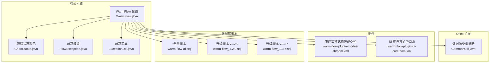
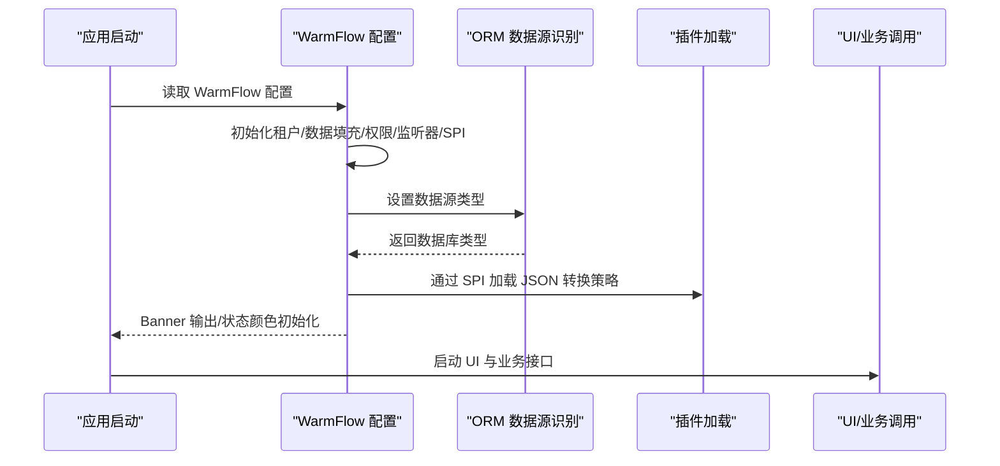
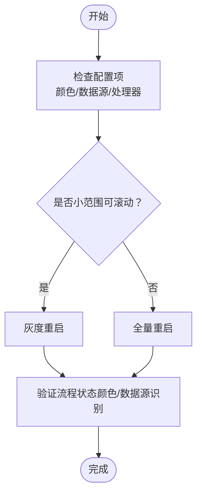
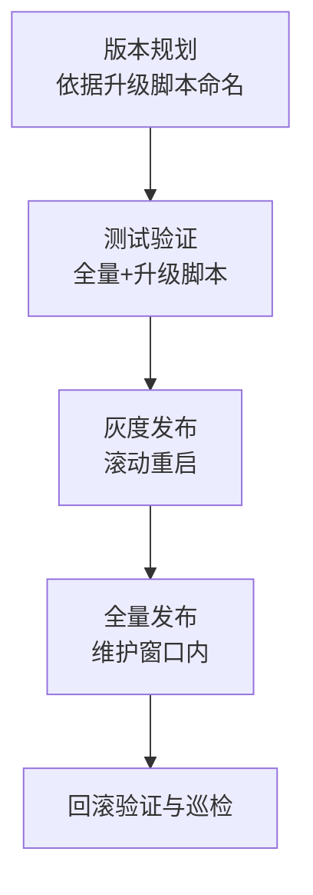
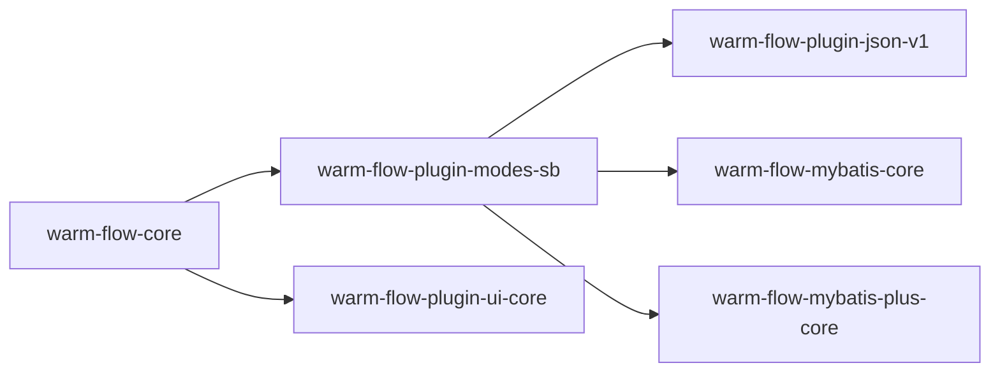
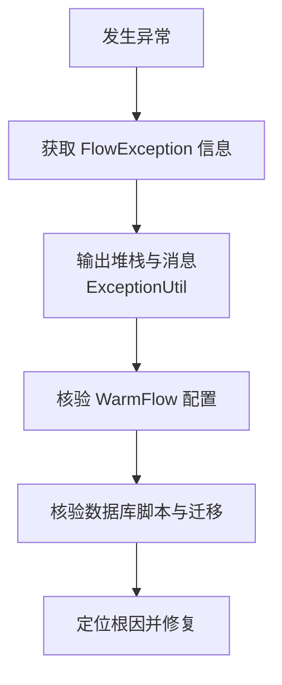

# 运维维护

<cite>
**本文引用的文件**   
- [README.md](file://README.md)
- [WarmFlow.java](file://warm-flow-core/src/main/java/org/dromara/warm/flow/core/config/WarmFlow.java)
- [ChartStatus.java](file://warm-flow-core/src/main/java/org/dromara/warm/flow/core/enums/ChartStatus.java)
- [warm-flow-all.sql](file://sql/mysql/warm-flow-all.sql)
- [warm-flow_1.2.0.sql](file://sql/mysql/v1-upgrade/warm-flow_1.2.0.sql)
- [warm-flow_1.3.7.sql](file://sql/mysql/v1-upgrade/warm-flow_1.3.7.sql)
- [CommonUtil.java](file://warm-flow-orm/warm-flow-mybatis/warm-flow-mybatis-core/src/main/java/org/dromara/warm/flow/orm/utils/CommonUtil.java)
- [FlowException.java](file://warm-flow-core/src/main/java/org/dromara/warm/flow/core/exception/FlowException.java)
- [ExceptionUtil.java](file://warm-flow-core/src/main/java/org/dromara/warm/flow/core/utils/ExceptionUtil.java)
- [warm-flow-plugin-modes-sb-pom.xml](file://warm-flow-plugin/warm-flow-plugin-modes/warm-flow-plugin-modes-sb/pom.xml)
- [warm-flow-plugin-ui-core-pom.xml](file://warm-flow-plugin/warm-flow-plugin-ui/warm-flow-plugin-ui-core/pom.xml)
- [release.yml](file://.github/workflows/release.yml)
</cite>

## 目录
1. [简介](#简介)
2. [项目结构](#项目结构)
3. [核心组件](#核心组件)
4. [架构总览](#架构总览)
5. [详细组件分析](#详细组件分析)
6. [依赖分析](#依赖分析)
7. [性能考虑](#性能考虑)
8. [故障排查指南](#故障排查指南)
9. [结论](#结论)
10. [附录](#附录)

## 简介
本指南面向 Warm-Flow 的运维与维护团队，围绕日常运维操作（应用重启、配置热更新、临时工单处理）、版本管理与发布流程（版本规划、测试验证、灰度与全量发布）、容量规划与扩容（水平/垂直扩容、数据库读写分离）、安全加固（漏洞扫描、权限审计、数据加密）、灾难恢复与业务连续性保障（故障转移、数据备份、应急响应）、以及运维自动化工具与脚本（部署、监控、维护）等方面，提供可落地的实践建议与操作路径。

Warm-Flow 是一款国产轻量化工作流引擎，具备简洁的七张核心表、多 ORM/多框架兼容、多数据库支持、多租户与软删除能力，并提供 UI 插件与多种表达式策略，适合在生产环境中进行稳定运维与持续演进。

章节来源
- [README.md:1-171](file://README.md#L1-L171)

## 项目结构
从运维视角，Warm-Flow 的结构可划分为以下关键层次：
- 核心引擎层：warm-flow-core，包含配置、枚举、实体、服务、工具、异常等基础能力
- ORM 扩展层：支持 MyBatis、MyBatis-Plus、Easy-Query 等，适配不同框架与数据库方言
- 插件层：表达式模式插件、UI 插件、JSON 插件等，提供可插拔的能力扩展
- UI 层：Vue3 前端工程，提供流程设计与表单设计界面
- 数据脚本：全量与升级脚本，覆盖 MySQL、Oracle、PostgreSQL、SQL Server

图表来源
- [WarmFlow.java:1-174](file://warm-flow-core/src/main/java/org/dromara/warm/flow/core/config/WarmFlow.java#L1-L174)
- [ChartStatus.java:66-92](file://warm-flow-core/src/main/java/org/dromara/warm/flow/core/enums/ChartStatus.java#L66-L92)
- [CommonUtil.java:37-61](file://warm-flow-orm/warm-flow-mybatis/warm-flow-mybatis-core/src/main/java/org/dromara/warm/flow/orm/utils/CommonUtil.java#L37-L61)
- [FlowException.java:1-80](file://warm-flow-core/src/main/java/org/dromara/warm/flow/core/exception/FlowException.java#L1-L80)
- [ExceptionUtil.java:1-47](file://warm-flow-core/src/main/java/org/dromara/warm/flow/core/utils/ExceptionUtil.java#L1-L47)
- [warm-flow-plugin-modes-sb-pom.xml:1-64](file://warm-flow-plugin/warm-flow-plugin-modes/warm-flow-plugin-modes-sb/pom.xml#L1-L64)
- [warm-flow-plugin-ui-core-pom.xml:1-36](file://warm-flow-plugin/warm-flow-plugin-ui/warm-flow-plugin-ui-core/pom.xml#L1-L36)
- [warm-flow-all.sql:1-160](file://sql/mysql/warm-flow-all.sql#L1-L160)
- [warm-flow_1.2.0.sql:1-24](file://sql/mysql/v1-upgrade/warm-flow_1.2.0.sql#L1-L24)
- [warm-flow_1.3.7.sql:1-1](file://sql/mysql/v1-upgrade/warm-flow_1.3.7.sql#L1-L1)

章节来源
- [README.md:1-171](file://README.md#L1-L171)

## 核心组件
- WarmFlow 配置：负责引擎开关、框架类型、Banner、逻辑删除、处理器路径、数据源类型、UI 开关、Token 名称、流程状态颜色等初始化与 SPI 加载
- ChartStatus 颜色：支持公共模式、经典模式、仿钉钉模式的流程状态三原色自定义
- ORM 数据源类型推断：根据数据源元数据推断数据库类型，兜底为 MySQL
- 异常体系：FlowException 提供统一错误码与消息；ExceptionUtil 提供堆栈与消息处理
- 插件依赖：表达式模式与 UI 插件通过 POM 明确依赖关系，便于打包与集成

章节来源
- [WarmFlow.java:34-174](file://warm-flow-core/src/main/java/org/dromara/warm/flow/core/config/WarmFlow.java#L34-L174)
- [ChartStatus.java:66-92](file://warm-flow-core/src/main/java/org/dromara/warm/flow/core/enums/ChartStatus.java#L66-L92)
- [CommonUtil.java:37-61](file://warm-flow-orm/warm-flow-mybatis/warm-flow-mybatis-core/src/main/java/org/dromara/warm/flow/orm/utils/CommonUtil.java#L37-L61)
- [FlowException.java:25-80](file://warm-flow-core/src/main/java/org/dromara/warm/flow/core/exception/FlowException.java#L25-L80)
- [ExceptionUtil.java:27-47](file://warm-flow-core/src/main/java/org/dromara/warm/flow/core/utils/ExceptionUtil.java#L27-L47)
- [warm-flow-plugin-modes-sb-pom.xml:16-61](file://warm-flow-plugin/warm-flow-plugin-modes/warm-flow-plugin-modes-sb/pom.xml#L16-L61)
- [warm-flow-plugin-ui-core-pom.xml:16-33](file://warm-flow-plugin/warm-flow-plugin-ui/warm-flow-plugin-ui-core/pom.xml#L16-L33)

## 架构总览
Warm-Flow 的运行时由“配置初始化 → ORM 数据源识别 → 插件加载 → UI/业务调用”构成。配置层负责开关与策略注入，ORM 层负责数据库方言适配，插件层提供表达式与 UI 能力，异常体系贯穿错误捕获与上报。

图表来源
- [WarmFlow.java:130-157](file://warm-flow-core/src/main/java/org/dromara/warm/flow/core/config/WarmFlow.java#L130-L157)
- [CommonUtil.java:37-61](file://warm-flow-orm/warm-flow-mybatis/warm-flow-mybatis-core/src/main/java/org/dromara/warm/flow/orm/utils/CommonUtil.java#L37-L61)

## 详细组件分析

### 配置热更新与应用重启
- 配置热更新范围
  - 流程状态颜色：通过 WarmFlow 初始化时设置公共/经典/仿钉钉模式的颜色映射，可在运行期调整后重新初始化生效
  - 数据源类型：通过 ORM 层推断数据库类型，若需强制切换可显式配置
  - 处理器与监听器：WarmFlow 支持在运行期设置租户、数据填充、权限、全局监听器路径，重启后生效
- 应用重启策略
  - 小范围配置（颜色、开关）：可滚动重启（灰度）以降低影响
  - 大范围配置（数据源类型、处理器路径）：建议在维护窗口内全量重启，确保一致性

图表来源
- [WarmFlow.java:130-157](file://warm-flow-core/src/main/java/org/dromara/warm/flow/core/config/WarmFlow.java#L130-L157)
- [ChartStatus.java:66-92](file://warm-flow-core/src/main/java/org/dromara/warm/flow/core/enums/ChartStatus.java#L66-L92)
- [CommonUtil.java:37-61](file://warm-flow-orm/warm-flow-mybatis/warm-flow-mybatis-core/src/main/java/org/dromara/warm/flow/orm/utils/CommonUtil.java#L37-L61)

章节来源
- [WarmFlow.java:130-157](file://warm-flow-core/src/main/java/org/dromara/warm/flow/core/config/WarmFlow.java#L130-L157)
- [ChartStatus.java:66-92](file://warm-flow-core/src/main/java/org/dromara/warm/flow/core/enums/ChartStatus.java#L66-L92)
- [CommonUtil.java:37-61](file://warm-flow-orm/warm-flow-mybatis/warm-flow-mybatis-core/src/main/java/org/dromara/warm/flow/orm/utils/CommonUtil.java#L37-L61)

### 临时工单处理
- 临时工单通常指紧急审批或绕过常规流程的特批场景。建议通过“监听器 + 权限处理器”实现：
  - 监听器：在流程节点前后注入监听器，实现临时工单标记与审计
  - 权限处理器：在紧急情况下允许特定角色直接通过或跳过某些节点
- 实施要点
  - 通过 WarmFlow 配置注入权限处理器路径
  - 在节点定义中绑定监听器类型与路径
  - 记录临时工单的审批意见与变量，便于事后审计

章节来源
- [WarmFlow.java:130-157](file://warm-flow-core/src/main/java/org/dromara/warm/flow/core/config/WarmFlow.java#L130-L157)

### 版本管理与发布流程
- 版本规划
  - 依据数据库脚本中的升级版本命名（如 v1-upgrade 下的 warm-flow_x.x.x.sql）进行版本规划
- 测试验证
  - 在测试环境执行全量脚本与升级脚本，验证表结构、索引、数据迁移（如 flow_user 历史数据迁移）
- 灰度发布
  - 采用滚动重启策略，先在少量实例上应用新配置/脚本，观察日志与指标
- 全量发布
  - 在维护窗口内对所有实例执行相同操作，完成后回滚验证与巡检

图表来源
- [warm-flow-all.sql:1-160](file://sql/mysql/warm-flow-all.sql#L1-L160)
- [warm-flow_1.2.0.sql:17-24](file://sql/mysql/v1-upgrade/warm-flow_1.2.0.sql#L17-L24)
- [warm-flow_1.3.7.sql:1-1](file://sql/mysql/v1-upgrade/warm-flow_1.3.7.sql#L1-L1)

章节来源
- [warm-flow-all.sql:1-160](file://sql/mysql/warm-flow-all.sql#L1-L160)
- [warm-flow_1.2.0.sql:17-24](file://sql/mysql/v1-upgrade/warm-flow_1.2.0.sql#L17-L24)
- [warm-flow_1.3.7.sql:1-1](file://sql/mysql/v1-upgrade/warm-flow_1.3.7.sql#L1-L1)

### 容量规划与扩容方案
- 水平扩容
  - 通过负载均衡将请求分发至多个实例，结合 UI 插件与核心引擎的无状态特性实现弹性伸缩
- 垂直扩容
  - 针对 CPU/内存敏感的审批计算与监听器处理，提升单实例规格
- 数据库读写分离
  - 利用 ORM 层对多数据库方言的支持，结合主从复制与只读副本，缓解写库压力

章节来源
- [README.md:111-128](file://README.md#L111-L128)
- [CommonUtil.java:37-61](file://warm-flow-orm/warm-flow-mybatis/warm-flow-mybatis-core/src/main/java/org/dromara/warm/flow/orm/utils/CommonUtil.java#L37-L61)

### 安全加固措施
- 漏洞扫描
  - 定期对依赖库进行扫描，关注表达式插件与 JSON 插件的安全公告
- 权限审计
  - 通过 WarmFlow 注入权限处理器，记录审批人、协作人、审批意见与变量，形成审计链路
- 数据加密
  - 对敏感字段（如审批意见、变量）在存储与传输层面实施加密策略

章节来源
- [FlowException.java:25-80](file://warm-flow-core/src/main/java/org/dromara/warm/flow/core/exception/FlowException.java#L25-L80)
- [ExceptionUtil.java:27-47](file://warm-flow-core/src/main/java/org/dromara/warm/flow/core/utils/ExceptionUtil.java#L27-L47)
- [warm-flow-plugin-modes-sb-pom.xml:16-61](file://warm-flow-plugin/warm-flow-plugin-modes/warm-flow-plugin-modes-sb/pom.xml#L16-L61)
- [warm-flow-plugin-ui-core-pom.xml:16-33](file://warm-flow-plugin/warm-flow-plugin-ui/warm-flow-plugin-ui-core/pom.xml#L16-L33)

### 灾难恢复与业务连续性
- 故障转移
  - 通过负载均衡与多实例部署实现故障实例隔离与流量切换
- 数据备份
  - 定期导出全量脚本与增量数据，结合数据库备份策略
- 应急响应
  - 基于异常模型与工具输出统一的日志与堆栈信息，快速定位问题

章节来源
- [FlowException.java:25-80](file://warm-flow-core/src/main/java/org/dromara/warm/flow/core/exception/FlowException.java#L25-L80)
- [ExceptionUtil.java:27-47](file://warm-flow-core/src/main/java/org/dromara/warm/flow/core/utils/ExceptionUtil.java#L27-L47)
- [warm-flow-all.sql:1-160](file://sql/mysql/warm-flow-all.sql#L1-L160)

### 运维自动化工具与脚本
- 部署脚本
  - 结合 GitHub Actions 的发布模板（release.yml），在发布后触发部署流程
- 监控脚本
  - 基于 WarmFlow 的 Banner 与配置初始化输出，结合日志采集进行健康检查
- 维护脚本
  - 数据库升级脚本自动化执行，确保版本一致性与可追溯性

章节来源
- [release.yml:1-42](file://.github/workflows/release.yml#L1-L42)
- [WarmFlow.java:159-171](file://warm-flow-core/src/main/java/org/dromara/warm/flow/core/config/WarmFlow.java#L159-L171)

## 依赖分析
Warm-Flow 的插件与核心模块之间存在明确的依赖关系，确保在不同框架（Spring Boot、Solon）与 ORM（MyBatis、MyBatis-Plus、Easy-Query）下的可插拔扩展。

图表来源
- [warm-flow-plugin-modes-sb-pom.xml:16-61](file://warm-flow-plugin/warm-flow-plugin-modes/warm-flow-plugin-modes-sb/pom.xml#L16-L61)
- [warm-flow-plugin-ui-core-pom.xml:16-33](file://warm-flow-plugin/warm-flow-plugin-ui/warm-flow-plugin-ui-core/pom.xml#L16-L33)

章节来源
- [warm-flow-plugin-modes-sb-pom.xml:16-61](file://warm-flow-plugin/warm-flow-plugin-modes/warm-flow-plugin-modes-sb/pom.xml#L16-L61)
- [warm-flow-plugin-ui-core-pom.xml:16-33](file://warm-flow-plugin/warm-flow-plugin-ui/warm-flow-plugin-ui-core/pom.xml#L16-L33)

## 性能考虑
- ORM 方言适配：通过数据源类型推断减少分页与方言差异带来的性能损耗
- 颜色与监听器：合理配置流程状态颜色与监听器数量，避免在高峰期产生额外开销
- 异步化：对耗时的监听器与权限计算尽量异步化，降低请求延迟

章节来源
- [CommonUtil.java:37-61](file://warm-flow-orm/warm-flow-mybatis/warm-flow-mybatis-core/src/main/java/org/dromara/warm/flow/orm/utils/CommonUtil.java#L37-L61)
- [WarmFlow.java:130-157](file://warm-flow-core/src/main/java/org/dromara/warm/flow/core/config/WarmFlow.java#L130-L157)

## 故障排查指南
- 异常定位
  - 使用 FlowException 获取统一错误码与消息，结合 ExceptionUtil 输出堆栈信息
- 配置核验
  - 检查 WarmFlow 配置项（开关、处理器路径、数据源类型、UI 开关）
- 数据库一致性
  - 对照升级脚本验证表结构与历史数据迁移是否正确

图表来源
- [FlowException.java:25-80](file://warm-flow-core/src/main/java/org/dromara/warm/flow/core/exception/FlowException.java#L25-L80)
- [ExceptionUtil.java:27-47](file://warm-flow-core/src/main/java/org/dromara/warm/flow/core/utils/ExceptionUtil.java#L27-L47)
- [WarmFlow.java:130-157](file://warm-flow-core/src/main/java/org/dromara/warm/flow/core/config/WarmFlow.java#L130-L157)

章节来源
- [FlowException.java:25-80](file://warm-flow-core/src/main/java/org/dromara/warm/flow/core/exception/FlowException.java#L25-L80)
- [ExceptionUtil.java:27-47](file://warm-flow-core/src/main/java/org/dromara/warm/flow/core/utils/ExceptionUtil.java#L27-L47)
- [WarmFlow.java:130-157](file://warm-flow-core/src/main/java/org/dromara/warm/flow/core/config/WarmFlow.java#L130-L157)

## 结论
Warm-Flow 提供了清晰的配置初始化、ORM 方言适配、插件化扩展与完善的异常体系，为运维提供了良好的可操作性与可观测性。结合本文的版本管理、容量规划、安全加固、灾备与自动化脚本建议，可有效提升系统的稳定性与可维护性。

## 附录
- 数据库脚本位置与用途
  - 全量脚本：首次导入数据库，建立七张核心表
  - 升级脚本：版本演进时执行，包含历史数据迁移与字段修正
- 插件依赖清单
  - 表达式模式插件：提供 SpEL/SnEL 等表达式策略
  - UI 插件核心：提供流程与表单设计能力

章节来源
- [warm-flow-all.sql:1-160](file://sql/mysql/warm-flow-all.sql#L1-L160)
- [warm-flow_1.2.0.sql:17-24](file://sql/mysql/v1-upgrade/warm-flow_1.2.0.sql#L17-L24)
- [warm-flow_1.3.7.sql:1-1](file://sql/mysql/v1-upgrade/warm-flow_1.3.7.sql#L1-L1)
- [warm-flow-plugin-modes-sb-pom.xml:16-61](file://warm-flow-plugin/warm-flow-plugin-modes/warm-flow-plugin-modes-sb/pom.xml#L16-L61)
- [warm-flow-plugin-ui-core-pom.xml:16-33](file://warm-flow-plugin/warm-flow-plugin-ui/warm-flow-plugin-ui-core/pom.xml#L16-L33)