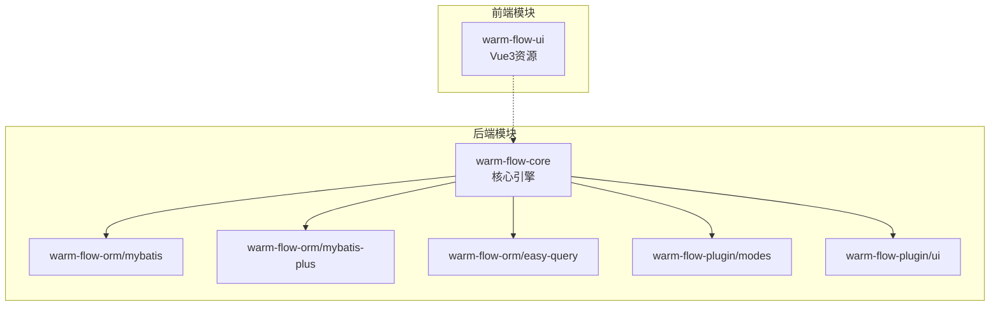
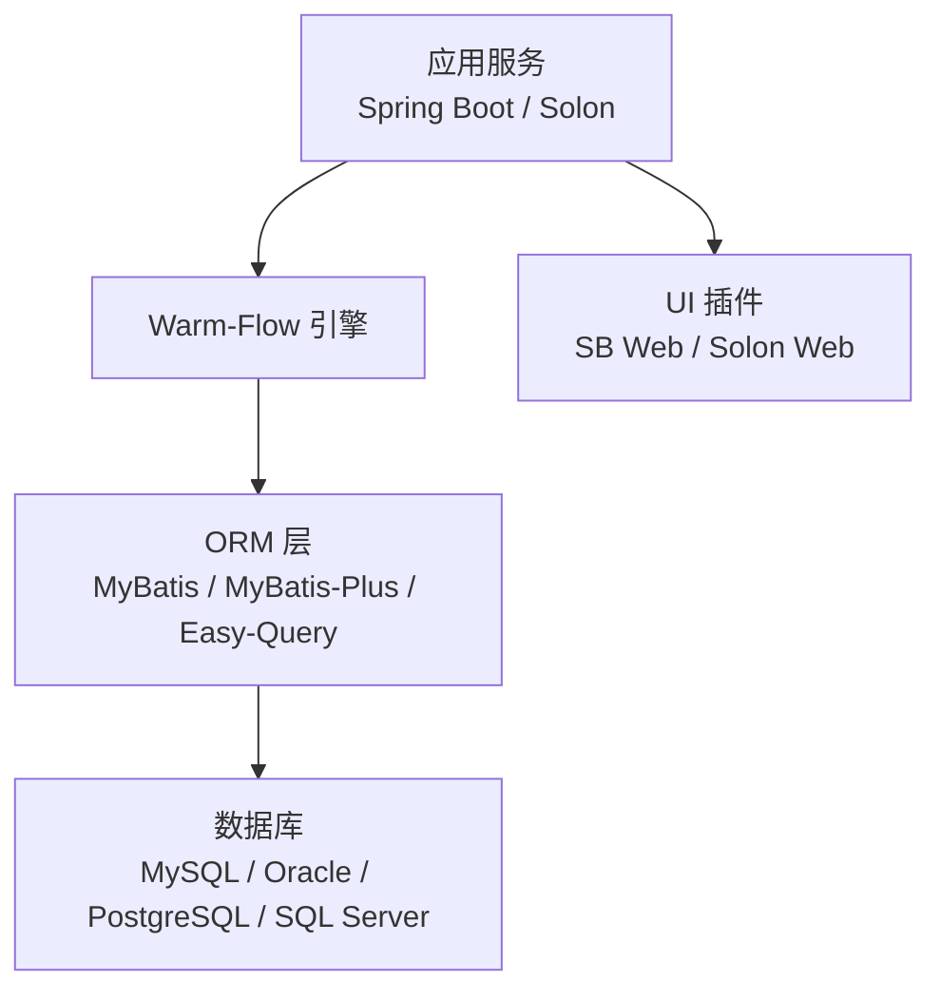
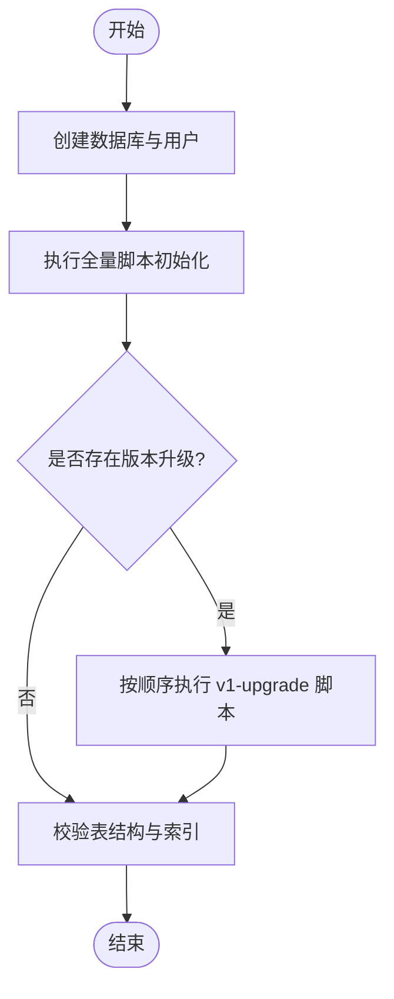
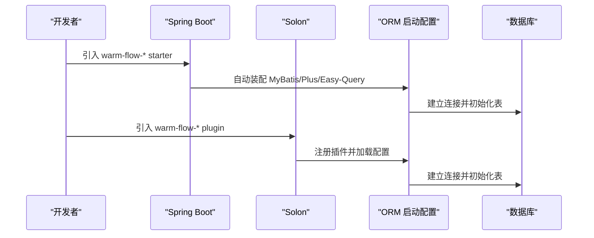
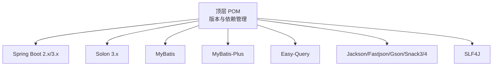

# 部署运维

<cite>
**本文引用的文件**
- [pom.xml](file://pom.xml)
- [README.md](file://README.md)
- [warm-flow-all.sql](file://sql/mysql/warm-flow-all.sql)
- [WarmFlow.java](file://warm-flow-core/src/main/java/org/dromara/warm/flow/core/config/WarmFlow.java)
- [FlowAutoConfig.java（MyBatis-SB）](file://warm-flow-orm/warm-flow-mybatis/warm-flow-mybatis-sb-starter/src/main/java/org/dromara/warm/flow/spring/boot/config/FlowAutoConfig.java)
- [FlowAutoConfig.java（MyBatis-Plus-SB）](file://warm-flow-orm/warm-flow-mybatis-plus/warm-flow-mybatis-plus-sb-starter/src/main/java/org/dromara/warm/flow/spring/boot/config/FlowAutoConfig.java)
- [FlowAutoConfig.java（Easy-Query-SB）](file://warm-flow-orm/warm-flow-easy-query/warm-flow-easy-query-sb-starter/src/main/java/org/dromara/warm/flow/spring/boot/config/FlowAutoConfig.java)
- [FlowAutoConfig.java（MyBatis-Solon）](file://warm-flow-orm/warm-flow-mybatis/warm-flow-mybatis-solon-plugin/src/main/java/org/dromara/warm/flow/solon/config/FlowAutoConfig.java)
- [FlowAutoConfig.java（MyBatis-Plus-Solon）](file://warm-flow-orm/warm-flow-mybatis-plus/warm-flow-mybatis-plus-solon-plugin/src/main/java/org/dromara/warm/flow/solon/config/FlowAutoConfig.java)
- [FlowAutoConfig.java（Easy-Query-Solon）](file://warm-flow-orm/warm-flow-easy-query/warm-flow-easy-query-solon-plugin/src/main/java/org/dromara/warm/flow/solon/config/FlowAutoConfig.java)
- [WarmFlowProperties.java](file://warm-flow-plugin/warm-flow-plugin-modes/warm-flow-plugin-modes-sb/src/main/java/org/dromara/warm/plugin/modes/sb/config/WarmFlowProperties.java)
- [WarmFlowUiConfig.java（UI-SB）](file://warm-flow-plugin/warm-flow-plugin-ui/warm-flow-plugin-ui-sb-web/src/main/java/org/dromara/warm/flow/ui/config/WarmFlowUiConfig.java)
- [WarmFlowUiSolonPlugin.java（UI-Solon）](file://warm-flow-plugin/warm-flow-plugin-ui/warm-flow-plugin-ui-solon-web/src/main/java/org/dromara/warm/flow/ui/WarmFlowUiSolonPlugin.java)
- [solon.properties（Easy-Query-Solon）](file://warm-flow-orm/warm-flow-easy-query/warm-flow-easy-query-solon-plugin/src/main/resources/META-INF/solon/org.dromara.warm.flow.solon.properties)
- [solon.properties（MyBatis-Solon）](file://warm-flow-orm/warm-flow-mybatis/warm-flow-mybatis-solon-plugin/src/main/resources/META-INF/solon/org.dromara.warm.flow.solon.properties)
- [solon.properties（MyBatis-Plus-Solon）](file://warm-flow-orm/warm-flow-mybatis-plus/warm-flow-mybatis-plus-solon-plugin/src/main/resources/META-INF/solon/org.dromara.warm.flow.solon.properties)
- [solon.properties（UI-Solon）](file://warm-flow-plugin/warm-flow-plugin-ui/warm-flow-plugin-ui-solon-web/src/main/resources/META-INF/solon/org.dromara.warm.flow.ui.properties)
- [spring.factories（MyBatis-SB）](file://warm-flow-orm/warm-flow-mybatis/warm-flow-mybatis-sb-starter/src/main/resources/META-INF/spring.factories)
- [spring.factories（MyBatis-Plus-SB）](file://warm-flow-orm/warm-flow-mybatis-plus/warm-flow-mybatis-plus-sb-starter/src/main/resources/META-INF/spring.factories)
- [spring.factories（Easy-Query-SB）](file://warm-flow-orm/warm-flow-easy-query/warm-flow-easy-query-sb-starter/src/main/resources/META-INF/spring.factories)
- [spring.factories（UI-SB）](file://warm-flow-plugin/warm-flow-plugin-ui/warm-flow-plugin-ui-sb-web/src/main/resources/META-INF/spring.factories)
</cite>

## 目录
1. [简介](#简介)
2. [项目结构](#项目结构)
3. [核心组件](#核心组件)
4. [架构总览](#架构总览)
5. [详细组件分析](#详细组件分析)
6. [依赖分析](#依赖分析)
7. [性能考虑](#性能考虑)
8. [故障排除指南](#故障排除指南)
9. [结论](#结论)
10. [附录](#附录)

## 简介
本文件面向 Warm-Flow 在生产环境的部署与运维，覆盖硬件与软件环境准备、数据库部署与初始化、应用打包与配置、服务启动与监控、日志与性能管理、故障排查与应急处理等内容。文档以仓库中的实际配置与脚本为依据，确保可操作性与准确性。

## 项目结构
Warm-Flow 采用多模块 Maven 结构，核心模块包括：
- 核心引擎：warm-flow-core
- ORM 支持：warm-flow-orm（含 MyBatis、MyBatis-Plus、Easy-Query）
- 插件生态：warm-flow-plugin（模式表达式、UI、JSON 实现等）
- UI 资源：warm-flow-ui（Vue3 前端资源）

图表来源
- [pom.xml:58-62](file://pom.xml#L58-L62)

章节来源
- [pom.xml:58-62](file://pom.xml#L58-L62)

## 核心组件
- WarmFlow 配置类：负责引擎开关、框架类型、逻辑删除、租户/权限/监听器处理器、UI 开关、流程状态颜色等初始化。
- ORM 启动配置：Spring Boot 与 Solon 的自动装配入口，分别对应 MyBatis、MyBatis-Plus、Easy-Query。
- 插件配置：模式表达式（SpEL/SnEL）、UI 配置、属性注入等。
- 数据库脚本：MySQL 全量与升级脚本，用于初始化与版本演进。

章节来源
- [WarmFlow.java:34-174](file://warm-flow-core/src/main/java/org/dromara/warm/flow/core/config/WarmFlow.java#L34-L174)
- [pom.xml:64-102](file://pom.xml#L64-L102)

## 架构总览
Warm-Flow 支持 Spring Boot 与 Solon 运行时，ORM 层提供 MyBatis、MyBatis-Plus、Easy-Query 三种实现；插件层提供表达式、UI、JSON 等能力；数据库层支持 MySQL、Oracle、PostgreSQL、SQL Server。

图表来源
- [pom.xml:76-97](file://pom.xml#L76-L97)
- [README.md:111-128](file://README.md#L111-L128)

## 详细组件分析

### 部署环境准备
- 硬件建议
  - CPU：至少 2 核，建议 4 核以上
  - 内存：最小 2GB，建议 4GB 以上
  - 磁盘：根据业务数据量预留空间，建议 SSD
- 软件依赖
  - Java：支持 Java 8、Java 17、Java 21（多版本兼容）
  - 运行时：Spring Boot 2.x/3.x 或 Solon 3.x
  - 数据库：MySQL 8.0、Oracle 11g+、PostgreSQL、SQL Server
- 网络配置
  - 应用端口：默认 HTTP 端口需开放（如 8080），UI 访问端口需可达
  - 数据库端口：MySQL 默认 3306，Oracle 默认 1521，PostgreSQL 默认 5432，SQL Server 默认 1433
  - 反向代理：如需 Nginx/Tomcat，需正确转发请求与静态资源

章节来源
- [pom.xml:67-79](file://pom.xml#L67-L79)
- [README.md:111-118](file://README.md#L111-L118)

### 数据库部署与初始化
- 创建数据库与用户，并赋予相应权限
- 执行全量脚本初始化表结构
- 版本升级：按 v1-upgrade 中的顺序执行增量脚本
- 校验表结构：确认 7 张核心表均存在且字段完整

图表来源
- [README.md:65-69](file://README.md#L65-L69)
- [warm-flow-all.sql:1-160](file://sql/mysql/warm-flow-all.sql#L1-L160)

章节来源
- [README.md:65-69](file://README.md#L65-L69)
- [warm-flow-all.sql:1-160](file://sql/mysql/warm-flow-all.sql#L1-L160)

### 应用打包与配置管理
- 打包命令
  - 清理并打包：mvn clean package -DskipTests
  - 安装本地仓库：mvn clean install -DskipTests
- 配置要点
  - 数据源：设置 JDBC URL、用户名、密码、连接池参数（HikariCP）
  - ORM 选择：根据运行时选择 MyBatis、MyBatis-Plus 或 Easy-Query 对应 Starter/Plugin
  - Warm-Flow 属性：启用开关、框架类型、逻辑删除、租户/权限/监听器处理器、UI 开关、状态颜色等
  - 模式表达式：Spring Boot 场景使用 SpEL，Solon 场景使用 SnEL
  - UI 集成：SB Web 或 Solon Web 插件按需启用

章节来源
- [pom.xml:527-532](file://pom.xml#L527-L532)
- [WarmFlow.java:34-174](file://warm-flow-core/src/main/java/org/dromara/warm/flow/core/config/WarmFlow.java#L34-L174)
- [WarmFlowProperties.java](file://warm-flow-plugin/warm-flow-plugin-modes/warm-flow-plugin-modes-sb/src/main/java/org/dromara/warm/plugin/modes/sb/config/WarmFlowProperties.java)

### 服务启动与集成
- Spring Boot 启动
  - 选择对应 Starter（MyBatis/MyBatis-Plus/Easy-Query）并引入 warm-flow-* starter
  - 启动类添加 @EnableAutoConfiguration 或使用 Spring Boot 自动装配
- Solon 启动
  - 引入对应 Plugin（MyBatis/MyBatis-Plus/Easy-Query）并注册 warm-flow-* plugin
  - 通过 solon.properties 配置数据源与 ORM 参数
- UI 集成
  - SB Web：引入 warm-flow-plugin-ui-sb-web，自动装配控制器与静态资源
  - Solon Web：引入 warm-flow-plugin-ui-solon-web，注册控制器与插件

图表来源
- [FlowAutoConfig.java（MyBatis-SB）](file://warm-flow-orm/warm-flow-mybatis/warm-flow-mybatis-sb-starter/src/main/java/org/dromara/warm/flow/spring/boot/config/FlowAutoConfig.java)
- [FlowAutoConfig.java（MyBatis-Plus-SB）](file://warm-flow-orm/warm-flow-mybatis-plus/warm-flow-mybatis-plus-sb-starter/src/main/java/org/dromara/warm/flow/spring/boot/config/FlowAutoConfig.java)
- [FlowAutoConfig.java（Easy-Query-SB）](file://warm-flow-orm/warm-flow-easy-query/warm-flow-easy-query-sb-starter/src/main/java/org/dromara/warm/flow/spring/boot/config/FlowAutoConfig.java)
- [FlowAutoConfig.java（MyBatis-Solon）](file://warm-flow-orm/warm-flow-mybatis/warm-flow-mybatis-solon-plugin/src/main/java/org/dromara/warm/flow/solon/config/FlowAutoConfig.java)
- [FlowAutoConfig.java（MyBatis-Plus-Solon）](file://warm-flow-orm/warm-flow-mybatis-plus/warm-flow-mybatis-plus-solon-plugin/src/main/java/org/dromara/warm/flow/solon/config/FlowAutoConfig.java)
- [FlowAutoConfig.java（Easy-Query-Solon）](file://warm-flow-orm/warm-flow-easy-query/warm-flow-easy-query-solon-plugin/src/main/java/org/dromara/warm/flow/solon/config/FlowAutoConfig.java)

章节来源
- [FlowAutoConfig.java（MyBatis-SB）](file://warm-flow-orm/warm-flow-mybatis/warm-flow-mybatis-sb-starter/src/main/java/org/dromara/warm/flow/spring/boot/config/FlowAutoConfig.java)
- [FlowAutoConfig.java（MyBatis-Plus-SB）](file://warm-flow-orm/warm-flow-mybatis-plus/warm-flow-mybatis-plus-sb-starter/src/main/java/org/dromara/warm/flow/spring/boot/config/FlowAutoConfig.java)
- [FlowAutoConfig.java（Easy-Query-SB）](file://warm-flow-orm/warm-flow-easy-query/warm-flow-easy-query-sb-starter/src/main/java/org/dromara/warm/flow/spring/boot/config/FlowAutoConfig.java)
- [FlowAutoConfig.java（MyBatis-Solon）](file://warm-flow-orm/warm-flow-mybatis/warm-flow-mybatis-solon-plugin/src/main/java/org/dromara/warm/flow/solon/config/FlowAutoConfig.java)
- [FlowAutoConfig.java（MyBatis-Plus-Solon）](file://warm-flow-orm/warm-flow-mybatis-plus/warm-flow-mybatis-plus-solon-plugin/src/main/java/org/dromara/warm/flow/solon/config/FlowAutoConfig.java)
- [FlowAutoConfig.java（Easy-Query-Solon）](file://warm-flow-orm/warm-flow-easy-query/warm-flow-easy-query-solon-plugin/src/main/java/org/dromara/warm/flow/solon/config/FlowAutoConfig.java)

### 监控与日志管理
- 性能监控
  - JVM 指标：GC、堆内存、线程数、类加载数
  - 应用指标：请求耗时、QPS、错误率、数据库连接池使用率
  - 分布式链路：接入 OpenTelemetry 或 APM 平台
- 错误追踪
  - 异常捕获：统一异常处理器记录异常栈与上下文
  - 日志采样：对高频错误进行降采样，避免日志风暴
- 日志管理
  - 日志级别：生产环境建议 INFO 或 WARN
  - 日志切割：按天/大小切割，保留周期建议 30-90 天
  - 集中收集：ELK/EFK 或 Loki/Grafana/Thanos

[本节为通用运维建议，无需特定文件引用]

### 故障排除指南
- 启动失败
  - 检查数据源连接参数与驱动版本
  - 确认 ORM Starter/Plugin 与运行时匹配
- 数据库异常
  - 核对数据库版本与字符集
  - 检查表结构是否完整，索引是否存在
- 权限与租户
  - 确认租户/权限处理器类路径配置正确
  - 校验多租户字段与软删除配置
- UI 无法访问
  - 检查 UI 插件是否正确引入与装配
  - 校验静态资源路径与反向代理配置

章节来源
- [WarmFlow.java:34-174](file://warm-flow-core/src/main/java/org/dromara/warm/flow/core/config/WarmFlow.java#L34-L174)

## 依赖分析
Warm-Flow 的依赖集中在运行时框架、ORM 框架与 JSON 序列化实现上，版本由顶层 pom 统一管理。

图表来源
- [pom.xml:104-432](file://pom.xml#L104-L432)

章节来源
- [pom.xml:104-432](file://pom.xml#L104-L432)

## 性能考虑
- 连接池：使用 HikariCP，合理设置最大连接数与空闲超时
- SQL 优化：为常用查询建立索引，避免 N+1 查询
- 缓存：对热点流程定义与表单进行缓存
- GC 调优：根据业务峰值调整堆大小与 GC 策略
- 并发控制：限制并发审批任务数量，避免数据库压力过大

[本节为通用性能建议，无需特定文件引用]

## 故障排除指南
- 启动阶段
  - 检查 Warm-Flow 配置项（enabled、framework、logicDelete 等）
  - 确认 ORM 启动配置类已正确加载
- 运行阶段
  - 观察数据库连接池状态与慢查询
  - 校验租户/权限处理器是否生效
  - 检查 UI 插件是否正确暴露接口与静态资源
- 版本升级
  - 严格按 v1-upgrade 顺序执行脚本
  - 升级前做好数据库备份

章节来源
- [WarmFlow.java:34-174](file://warm-flow-core/src/main/java/org/dromara/warm/flow/core/config/WarmFlow.java#L34-L174)
- [README.md:65-69](file://README.md#L65-L69)

## 结论
Warm-Flow 提供了清晰的多运行时与多 ORM 支持，配合完善的数据库脚本与插件体系，能够满足生产环境的部署与运维需求。建议在生产环境中遵循本文的环境准备、配置管理、监控与故障处理流程，确保系统的稳定性与可维护性。

## 附录

### 关键配置清单
- 数据源配置：JDBC URL、用户名、密码、连接池参数
- Warm-Flow 属性：enabled、framework、logicDelete、tenantHandlerPath、permissionHandlerPath、globalListenerPath、ui、chartStatusColor 等
- ORM 选择：MyBatis / MyBatis-Plus / Easy-Query 对应 Starter/Plugin
- 模式表达式：SpEL（SB）或 SnEL（Solon）
- UI 插件：SB Web 或 Solon Web

章节来源
- [WarmFlow.java:34-174](file://warm-flow-core/src/main/java/org/dromara/warm/flow/core/config/WarmFlow.java#L34-L174)
- [WarmFlowProperties.java](file://warm-flow-plugin/warm-flow-plugin-modes/warm-flow-plugin-modes-sb/src/main/java/org/dromara/warm/plugin/modes/sb/config/WarmFlowProperties.java)