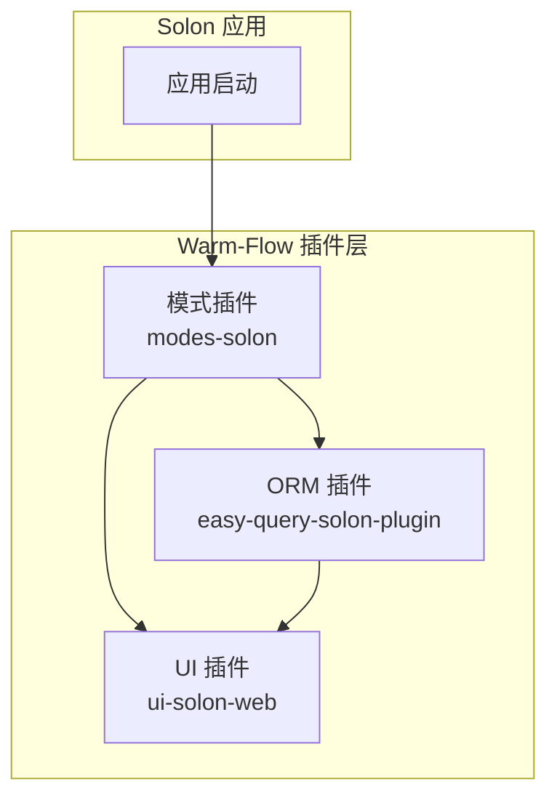
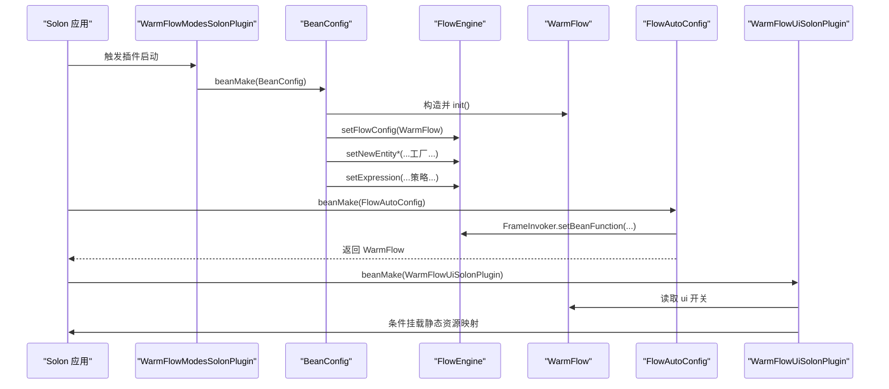
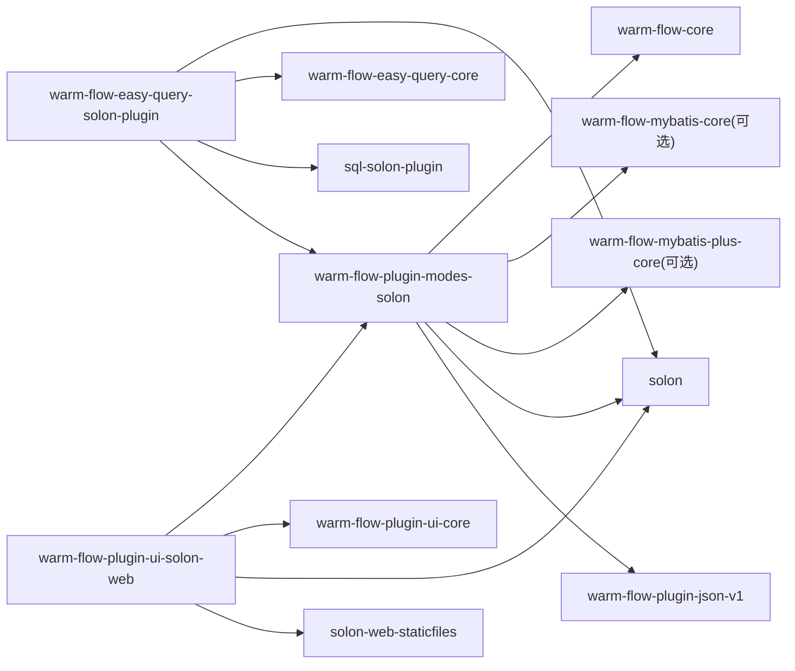

# Solon 集成

<cite>
**本文引用的文件**   
- [WarmFlowModesSolonPlugin.java](file://warm-flow-plugin/warm-flow-plugin-modes/warm-flow-plugin-modes-solon/src/main/java/org/dromara/warm/plugin/modes/solon/WarmFlowModesSolonPlugin.java)
- [BeanConfig.java](file://warm-flow-plugin/warm-flow-plugin-modes/warm-flow-plugin-modes-solon/src/main/java/org/dromara/warm/plugin/modes/solon/config/BeanConfig.java)
- [FlowAutoConfig.java](file://warm-flow-orm/warm-flow-easy-query/warm-flow-easy-query-solon-plugin/src/main/java/org/dromara/warm/flow/solon/config/FlowAutoConfig.java)
- [XPluginImpl.java](file://warm-flow-orm/warm-flow-easy-query/warm-flow-easy-query-solon-plugin/src/main/java/org/dromara/warm/flow/solon/XPluginImpl.java)
- [WarmFlowUiSolonPlugin.java](file://warm-flow-plugin/warm-flow-plugin-ui/warm-flow-plugin-ui-solon-web/src/main/java/org/dromara/warm/flow/ui/WarmFlowUiSolonPlugin.java)
- [org.dromara.warm.plugin.modes.solon.properties](file://warm-flow-plugin/warm-flow-plugin-modes/warm-flow-plugin-modes-solon/src/main/resources/META-INF/solon/org.dromara.warm.plugin.modes.solon.properties)
- [org.dromara.warm.flow.solon.properties](file://warm-flow-orm/warm-flow-easy-query/warm-flow-easy-query-solon-plugin/src/main/resources/META-INF/solon/org.dromara.warm.flow.solon.properties)
- [org.dromara.warm.flow.ui.properties](file://warm-flow-plugin/warm-flow-plugin-ui/warm-flow-plugin-ui-solon-web/src/main/resources/META-INF/solon/org.dromara.warm.flow.ui.properties)
- [WarmFlow.java](file://warm-flow-core/src/main/java/org/dromara/warm/flow/core/config/WarmFlow.java)
- [FlowEngine.java](file://warm-flow-core/src/main/java/org/dromara/warm/flow/core/FlowEngine.java)
- [ConditionStrategySnEl.java](file://warm-flow-plugin/warm-flow-plugin-modes/warm-flow-plugin-modes-solon/src/main/java/org/dromara/warm/plugin/modes/solon/expression/ConditionStrategySnEl.java)
- [WarmFlowController.java](file://warm-flow-plugin/warm-flow-plugin-ui/warm-flow-plugin-ui-solon-web/src/main/java/org/dromara/warm/flow/ui/controller/WarmFlowController.java)
- [warm-flow-plugin-modes-solon/pom.xml](file://warm-flow-plugin/warm-flow-plugin-modes/warm-flow-plugin-modes-solon/pom.xml)
- [warm-flow-easy-query-solon-plugin/pom.xml](file://warm-flow-orm/warm-flow-easy-query/warm-flow-easy-query-solon-plugin/pom.xml)
- [warm-flow-plugin-ui-solon-web/pom.xml](file://warm-flow-plugin/warm-flow-plugin-ui/warm-flow-plugin-ui-solon-web/pom.xml)
</cite>

## 目录
1. [简介](#简介)
2. [项目结构](#项目结构)
3. [核心组件](#核心组件)
4. [架构总览](#架构总览)
5. [组件详解](#组件详解)
6. [依赖关系分析](#依赖关系分析)
7. [性能考量](#性能考量)
8. [故障排查指南](#故障排查指南)
9. [结论](#结论)
10. [附录](#附录)

## 简介
本文件面向在 Solon 项目中集成 Warm-Flow 工作流引擎的开发者，系统性阐述以下内容：
- 如何通过 Solon 插件机制加载 Warm-Flow 的模式插件、ORM 插件与 UI 插件
- 在 Solon 下的依赖注入与 Bean 注册机制（基于 @Bean、@Inject、@Configuration）
- 运行机制与初始化流程（WarmFlow 初始化、表达式策略、实体工厂）
- 与 Spring Boot 集成的差异点（注解体系、Bean 管理、事件与静态资源处理）
- 完整的集成步骤与关键配置要点（含 Maven 依赖、插件声明、WarmFlow 配置）

## 项目结构
Solon 集成涉及三个主要模块：
- 模式插件（modes-solon）：负责在 Solon 中注册工作流相关 Bean、初始化 WarmFlow、绑定表达式策略
- ORM 插件（easy-query-solon-plugin/mybatis-solon-plugin/mybatis-plus-solon-plugin）：在 Solon 中接入 ORM 能力，并与模式插件协同
- UI 插件（ui-solon-web）：在 Solon 中暴露设计器与执行接口，并按需挂载静态资源

图表来源
- [WarmFlowModesSolonPlugin.java:27-35](file://warm-flow-plugin/warm-flow-plugin-modes/warm-flow-plugin-modes-solon/src/main/java/org/dromara/warm/plugin/modes/solon/WarmFlowModesSolonPlugin.java#L27-L35)
- [XPluginImpl.java:27-33](file://warm-flow-orm/warm-flow-easy-query/warm-flow-easy-query-solon-plugin/src/main/java/org/dromara/warm/flow/solon/XPluginImpl.java#L27-L33)
- [WarmFlowUiSolonPlugin.java:29-41](file://warm-flow-plugin/warm-flow-plugin-ui/warm-flow-plugin-ui-solon-web/src/main/java/org/dromara/warm/flow/ui/WarmFlowUiSolonPlugin.java#L29-L41)

章节来源
- [warm-flow-plugin-modes-solon/pom.xml:16-43](file://warm-flow-plugin/warm-flow-plugin-modes/warm-flow-plugin-modes-solon/pom.xml#L16-L43)
- [warm-flow-easy-query-solon-plugin/pom.xml:16-41](file://warm-flow-orm/warm-flow-easy-query/warm-flow-easy-query-solon-plugin/pom.xml#L16-L41)
- [warm-flow-plugin-ui-solon-web/pom.xml:16-36](file://warm-flow-plugin/warm-flow-plugin-ui/warm-flow-plugin-ui-solon-web/pom.xml#L16-L36)

## 核心组件
- WarmFlowModesSolonPlugin：作为模式插件入口，启动时触发 BeanConfig 的装配
- BeanConfig：在 Solon 中以 @Configuration/@Bean 形式注册 DAO、Service、WarmFlow 实例与表达式策略
- FlowAutoConfig：在 ORM 插件中扩展 Bean 解析逻辑，将 ORM 查询能力注入到框架调用器
- WarmFlowUiSolonPlugin：扫描控制器、按配置决定是否挂载 UI 静态资源映射
- WarmFlow：工作流全局配置对象，负责初始化处理器、监听器、SPI 加载等
- FlowEngine：工作流引擎门面，持有服务与实体工厂、配置 WarmFlow

章节来源
- [BeanConfig.java:49-176](file://warm-flow-plugin/warm-flow-plugin-modes/warm-flow-plugin-modes-solon/src/main/java/org/dromara/warm/plugin/modes/solon/config/BeanConfig.java#L49-L176)
- [FlowAutoConfig.java:36-51](file://warm-flow-orm/warm-flow-easy-query/warm-flow-easy-query-solon-plugin/src/main/java/org/dromara/warm/flow/solon/config/FlowAutoConfig.java#L36-L51)
- [WarmFlowUiSolonPlugin.java:29-41](file://warm-flow-plugin/warm-flow-plugin-ui/warm-flow-plugin-ui-solon-web/src/main/java/org/dromara/warm/flow/ui/WarmFlowUiSolonPlugin.java#L29-L41)
- [WarmFlow.java:34-174](file://warm-flow-core/src/main/java/org/dromara/warm/flow/core/config/WarmFlow.java#L34-L174)
- [FlowEngine.java:39-200](file://warm-flow-core/src/main/java/org/dromara/warm/flow/core/FlowEngine.java#L39-L200)

## 架构总览
下图展示 Solon 启动后，Warm-Flow 插件链路如何完成初始化与服务注册：

图表来源
- [WarmFlowModesSolonPlugin.java:30-34](file://warm-flow-plugin/warm-flow-plugin-modes/warm-flow-plugin-modes-solon/src/main/java/org/dromara/warm/plugin/modes/solon/WarmFlowModesSolonPlugin.java#L30-L34)
- [BeanConfig.java:140-156](file://warm-flow-plugin/warm-flow-plugin-modes/warm-flow-plugin-modes-solon/src/main/java/org/dromara/warm/plugin/modes/solon/config/BeanConfig.java#L140-L156)
- [FlowAutoConfig.java:40-50](file://warm-flow-orm/warm-flow-easy-query/warm-flow-easy-query-solon-plugin/src/main/java/org/dromara/warm/flow/solon/config/FlowAutoConfig.java#L40-L50)
- [WarmFlowUiSolonPlugin.java:32-40](file://warm-flow-plugin/warm-flow-plugin-ui/warm-flow-plugin-ui-solon-web/src/main/java/org/dromara/warm/flow/ui/WarmFlowUiSolonPlugin.java#L32-L40)

## 组件详解

### 模式插件 WarmFlowModesSolonPlugin
- 作用：在 Solon 启动阶段注册 BeanConfig，从而触发所有工作流 Bean 的装配
- 关键点：通过 AppContext.beanMake 将配置类交由 Solon 容器管理

章节来源
- [WarmFlowModesSolonPlugin.java:27-35](file://warm-flow-plugin/warm-flow-plugin-modes/warm-flow-plugin-modes-solon/src/main/java/org/dromara/warm/plugin/modes/solon/WarmFlowModesSolonPlugin.java#L27-L35)
- [org.dromara.warm.plugin.modes.solon.properties:1-2](file://warm-flow-plugin/warm-flow-plugin-modes/warm-flow-plugin-modes-solon/src/main/resources/META-INF/solon/org.dromara.warm.plugin.modes.solon.properties#L1-L2)

### BeanConfig（Solon 下的 Bean 注册与 WarmFlow 初始化）
- 通过 @Configuration 声明为配置类，@Bean 声明各类 DAO/Service
- 通过 @Inject 注入 WarmFlow、处理器与监听器
- 初始化流程：
  - 设置实体工厂（newDef/newIns/newTask 等）
  - 设置框架类型为 SOLON
  - 设置表达式策略（条件/监听/处理器/投票）
  - 将 WarmFlow 注入 FlowEngine
- 条件装配：基于 warm-flow.enabled 属性控制是否启用

章节来源
- [BeanConfig.java:49-176](file://warm-flow-plugin/warm-flow-plugin-modes/warm-flow-plugin-modes-solon/src/main/java/org/dromara/warm/plugin/modes/solon/config/BeanConfig.java#L49-L176)
- [WarmFlow.java:130-157](file://warm-flow-core/src/main/java/org/dromara/warm/flow/core/config/WarmFlow.java#L130-L157)
- [FlowEngine.java:108-178](file://warm-flow-core/src/main/java/org/dromara/warm/flow/core/FlowEngine.java#L108-L178)

### ORM 插件 FlowAutoConfig（Easy-Query）
- 继承 BeanConfig，扩展 Bean 解析逻辑
- 使用 @Db 注入 EasyEntityQuery，并将其注入到 FrameInvoker 的 Bean 获取函数中
- 保证 ORM 查询能力在 Warm-Flow 内部可用

章节来源
- [FlowAutoConfig.java:36-51](file://warm-flow-orm/warm-flow-easy-query/warm-flow-easy-query-solon-plugin/src/main/java/org/dromara/warm/flow/solon/config/FlowAutoConfig.java#L36-L51)

### UI 插件 WarmFlowUiSolonPlugin
- 扫描控制器类，注册 Web 控制器
- 读取 WarmFlow 配置，若 ui=true 则挂载静态资源映射，使前端 UI 可访问
- 依赖 solon-web-staticfiles 与 solon-data

章节来源
- [WarmFlowUiSolonPlugin.java:29-41](file://warm-flow-plugin/warm-flow-plugin-ui/warm-flow-plugin-ui-solon-web/src/main/java/org/dromara/warm/flow/ui/WarmFlowUiSolonPlugin.java#L29-L41)
- [org.dromara.warm.flow.ui.properties:1-2](file://warm-flow-plugin/warm-flow-plugin-ui/warm-flow-plugin-ui-solon-web/src/main/resources/META-INF/solon/org.dromara.warm.flow.ui.properties#L1-L2)

### 表达式策略（Solon 版本）
- ConditionStrategySnEl：基于 SnEl 的条件表达式解析器
- 通过 ExpressionUtil 注册到表达式体系，供流程规则使用

章节来源
- [ConditionStrategySnEl.java:24-40](file://warm-flow-plugin/warm-flow-plugin-modes/warm-flow-plugin-modes-solon/src/main/java/org/dromara/warm/plugin/modes/solon/expression/ConditionStrategySnEl.java#L24-L40)

### 控制器（UI 接口）
- WarmFlowController：提供流程设计、表单、执行等接口，统一返回 ApiResult
- 支持事务注解与路径参数、请求头、表单参数等

章节来源
- [WarmFlowController.java:38-244](file://warm-flow-plugin/warm-flow-plugin-ui/warm-flow-plugin-ui-solon-web/src/main/java/org/dromara/warm/flow/ui/controller/WarmFlowController.java#L38-L244)

## 依赖关系分析

图表来源
- [warm-flow-plugin-modes-solon/pom.xml:16-43](file://warm-flow-plugin/warm-flow-plugin-modes/warm-flow-plugin-modes-solon/pom.xml#L16-L43)
- [warm-flow-easy-query-solon-plugin/pom.xml:16-41](file://warm-flow-orm/warm-flow-easy-query/warm-flow-easy-query-solon-plugin/pom.xml#L16-L41)
- [warm-flow-plugin-ui-solon-web/pom.xml:16-36](file://warm-flow-plugin/warm-flow-plugin-ui/warm-flow-plugin-ui-solon-web/pom.xml#L16-L36)

章节来源
- [warm-flow-plugin-modes-solon/pom.xml:16-43](file://warm-flow-plugin/warm-flow-plugin-modes/warm-flow-plugin-modes-solon/pom.xml#L16-L43)
- [warm-flow-easy-query-solon-plugin/pom.xml:16-41](file://warm-flow-orm/warm-flow-easy-query/warm-flow-easy-query-solon-plugin/pom.xml#L16-L41)
- [warm-flow-plugin-ui-solon-web/pom.xml:16-36](file://warm-flow-plugin/warm-flow-plugin-ui/warm-flow-plugin-ui-solon-web/pom.xml#L16-L36)

## 性能考量
- Bean 注册与装配：通过 @Configuration/@Bean 在启动阶段集中装配，避免运行期动态发现开销
- 表达式策略：采用策略注册与缓存，减少重复解析成本
- ORM 集成：通过 FrameInvoker 统一获取 ORM 实例，避免多处硬编码
- 静态资源：仅在 ui=true 时挂载映射，降低不必要的静态文件处理

## 故障排查指南
- 插件未加载
  - 检查 META-INF/solon 下的 solon.plugin 配置是否指向正确的插件类
  - 确认依赖已引入且版本兼容
- WarmFlow 未生效
  - 检查 warm-flow.enabled 是否为 true
  - 确认 WarmFlow Bean 已被装配并 setFlowConfig
- ORM 查询不可用
  - 确认 FlowAutoConfig 已被装配，且 @Db 注解的 EasyEntityQuery 可用
- UI 无法访问
  - 检查 WarmFlow.ui 是否为 true
  - 确认静态资源映射已挂载

章节来源
- [org.dromara.warm.plugin.modes.solon.properties:1-2](file://warm-flow-plugin/warm-flow-plugin-modes/warm-flow-plugin-modes-solon/src/main/resources/META-INF/solon/org.dromara.warm.plugin.modes.solon.properties#L1-L2)
- [org.dromara.warm.flow.solon.properties:1-2](file://warm-flow-orm/warm-flow-easy-query/warm-flow-easy-query-solon-plugin/src/main/resources/META-INF/solon/org.dromara.warm.flow.solon.properties#L1-L2)
- [org.dromara.warm.flow.ui.properties:1-2](file://warm-flow-plugin/warm-flow-plugin-ui/warm-flow-plugin-ui-solon-web/src/main/resources/META-INF/solon/org.dromara.warm.flow.ui.properties#L1-L2)
- [BeanConfig.java:140-156](file://warm-flow-plugin/warm-flow-plugin-modes/warm-flow-plugin-modes-solon/src/main/java/org/dromara/warm/plugin/modes/solon/config/BeanConfig.java#L140-L156)
- [FlowAutoConfig.java:40-50](file://warm-flow-orm/warm-flow-easy-query/warm-flow-easy-query-solon-plugin/src/main/java/org/dromara/warm/flow/solon/config/FlowAutoConfig.java#L40-L50)
- [WarmFlowUiSolonPlugin.java:32-40](file://warm-flow-plugin/warm-flow-plugin-ui/warm-flow-plugin-ui-solon-web/src/main/java/org/dromara/warm/flow/ui/WarmFlowUiSolonPlugin.java#L32-L40)

## 结论
在 Solon 中集成 Warm-Flow 的关键在于：
- 正确声明并加载三个插件（modes、orm、ui）
- 在 Solon 的 @Configuration 中集中注册 Bean 并初始化 WarmFlow
- 通过 FlowAutoConfig 将 ORM 查询能力注入框架调用器
- 依据 WarmFlow 配置按需挂载 UI 静态资源
- 与 Spring Boot 的差异主要体现在注解体系、Bean 管理与静态资源处理上

## 附录

### 与 Spring Boot 集成的差异与特点
- 注解体系
  - Solon 使用 @Configuration/@Bean/@Inject 等；Spring Boot 使用 @ComponentScan/@Service/@Autowired 等
- Bean 管理
  - Solon 通过 AppContext.beanMake 与 @Configuration 驱动装配；Spring Boot 通过组件扫描自动注册
- 事件与静态资源
  - Solon 通过插件与静态资源映射进行 UI 发布；Spring Boot 通常通过 WebMvcConfigurer 或自动装配
- 表达式与策略
  - 两者均通过策略注册机制实现，但 Solon 版本使用 SnEl 相关策略类

### 完整集成步骤（Solon 环境）
- 添加依赖
  - 引入 warm-flow-plugin-modes-solon、任一 ORM 插件（如 easy-query-solon-plugin）、warm-flow-plugin-ui-solon-web
- 插件加载
  - 确保各模块的 solon.plugin 配置正确指向插件类
- 配置 WarmFlow
  - 在配置文件中设置 warm-flow.* 相关属性（如 enabled、ui、tokenName 等）
- 启动验证
  - 启动应用，确认日志输出“Warm-Flow”初始化成功
  - 访问 UI 路径或调用控制器接口验证功能

章节来源
- [BeanConfig.java:140-156](file://warm-flow-plugin/warm-flow-plugin-modes/warm-flow-plugin-modes-solon/src/main/java/org/dromara/warm/plugin/modes/solon/config/BeanConfig.java#L140-L156)
- [WarmFlow.java:34-174](file://warm-flow-core/src/main/java/org/dromara/warm/flow/core/config/WarmFlow.java#L34-L174)
- [WarmFlowUiSolonPlugin.java:32-40](file://warm-flow-plugin/warm-flow-plugin-ui/warm-flow-plugin-ui-solon-web/src/main/java/org/dromara/warm/flow/ui/WarmFlowUiSolonPlugin.java#L32-L40)