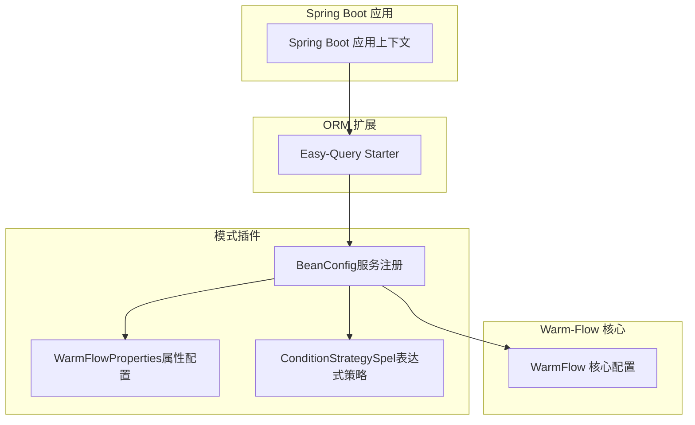
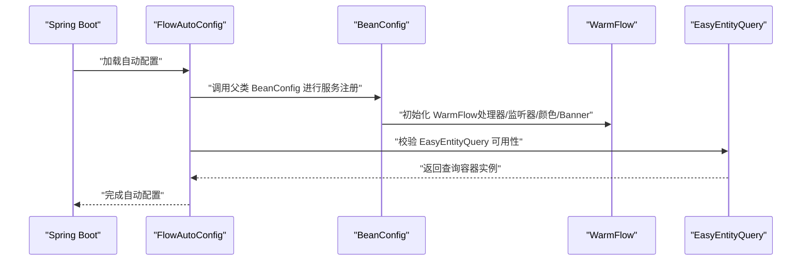
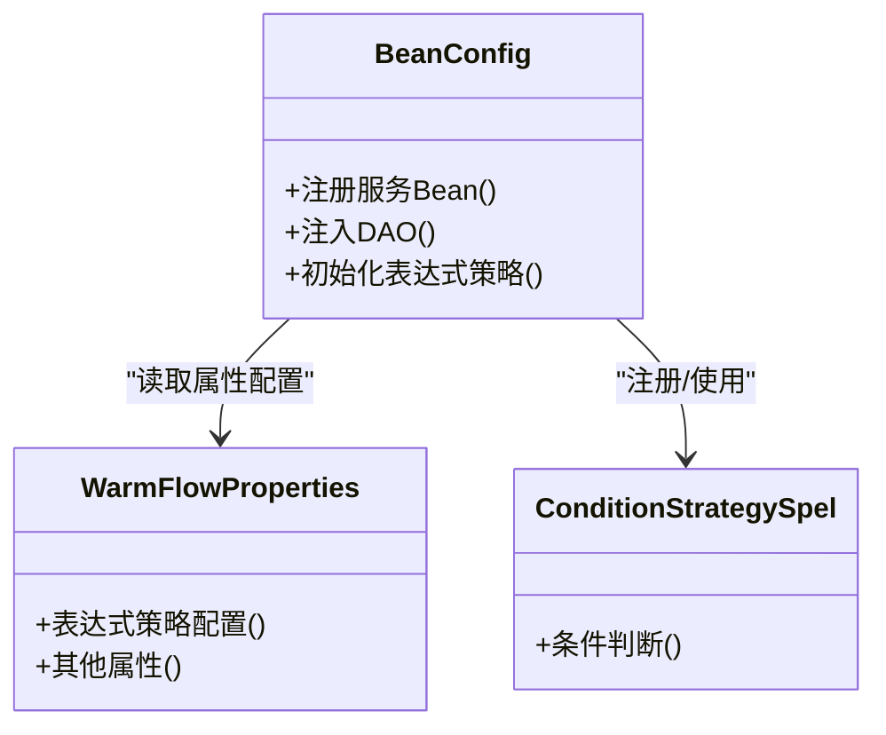
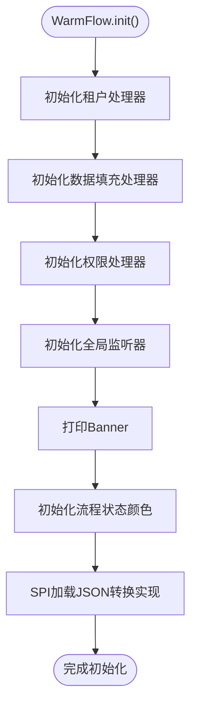
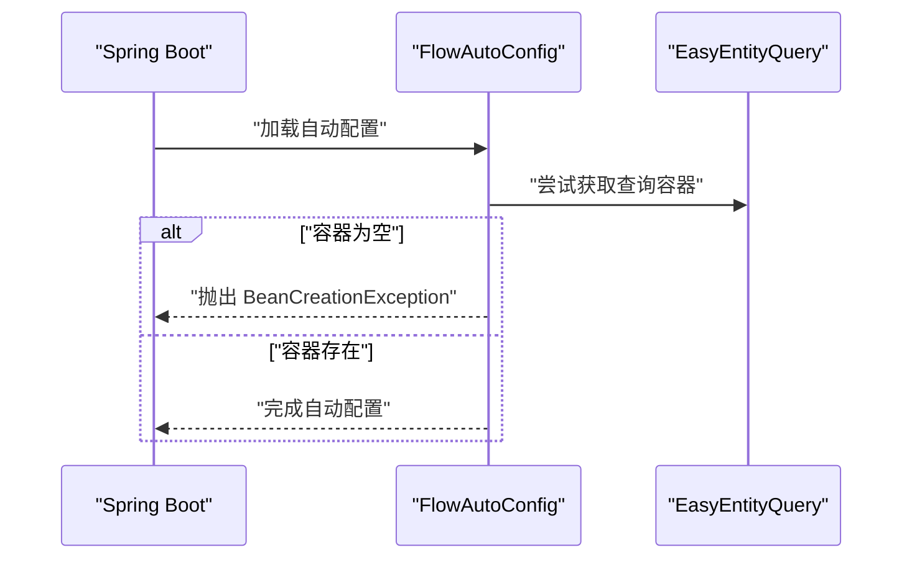
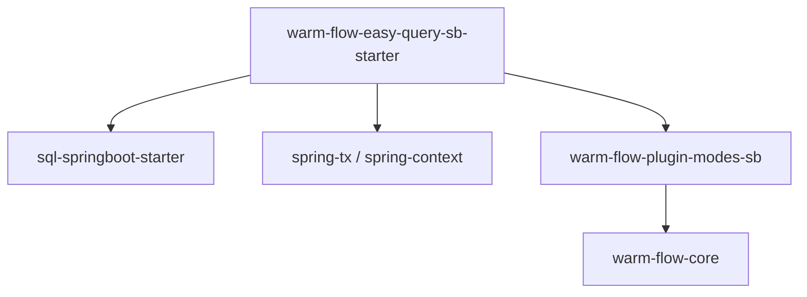

# Spring Boot 集成

<cite>
**本文引用的文件**
- [warm-flow-core/src/main/java/org/dromara/warm/flow/core/config/WarmFlow.java](file://warm-flow-core/src/main/java/org/dromara/warm/flow/core/config/WarmFlow.java)
- [warm-flow-orm/warm-flow-easy-query/warm-flow-easy-query-sb-starter/src/main/java/org/dromara/warm/flow/spring/boot/config/FlowAutoConfig.java](file://warm-flow-orm/warm-flow-easy-query/warm-flow-easy-query-sb-starter/src/main/java/org/dromara/warm/flow/spring/boot/config/FlowAutoConfig.java)
- [warm-flow-orm/warm-flow-easy-query/warm-flow-easy-query-sb-starter/src/main/resources/META-INF/spring.factories](file://warm-flow-orm/warm-flow-easy-query/warm-flow-easy-query-sb-starter/src/main/resources/META-INF/spring.factories)
- [warm-flow-orm/warm-flow-easy-query/warm-flow-easy-query-sb-starter/src/main/resources/META-INF/spring/org.springframework.boot.autoconfigure.AutoConfiguration.imports](file://warm-flow-orm/warm-flow-easy-query/warm-flow-easy-query-sb-starter/src/main/resources/META-INF/spring/org.springframework.boot.autoconfigure.AutoConfiguration.imports)
- [warm-flow-orm/warm-flow-easy-query/warm-flow-easy-query-sb-starter/pom.xml](file://warm-flow-orm/warm-flow-easy-query/warm-flow-easy-query-sb-starter/pom.xml)
- [warm-flow-core/pom.xml](file://warm-flow-core/pom.xml)
- [warm-flow-plugin/warm-flow-plugin-modes/warm-flow-plugin-modes-sb/src/main/java/org/dromara/warm/plugin/modes/sb/config/BeanConfig.java](file://warm-flow-plugin/warm-flow-plugin-modes/warm-flow-plugin-modes-sb/src/main/java/org/dromara/warm/plugin/modes/sb/config/BeanConfig.java)
- [warm-flow-plugin/warm-flow-plugin-modes/warm-flow-plugin-modes-sb/src/main/java/org/dromara/warm/plugin/modes/sb/config/WarmFlowProperties.java](file://warm-flow-plugin/warm-flow-plugin-modes/warm-flow-plugin-modes-sb/src/main/java/org/dromara/warm/plugin/modes/sb/config/WarmFlowProperties.java)
- [warm-flow-plugin/warm-flow-plugin-modes/warm-flow-plugin-modes-sb/src/main/java/org/dromara/warm/plugin/modes/sb/expression/ConditionStrategySpel.java](file://warm-flow-plugin/warm-flow-plugin-modes/warm-flow-plugin-modes-sb/src/main/java/org/dromara/warm/plugin/modes/sb/expression/ConditionStrategySpel.java)
</cite>

## 目录
1. [简介](#简介)
2. [项目结构](#项目结构)
3. [核心组件](#核心组件)
4. [架构总览](#架构总览)
5. [详细组件分析](#详细组件分析)
6. [依赖分析](#依赖分析)
7. [性能考虑](#性能考虑)
8. [故障排查指南](#故障排查指南)
9. [结论](#结论)
10. [附录](#附录)

## 简介
本文件面向在 Spring Boot 项目中集成 Warm-Flow 工作流引擎的开发者，系统性说明从 Maven 依赖引入、自动配置启用、属性配置到 Bean 注册与表达式策略的关键要点。重点覆盖以下内容：
- 如何通过 Starter 引入 Warm-Flow 并启用自动配置
- BeanConfig 的作用与服务 Bean 注册机制
- WarmFlowProperties 的配置项与使用方式（含表达式策略）
- WarmFlow 核心配置类的初始化流程与 SPI 加载
- 多数据源、事务管理、AOP 切面等高级集成建议

## 项目结构
Warm-Flow 在 Spring Boot 中采用“核心引擎 + ORM 扩展 + 模式插件 + UI 插件”的分层结构：
- warm-flow-core：核心引擎与通用能力（配置、实体、枚举、工具、服务接口）
- warm-flow-orm：ORM 扩展（MyBatis、MyBatis-Plus、Easy-Query 等）
- warm-flow-plugin：模式与 UI 插件（表达式策略、UI 控制器、Spring/Solon 自动装配）
- warm-flow-ui：前端设计器资源（可选）

下图展示 Spring Boot 集成的关键模块关系与装配入口：

图表来源
- [warm-flow-orm/warm-flow-easy-query/warm-flow-easy-query-sb-starter/src/main/java/org/dromara/warm/flow/spring/boot/config/FlowAutoConfig.java:32-44](file://warm-flow-orm/warm-flow-easy-query/warm-flow-easy-query-sb-starter/src/main/java/org/dromara/warm/flow/spring/boot/config/FlowAutoConfig.java#L32-L44)
- [warm-flow-plugin/warm-flow-plugin-modes/warm-flow-plugin-modes-sb/src/main/java/org/dromara/warm/plugin/modes/sb/config/BeanConfig.java](file://warm-flow-plugin/warm-flow-plugin-modes/warm-flow-plugin-modes-sb/src/main/java/org/dromara/warm/plugin/modes/sb/config/BeanConfig.java)
- [warm-flow-plugin/warm-flow-plugin-modes/warm-flow-plugin-modes-sb/src/main/java/org/dromara/warm/plugin/modes/sb/config/WarmFlowProperties.java](file://warm-flow-plugin/warm-flow-plugin-modes/warm-flow-plugin-modes-sb/src/main/java/org/dromara/warm/plugin/modes/sb/config/WarmFlowProperties.java)
- [warm-flow-plugin/warm-flow-plugin-modes/warm-flow-plugin-modes-sb/src/main/java/org/dromara/warm/plugin/modes/sb/expression/ConditionStrategySpel.java](file://warm-flow-plugin/warm-flow-plugin-modes/warm-flow-plugin-modes-sb/src/main/java/org/dromara/warm/plugin/modes/sb/expression/ConditionStrategySpel.java)

章节来源
- [warm-flow-orm/warm-flow-easy-query/warm-flow-easy-query-sb-starter/src/main/resources/META-INF/spring.factories:1-3](file://warm-flow-orm/warm-flow-easy-query/warm-flow-easy-query-sb-starter/src/main/resources/META-INF/spring.factories#L1-L3)
- [warm-flow-orm/warm-flow-easy-query/warm-flow-easy-query-sb-starter/src/main/resources/META-INF/spring/org.springframework.boot.autoconfigure.AutoConfiguration.imports:1-2](file://warm-flow-orm/warm-flow-easy-query/warm-flow-easy-query-sb-starter/src/main/resources/META-INF/spring/org.springframework.boot.autoconfigure.AutoConfiguration.imports#L1-L2)

## 核心组件
- WarmFlow 核心配置类：负责加载租户、数据填充、权限、全局监听器、流程状态颜色、Banner 输出以及 JSON 转换 SPI 等初始化逻辑。
- FlowAutoConfig 自动配置类：继承模式插件的 BeanConfig，在启动后校验 Easy-Query 容器可用性，确保 ORM 基础设施就绪。
- BeanConfig 服务注册：在 Spring 上下文中注册 Warm-Flow 所需的服务 Bean，作为 ORM 扩展与核心引擎之间的桥梁。
- WarmFlowProperties 属性配置：提供表达式策略、DAO 注入、服务 Bean 等配置入口。
- ConditionStrategySpel 表达式策略：基于 SpEL 的条件判断策略实现。

章节来源
- [warm-flow-core/src/main/java/org/dromara/warm/flow/core/config/WarmFlow.java:34-157](file://warm-flow-core/src/main/java/org/dromara/warm/flow/core/config/WarmFlow.java#L34-L157)
- [warm-flow-orm/warm-flow-easy-query/warm-flow-easy-query-sb-starter/src/main/java/org/dromara/warm/flow/spring/boot/config/FlowAutoConfig.java:32-44](file://warm-flow-orm/warm-flow-easy-query/warm-flow-easy-query-sb-starter/src/main/java/org/dromara/warm/flow/spring/boot/config/FlowAutoConfig.java#L32-L44)
- [warm-flow-plugin/warm-flow-plugin-modes/warm-flow-plugin-modes-sb/src/main/java/org/dromara/warm/plugin/modes/sb/config/BeanConfig.java](file://warm-flow-plugin/warm-flow-plugin-modes/warm-flow-plugin-modes-sb/src/main/java/org/dromara/warm/plugin/modes/sb/config/BeanConfig.java)
- [warm-flow-plugin/warm-flow-plugin-modes/warm-flow-plugin-modes-sb/src/main/java/org/dromara/warm/plugin/modes/sb/config/WarmFlowProperties.java](file://warm-flow-plugin/warm-flow-plugin-modes/warm-flow-plugin-modes-sb/src/main/java/org/dromara/warm/plugin/modes/sb/config/WarmFlowProperties.java)
- [warm-flow-plugin/warm-flow-plugin-modes/warm-flow-plugin-modes-sb/src/main/java/org/dromara/warm/plugin/modes/sb/expression/ConditionStrategySpel.java](file://warm-flow-plugin/warm-flow-plugin-modes/warm-flow-plugin-modes-sb/src/main/java/org/dromara/warm/plugin/modes/sb/expression/ConditionStrategySpel.java)

## 架构总览
Warm-Flow 在 Spring Boot 中的装配流程如下：
- Spring Boot 启动时扫描 META-INF 下的自动配置入口，加载 FlowAutoConfig
- FlowAutoConfig 继承 BeanConfig，完成服务 Bean 注册与 WarmFlow 初始化
- WarmFlow.init() 负责加载处理器、监听器、颜色配置与 Banner 输出
- Easy-Query 容器用于 ORM 查询能力，FlowAutoConfig 在启动后进行可用性校验

图表来源
- [warm-flow-orm/warm-flow-easy-query/warm-flow-easy-query-sb-starter/src/main/resources/META-INF/spring.factories:1-3](file://warm-flow-orm/warm-flow-easy-query/warm-flow-easy-query-sb-starter/src/main/resources/META-INF/spring.factories#L1-L3)
- [warm-flow-orm/warm-flow-easy-query/warm-flow-easy-query-sb-starter/src/main/resources/META-INF/spring/org.springframework.boot.autoconfigure.AutoConfiguration.imports:1-2](file://warm-flow-orm/warm-flow-easy-query/warm-flow-easy-query-sb-starter/src/main/resources/META-INF/spring/org.springframework.boot.autoconfigure.AutoConfiguration.imports#L1-L2)
- [warm-flow-orm/warm-flow-easy-query/warm-flow-easy-query-sb-starter/src/main/java/org/dromara/warm/flow/spring/boot/config/FlowAutoConfig.java:32-44](file://warm-flow-orm/warm-flow-easy-query/warm-flow-easy-query-sb-starter/src/main/java/org/dromara/warm/flow/spring/boot/config/FlowAutoConfig.java#L32-L44)
- [warm-flow-core/src/main/java/org/dromara/warm/flow/core/config/WarmFlow.java:130-157](file://warm-flow-core/src/main/java/org/dromara/warm/flow/core/config/WarmFlow.java#L130-L157)

## 详细组件分析

### BeanConfig 服务注册与 DAO 注入
- BeanConfig 作为模式插件的核心注册类，负责在 Spring 上下文中注册 Warm-Flow 所需的服务 Bean，使核心引擎能够通过 Spring 获取 DAO 与服务实例。
- 该类通常会将各 Service 实现（如 DefService、InsService、TaskService 等）以 @Service 或 @Component 形式暴露给容器，供控制器或业务层注入使用。
- DAO 层通过 ORM 扩展（如 Easy-Query）提供的查询容器进行数据访问，BeanConfig 将这些 DAO 注入到对应 Service 中，形成“DAO -> Service -> Controller”的标准分层。

图表来源
- [warm-flow-plugin/warm-flow-plugin-modes/warm-flow-plugin-modes-sb/src/main/java/org/dromara/warm/plugin/modes/sb/config/BeanConfig.java](file://warm-flow-plugin/warm-flow-plugin-modes/warm-flow-plugin-modes-sb/src/main/java/org/dromara/warm/plugin/modes/sb/config/BeanConfig.java)
- [warm-flow-plugin/warm-flow-plugin-modes/warm-flow-plugin-modes-sb/src/main/java/org/dromara/warm/plugin/modes/sb/config/WarmFlowProperties.java](file://warm-flow-plugin/warm-flow-plugin-modes/warm-flow-plugin-modes-sb/src/main/java/org/dromara/warm/plugin/modes/sb/config/WarmFlowProperties.java)
- [warm-flow-plugin/warm-flow-plugin-modes/warm-flow-plugin-modes-sb/src/main/java/org/dromara/warm/plugin/modes/sb/expression/ConditionStrategySpel.java](file://warm-flow-plugin/warm-flow-plugin-modes/warm-flow-plugin-modes-sb/src/main/java/org/dromara/warm/plugin/modes/sb/expression/ConditionStrategySpel.java)

章节来源
- [warm-flow-plugin/warm-flow-plugin-modes/warm-flow-plugin-modes-sb/src/main/java/org/dromara/warm/plugin/modes/sb/config/BeanConfig.java](file://warm-flow-plugin/warm-flow-plugin-modes/warm-flow-plugin-modes-sb/src/main/java/org/dromara/warm/plugin/modes/sb/config/BeanConfig.java)

### WarmFlowProperties 配置项与使用
WarmFlowProperties 提供表达式策略等配置入口，典型用途包括：
- 表达式策略：选择 SpEL 等策略实现，用于节点条件判断、监听器变量解析等
- 其他属性：与 BeanConfig 协同，驱动服务 Bean 的行为与注入时机

章节来源
- [warm-flow-plugin/warm-flow-plugin-modes/warm-flow-plugin-modes-sb/src/main/java/org/dromara/warm/plugin/modes/sb/config/WarmFlowProperties.java](file://warm-flow-plugin/warm-flow-plugin-modes/warm-flow-plugin-modes-sb/src/main/java/org/dromara/warm/plugin/modes/sb/config/WarmFlowProperties.java)

### WarmFlow 核心配置类初始化流程
WarmFlow.init() 负责：
- 初始化租户处理器、数据填充处理器、权限处理器、全局监听器
- 打印 Banner
- 初始化流程状态颜色（支持多种模式）
- 通过 SPI 机制加载 JSON 转换实现

图表来源
- [warm-flow-core/src/main/java/org/dromara/warm/flow/core/config/WarmFlow.java:130-157](file://warm-flow-core/src/main/java/org/dromara/warm/flow/core/config/WarmFlow.java#L130-L157)

章节来源
- [warm-flow-core/src/main/java/org/dromara/warm/flow/core/config/WarmFlow.java:34-157](file://warm-flow-core/src/main/java/org/dromara/warm/flow/core/config/WarmFlow.java#L34-L157)

### FlowAutoConfig 自动配置与 Easy-Query 校验
FlowAutoConfig 继承 BeanConfig，并在启动后校验 EasyEntityQuery 是否可用，确保 ORM 查询能力已就绪。该类通过 Spring Boot 的自动配置机制被加载。

图表来源
- [warm-flow-orm/warm-flow-easy-query/warm-flow-easy-query-sb-starter/src/main/java/org/dromara/warm/flow/spring/boot/config/FlowAutoConfig.java:32-44](file://warm-flow-orm/warm-flow-easy-query/warm-flow-easy-query-sb-starter/src/main/java/org/dromara/warm/flow/spring/boot/config/FlowAutoConfig.java#L32-L44)

章节来源
- [warm-flow-orm/warm-flow-easy-query/warm-flow-easy-query-sb-starter/src/main/java/org/dromara/warm/flow/spring/boot/config/FlowAutoConfig.java:32-44](file://warm-flow-orm/warm-flow-easy-query/warm-flow-easy-query-sb-starter/src/main/java/org/dromara/warm/flow/spring/boot/config/FlowAutoConfig.java#L32-L44)

## 依赖分析
Warm-Flow 在 Spring Boot 中的依赖关系如下：
- warm-flow-easy-query-sb-starter 依赖 Easy-Query Spring Boot Starter、Spring Tx/Context 以及 warm-flow-plugin-modes-sb
- warm-flow-core 提供核心能力与依赖（SLF4J、Lombok 等）

图表来源
- [warm-flow-orm/warm-flow-easy-query/warm-flow-easy-query-sb-starter/pom.xml:16-41](file://warm-flow-orm/warm-flow-easy-query/warm-flow-easy-query-sb-starter/pom.xml#L16-L41)
- [warm-flow-core/pom.xml:16-33](file://warm-flow-core/pom.xml#L16-L33)

章节来源
- [warm-flow-orm/warm-flow-easy-query/warm-flow-easy-query-sb-starter/pom.xml:16-41](file://warm-flow-orm/warm-flow-easy-query/warm-flow-easy-query-sb-starter/pom.xml#L16-L41)
- [warm-flow-core/pom.xml:16-33](file://warm-flow-core/pom.xml#L16-L33)

## 性能考虑
- 启动阶段仅进行必要初始化（处理器、监听器、颜色、Banner），避免在热路径上执行重操作
- 使用 SPI 加载 JSON 转换实现，便于替换高性能实现（如 Jackson/Gson/FastJson）
- Easy-Query 查询容器应与应用数据源一致，减少跨数据源带来的额外开销
- 表达式策略（SpEL）在高并发场景下可能带来一定计算成本，建议结合缓存与合理设计表达式

## 故障排查指南
- EasyEntityQuery 未找到：FlowAutoConfig 在启动后会校验 EasyEntityQuery 是否可用，若缺失会抛出 BeanCreationException。请检查 Easy-Query Starter 是否正确引入与版本兼容。
- 自动配置未生效：确认 warm-flow-easy-query-sb-starter 已在 classpath 中，且 Spring Boot 版本与 Starter 兼容。
- 属性不生效：WarmFlowProperties 的配置项需与 BeanConfig 协同生效，检查属性命名与类型是否匹配。

章节来源
- [warm-flow-orm/warm-flow-easy-query/warm-flow-easy-query-sb-starter/src/main/java/org/dromara/warm/flow/spring/boot/config/FlowAutoConfig.java:36-43](file://warm-flow-orm/warm-flow-easy-query/warm-flow-easy-query-sb-starter/src/main/java/org/dromara/warm/flow/spring/boot/config/FlowAutoConfig.java#L36-L43)

## 结论
通过 warm-flow-easy-query-sb-starter 与模式插件的配合，Warm-Flow 在 Spring Boot 中实现了零样板化的自动装配与服务注册。开发者只需引入 Starter、按需配置 WarmFlowProperties，即可快速启用工作流引擎，并借助 BeanConfig 与 WarmFlow.init() 完成处理器、监听器与表达式策略的初始化。

## 附录

### Maven 依赖与自动配置启用
- 引入 warm-flow-easy-query-sb-starter，确保包含 Easy-Query 与 Spring 上下文依赖
- 确保 Spring Boot 自动配置扫描到 FlowAutoConfig（由 spring.factories 或 AutoConfiguration.imports 提供）

章节来源
- [warm-flow-orm/warm-flow-easy-query/warm-flow-easy-query-sb-starter/pom.xml:16-41](file://warm-flow-orm/warm-flow-easy-query/warm-flow-easy-query-sb-starter/pom.xml#L16-L41)
- [warm-flow-orm/warm-flow-easy-query/warm-flow-easy-query-sb-starter/src/main/resources/META-INF/spring.factories:1-3](file://warm-flow-orm/warm-flow-easy-query/warm-flow-easy-query-sb-starter/src/main/resources/META-INF/spring.factories#L1-L3)
- [warm-flow-orm/warm-flow-easy-query/warm-flow-easy-query-sb-starter/src/main/resources/META-INF/spring/org.springframework.boot.autoconfigure.AutoConfiguration.imports:1-2](file://warm-flow-orm/warm-flow-easy-query/warm-flow-easy-query-sb-starter/src/main/resources/META-INF/spring/org.springframework.boot.autoconfigure.AutoConfiguration.imports#L1-L2)

### 高级集成建议
- 多数据源：确保 Easy-Query 的数据源与业务数据源一致；如需隔离，建议通过 ORM 扩展提供的多数据源适配能力进行配置
- 事务管理：在工作流相关 Service 方法上使用 @Transactional，保证流程状态变更与业务数据的一致性
- AOP 切面：可在 WarmFlow.init() 注册的全局监听器中接入切面逻辑，实现统一的日志、审计与监控