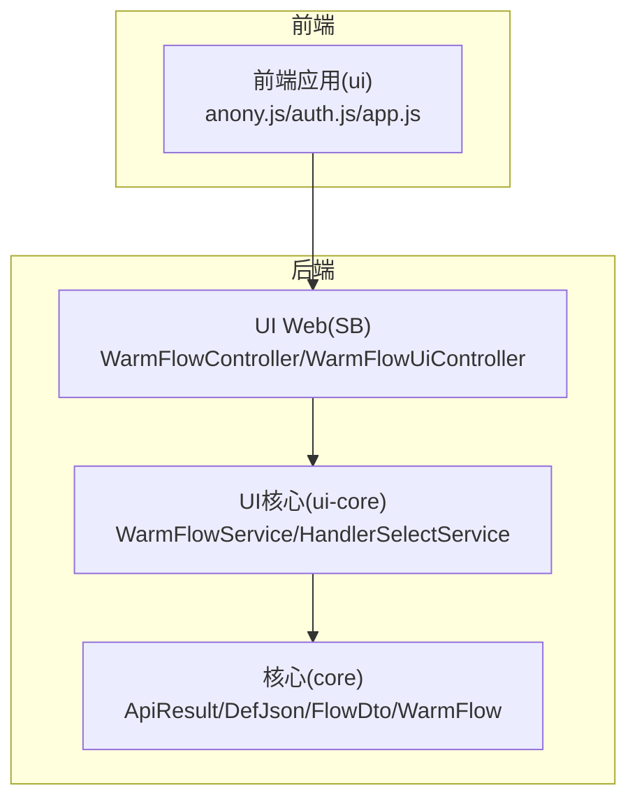
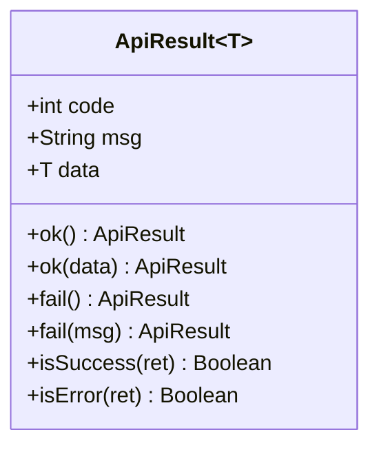
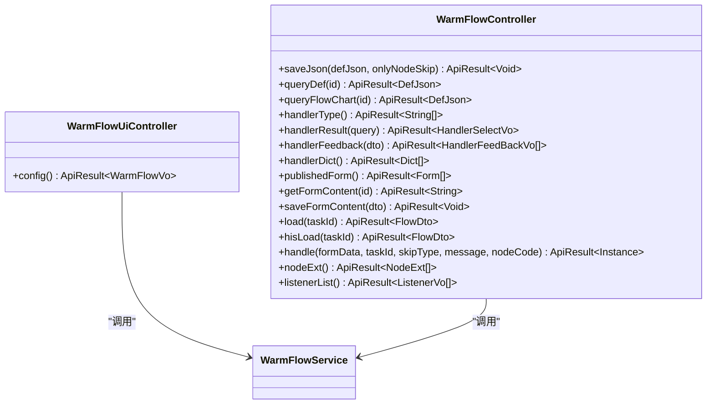
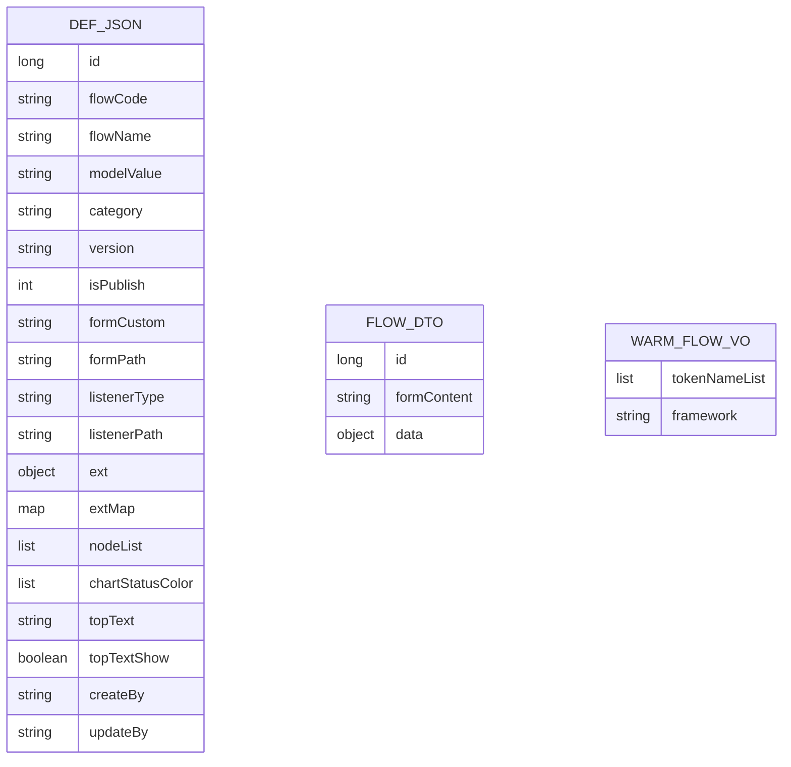
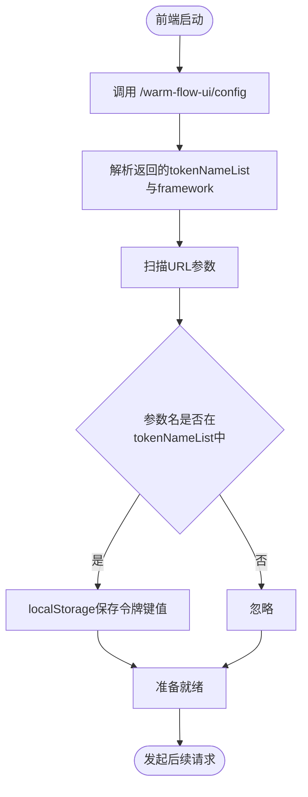
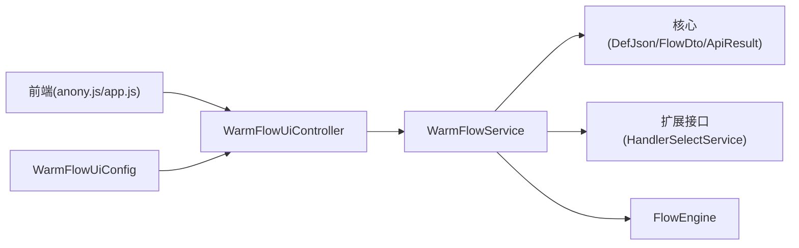

# 第三方系统集成

<cite>
**本文引用的文件**   
- [ApiResult.java](file://warm-flow-core/src/main/java/org/dromara/warm/flow/core/dto/ApiResult.java)
- [WarmFlowController.java](file://warm-flow-plugin/warm-flow-plugin-ui/warm-flow-plugin-ui-sb-web/src/main/java/org/dromara/warm/flow/ui/controller/WarmFlowController.java)
- [WarmFlowUiController.java](file://warm-flow-plugin/warm-flow-plugin-ui/warm-flow-plugin-ui-sb-web/src/main/java/org/dromara/warm/flow/ui/controller/WarmFlowUiController.java)
- [WarmFlowService.java](file://warm-flow-plugin/warm-flow-plugin-ui/warm-flow-plugin-ui-core/src/main/java/org/dromara/warm/flow/ui/service/WarmFlowService.java)
- [WarmFlowVo.java](file://warm-flow-plugin/warm-flow-plugin-ui/warm-flow-plugin-ui-core/src/main/java/org/dromara/warm/flow/ui/vo/WarmFlowVo.java)
- [WarmFlow.java](file://warm-flow-core/src/main/java/org/dromara/warm/flow/core/config/WarmFlow.java)
- [DefJson.java](file://warm-flow-core/src/main/java/org/dromara/warm/flow/core/dto/DefJson.java)
- [FlowDto.java](file://warm-flow-core/src/main/java/org/dromara/warm/flow/core/dto/FlowDto.java)
- [HandlerSelectService.java](file://warm-flow-plugin/warm-flow-plugin-ui/warm-flow-plugin-ui-core/src/main/java/org/dromara/warm/flow/ui/service/HandlerSelectService.java)
- [WarmFlowUiConfig.java](file://warm-flow-plugin/warm-flow-plugin-ui/warm-flow-plugin-ui-sb-web/src/main/java/org/dromara/warm/flow/ui/config/WarmFlowUiConfig.java)
- [anony.js](file://warm-flow-ui/src/api/anony.js)
- [auth.js](file://warm-flow-ui/src/utils/auth.js)
- [app.js](file://warm-flow-ui/src/store/app.js)
</cite>

## 目录
1. [简介](#简介)
2. [项目结构](#项目结构)
3. [核心组件](#核心组件)
4. [架构总览](#架构总览)
5. [详细组件分析](#详细组件分析)
6. [依赖分析](#依赖分析)
7. [性能考虑](#性能考虑)
8. [故障排查指南](#故障排查指南)
9. [结论](#结论)
10. [附录](#附录)

## 简介
本技术文档面向第三方系统集成Warm-Flow的场景，系统性阐述REST API接口设计、数据格式规范、认证授权机制、UI插件控制器使用方法以及统一响应体ApiResult的标准化处理。同时提供单点登录集成、消息队列集成、文件存储集成等常见第三方系统集成场景的实践建议与实现路径。

## 项目结构
Warm-Flow采用多模块分层组织，核心能力集中在warm-flow-core，UI相关能力在warm-flow-plugin-ui系列模块，前端界面在warm-flow-ui。第三方系统集成主要围绕以下模块展开：
- warm-flow-core：核心引擎、实体、DTO、统一响应体、配置等
- warm-flow-plugin-ui-core：UI服务编排、业务扩展接口（如HandlerSelectService）
- warm-flow-plugin-ui-sb-web：Spring Boot Web控制器（WarmFlowController、WarmFlowUiController）
- warm-flow-ui：前端应用，负责初始化、认证头注入、请求转发

**图表来源**
- [WarmFlowController.java:38-216](file://warm-flow-plugin/warm-flow-plugin-ui/warm-flow-plugin-ui-sb-web/src/main/java/org/dromara/warm/flow/ui/controller/WarmFlowController.java#L38-L216)
- [WarmFlowUiController.java:30-44](file://warm-flow-plugin/warm-flow-plugin-ui/warm-flow-plugin-ui-sb-web/src/main/java/org/dromara/warm/flow/ui/controller/WarmFlowUiController.java#L30-L44)
- [WarmFlowService.java:44-375](file://warm-flow-plugin/warm-flow-plugin-ui/warm-flow-plugin-ui-core/src/main/java/org/dromara/warm/flow/ui/service/WarmFlowService.java#L44-L375)
- [ApiResult.java:30-96](file://warm-flow-core/src/main/java/org/dromara/warm/flow/core/dto/ApiResult.java#L30-L96)
- [DefJson.java:44-292](file://warm-flow-core/src/main/java/org/dromara/warm/flow/core/dto/DefJson.java#L44-L292)
- [FlowDto.java:31-54](file://warm-flow-core/src/main/java/org/dromara/warm/flow/core/dto/FlowDto.java#L31-L54)
- [WarmFlow.java:36-174](file://warm-flow-core/src/main/java/org/dromara/warm/flow/core/config/WarmFlow.java#L36-L174)
- [anony.js:6-11](file://warm-flow-ui/src/api/anony.js#L6-L11)
- [auth.js:1-37](file://warm-flow-ui/src/utils/auth.js#L1-L37)
- [app.js:1-41](file://warm-flow-ui/src/store/app.js#L1-L41)

**章节来源**
- [WarmFlowController.java:38-216](file://warm-flow-plugin/warm-flow-plugin-ui/warm-flow-plugin-ui-sb-web/src/main/java/org/dromara/warm/flow/ui/controller/WarmFlowController.java#L38-L216)
- [WarmFlowUiController.java:30-44](file://warm-flow-plugin/warm-flow-plugin-ui/warm-flow-plugin-ui-sb-web/src/main/java/org/dromara/warm/flow/ui/controller/WarmFlowUiController.java#L30-L44)
- [WarmFlowService.java:44-375](file://warm-flow-plugin/warm-flow-plugin-ui/warm-flow-plugin-ui-core/src/main/java/org/dromara/warm/flow/ui/service/WarmFlowService.java#L44-L375)
- [ApiResult.java:30-96](file://warm-flow-core/src/main/java/org/dromara/warm/flow/core/dto/ApiResult.java#L30-L96)
- [DefJson.java:44-292](file://warm-flow-core/src/main/java/org/dromara/warm/flow/core/dto/DefJson.java#L44-L292)
- [FlowDto.java:31-54](file://warm-flow-core/src/main/java/org/dromara/warm/flow/core/dto/FlowDto.java#L31-L54)
- [WarmFlow.java:36-174](file://warm-flow-core/src/main/java/org/dromara/warm/flow/core/config/WarmFlow.java#L36-L174)
- [anony.js:6-11](file://warm-flow-ui/src/api/anony.js#L6-L11)
- [auth.js:1-37](file://warm-flow-ui/src/utils/auth.js#L1-L37)
- [app.js:1-41](file://warm-flow-ui/src/store/app.js#L1-L41)

## 核心组件
- 统一响应体ApiResult：提供成功/失败的统一封装，包含code/msg/data三要素，便于前后端一致化处理。
- 控制器WarmFlowController：提供流程设计、表单、执行等REST接口，支持事务性操作。
- 控制器WarmFlowUiController：提供匿名访问的UI配置接口，用于前端初始化令牌名与框架类型。
- UI服务WarmFlowService：编排核心业务，调用FlowEngine与扩展接口（如HandlerSelectService），并以ApiResult返回。
- 配置WarmFlow：集中管理框架类型、令牌名、UI开关、状态颜色等，支撑第三方系统共享业务系统权限。
- 数据传输对象DefJson/FlowDto：定义流程定义JSON、表单内容与数据的结构化载体。
- 扩展接口HandlerSelectService：第三方系统实现“办理人权限”等业务数据查询与回显。

**章节来源**
- [ApiResult.java:30-96](file://warm-flow-core/src/main/java/org/dromara/warm/flow/core/dto/ApiResult.java#L30-L96)
- [WarmFlowController.java:38-216](file://warm-flow-plugin/warm-flow-plugin-ui/warm-flow-plugin-ui-sb-web/src/main/java/org/dromara/warm/flow/ui/controller/WarmFlowController.java#L38-L216)
- [WarmFlowUiController.java:30-44](file://warm-flow-plugin/warm-flow-plugin-ui/warm-flow-plugin-ui-sb-web/src/main/java/org/dromara/warm/flow/ui/controller/WarmFlowUiController.java#L30-L44)
- [WarmFlowService.java:44-375](file://warm-flow-plugin/warm-flow-plugin-ui/warm-flow-plugin-ui-core/src/main/java/org/dromara/warm/flow/ui/service/WarmFlowService.java#L44-L375)
- [WarmFlow.java:36-174](file://warm-flow-core/src/main/java/org/dromara/warm/flow/core/config/WarmFlow.java#L36-L174)
- [DefJson.java:44-292](file://warm-flow-core/src/main/java/org/dromara/warm/flow/core/dto/DefJson.java#L44-L292)
- [FlowDto.java:31-54](file://warm-flow-core/src/main/java/org/dromara/warm/flow/core/dto/FlowDto.java#L31-L54)
- [HandlerSelectService.java:39-97](file://warm-flow-plugin/warm-flow-plugin-ui/warm-flow-plugin-ui-core/src/main/java/org/dromara/warm/flow/ui/service/HandlerSelectService.java#L39-L97)

## 架构总览
第三方系统通过Warm-Flow提供的REST接口与UI插件进行集成，前端在启动阶段从WarmFlowUiController拉取配置，解析URL参数中的令牌名并注入到本地存储，后续所有请求均携带对应令牌头。后端控制器将请求委派给WarmFlowService，后者根据扩展接口实现业务数据查询与回显，并以ApiResult统一返回。

```mermaid
sequenceDiagram
participant FE as "前端应用"
participant UI_C as "WarmFlowUiController"
participant WF_C as "WarmFlowController"
participant WF_S as "WarmFlowService"
participant EXT as "扩展接口(如HandlerSelectService)"
participant ENG as "FlowEngine"
FE->>UI_C : GET /warm-flow-ui/config
UI_C->>WF_S : config()
WF_S-->>FE : ApiResult{code,msg,data{tokenNameList,framework}}
FE->>WF_C : GET /warm-flow/published-form
WF_C->>WF_S : publishedForm()
WF_S->>ENG : formService().list(...)
ENG-->>WF_S : List<Form>
WF_S-->>FE : ApiResult{code,msg,data}
FE->>WF_C : POST /warm-flow/execute/handle
WF_C->>WF_S : handle(formData, taskId, skipType, message, nodeCode)
WF_S->>ENG : taskService().skip(...)
ENG-->>WF_S : Instance
WF_S-->>FE : ApiResult{code,msg,data}
```

**图表来源**
- [WarmFlowUiController.java:39-42](file://warm-flow-plugin/warm-flow-plugin-ui/warm-flow-plugin-ui-sb-web/src/main/java/org/dromara/warm/flow/ui/controller/WarmFlowUiController.java#L39-L42)
- [WarmFlowController.java:124-194](file://warm-flow-plugin/warm-flow-plugin-ui/warm-flow-plugin-ui-sb-web/src/main/java/org/dromara/warm/flow/ui/controller/WarmFlowController.java#L124-L194)
- [WarmFlowService.java:251-333](file://warm-flow-plugin/warm-flow-plugin-ui/warm-flow-plugin-ui-core/src/main/java/org/dromara/warm/flow/ui/service/WarmFlowService.java#L251-L333)
- [anony.js:6-11](file://warm-flow-ui/src/api/anony.js#L6-L11)
- [app.js:11-37](file://warm-flow-ui/src/store/app.js#L11-L37)

## 详细组件分析

### 统一响应体 ApiResult
- 规范：统一返回code(200成功/500失败)、msg、data三段式结构，便于前端统一处理。
- 使用：成功/失败静态工厂方法覆盖多种场景，isSuccess/isError辅助判断。
- 最佳实践：后端所有对外接口均以ApiResult封装；前端基于code进行分支处理，避免直接解析data。

**图表来源**
- [ApiResult.java:30-96](file://warm-flow-core/src/main/java/org/dromara/warm/flow/core/dto/ApiResult.java#L30-L96)

**章节来源**
- [ApiResult.java:30-96](file://warm-flow-core/src/main/java/org/dromara/warm/flow/core/dto/ApiResult.java#L30-L96)

### UI 插件控制器 WarmFlowController 与 WarmFlowUiController
- WarmFlowUiController：提供GET /warm-flow-ui/config，返回tokenNameList与framework，供前端初始化。
- WarmFlowController：提供流程设计、表单、执行等REST接口，如保存流程、查询流程定义、执行审批等。
- 参数传递：支持路径参数、请求头、请求体与查询参数组合；部分接口带事务注解保证一致性。

**图表来源**
- [WarmFlowUiController.java:30-44](file://warm-flow-plugin/warm-flow-plugin-ui/warm-flow-plugin-ui-sb-web/src/main/java/org/dromara/warm/flow/ui/controller/WarmFlowUiController.java#L30-L44)
- [WarmFlowController.java:38-216](file://warm-flow-plugin/warm-flow-plugin-ui/warm-flow-plugin-ui-sb-web/src/main/java/org/dromara/warm/flow/ui/controller/WarmFlowController.java#L38-L216)
- [WarmFlowService.java:44-375](file://warm-flow-plugin/warm-flow-plugin-ui/warm-flow-plugin-ui-core/src/main/java/org/dromara/warm/flow/ui/service/WarmFlowService.java#L44-L375)

**章节来源**
- [WarmFlowUiController.java:30-44](file://warm-flow-plugin/warm-flow-plugin-ui/warm-flow-plugin-ui-sb-web/src/main/java/org/dromara/warm/flow/ui/controller/WarmFlowUiController.java#L30-L44)
- [WarmFlowController.java:38-216](file://warm-flow-plugin/warm-flow-plugin-ui/warm-flow-plugin-ui-sb-web/src/main/java/org/dromara/warm/flow/ui/controller/WarmFlowController.java#L38-L216)
- [WarmFlowService.java:44-375](file://warm-flow-plugin/warm-flow-plugin-ui/warm-flow-plugin-ui-core/src/main/java/org/dromara/warm/flow/ui/service/WarmFlowService.java#L44-L375)

### 数据格式规范
- 流程定义：DefJson承载流程元数据、节点列表、跳转列表、分类树、表单路径树等，支持序列化/反序列化。
- 表单数据：FlowDto承载表单ID、表单内容、表单实体与业务数据，用于加载/保存表单。
- UI配置：WarmFlowVo承载tokenNameList与framework，用于前端初始化令牌名与框架类型。

**图表来源**
- [DefJson.java:44-292](file://warm-flow-core/src/main/java/org/dromara/warm/flow/core/dto/DefJson.java#L44-L292)
- [FlowDto.java:31-54](file://warm-flow-core/src/main/java/org/dromara/warm/flow/core/dto/FlowDto.java#L31-L54)
- [WarmFlowVo.java:32-44](file://warm-flow-plugin/warm-flow-plugin-ui/warm-flow-plugin-ui-core/src/main/java/org/dromara/warm/flow/ui/vo/WarmFlowVo.java#L32-L44)

**章节来源**
- [DefJson.java:44-292](file://warm-flow-core/src/main/java/org/dromara/warm/flow/core/dto/DefJson.java#L44-L292)
- [FlowDto.java:31-54](file://warm-flow-core/src/main/java/org/dromara/warm/flow/core/dto/FlowDto.java#L31-L54)
- [WarmFlowVo.java:32-44](file://warm-flow-plugin/warm-flow-plugin-ui/warm-flow-plugin-ui-core/src/main/java/org/dromara/warm/flow/ui/vo/WarmFlowVo.java#L32-L44)

### 认证授权机制
- 配置来源：WarmFlow配置tokenName（默认"Authorization"），支持多个令牌名以逗号分隔。
- 前端初始化：前端启动时调用WarmFlowUiController的config接口，获取tokenNameList与framework；随后扫描URL参数，命中令牌名即存入localStorage。
- 请求头注入：前端请求统一携带对应令牌头，后端控制器接收并透传至业务处理。

**图表来源**
- [WarmFlow.java:105-108](file://warm-flow-core/src/main/java/org/dromara/warm/flow/core/config/WarmFlow.java#L105-L108)
- [anony.js:6-11](file://warm-flow-ui/src/api/anony.js#L6-L11)
- [auth.js:20-33](file://warm-flow-ui/src/utils/auth.js#L20-L33)
- [app.js:11-37](file://warm-flow-ui/src/store/app.js#L11-L37)

**章节来源**
- [WarmFlow.java:105-108](file://warm-flow-core/src/main/java/org/dromara/warm/flow/core/config/WarmFlow.java#L105-L108)
- [anony.js:6-11](file://warm-flow-ui/src/api/anony.js#L6-L11)
- [auth.js:1-37](file://warm-flow-ui/src/utils/auth.js#L1-L37)
- [app.js:1-41](file://warm-flow-ui/src/store/app.js#L1-L41)

### UI 插件控制器使用方法
- WarmFlowUiController：仅需调用GET /warm-flow-ui/config，即可获得tokenNameList与framework，前端据此完成令牌注入与框架识别。
- WarmFlowController：根据业务场景调用相应接口，如保存流程、查询流程、执行审批等；注意部分接口带有事务注解，确保一致性。

**章节来源**
- [WarmFlowUiController.java:30-44](file://warm-flow-plugin/warm-flow-plugin-ui/warm-flow-plugin-ui-sb-web/src/main/java/org/dromara/warm/flow/ui/controller/WarmFlowUiController.java#L30-L44)
- [WarmFlowController.java:38-216](file://warm-flow-plugin/warm-flow-plugin-ui/warm-flow-plugin-ui-sb-web/src/main/java/org/dromara/warm/flow/ui/controller/WarmFlowController.java#L38-L216)

### API 返回结果的标准化处理
- 统一使用ApiResult封装，前端基于code判断成功与否，msg用于提示，data承载具体业务数据。
- 建议：后端所有接口均以ApiResult返回；前端统一拦截器/拦截器处理code非200的情况，避免分散处理。

**章节来源**
- [ApiResult.java:30-96](file://warm-flow-core/src/main/java/org/dromara/warm/flow/core/dto/ApiResult.java#L30-L96)
- [WarmFlowService.java:44-375](file://warm-flow-plugin/warm-flow-plugin-ui/warm-flow-plugin-ui-core/src/main/java/org/dromara/warm/flow/ui/service/WarmFlowService.java#L44-L375)

### 常见第三方系统集成场景与最佳实践

#### 单点登录（SSO）集成
- 方案：WarmFlow配置tokenName（如"Authorization"或"X-Token"），前端启动时从WarmFlowUiController获取tokenNameList，扫描URL参数匹配后存入localStorage并注入请求头。
- 关键点：确保第三方系统在回调中携带令牌名参数，且与WarmFlow配置一致；后端控制器自动透传令牌头至业务处理。

**章节来源**
- [WarmFlow.java:105-108](file://warm-flow-core/src/main/java/org/dromara/warm/flow/core/config/WarmFlow.java#L105-L108)
- [anony.js:6-11](file://warm-flow-ui/src/api/anony.js#L6-L11)
- [auth.js:20-33](file://warm-flow-ui/src/utils/auth.js#L20-L33)
- [app.js:11-37](file://warm-flow-ui/src/store/app.js#L11-L37)

#### 消息队列集成
- 场景：流程审批完成后，通过监听器或扩展接口触发消息推送。
- 实现：在WarmFlowService中调用扩展接口（如ListenerListService）获取监听器列表，或在流程节点配置监听器路径，由后端执行时触发消息发送。
- 注意：监听器实现需幂等，避免重复推送。

**章节来源**
- [WarmFlowService.java:360-373](file://warm-flow-plugin/warm-flow-plugin-ui/warm-flow-plugin-ui-core/src/main/java/org/dromara/warm/flow/ui/service/WarmFlowService.java#L360-L373)

#### 文件存储集成
- 场景：流程中上传附件或生成文档，需要对接企业文件存储系统。
- 实现：在表单内容中嵌入文件元数据，后端通过WarmFlowController的表单内容接口保存；若涉及大文件，建议采用分片/断点续传策略并在业务侧记录下载链接。
- 注意：表单内容以字符串形式传输，建议对二进制内容进行安全编码；后端保存时校验长度与格式。

**章节来源**
- [WarmFlowController.java:147-151](file://warm-flow-plugin/warm-flow-plugin-ui/warm-flow-plugin-ui-sb-web/src/main/java/org/dromara/warm/flow/ui/controller/WarmFlowController.java#L147-L151)
- [FlowDto.java:31-54](file://warm-flow-core/src/main/java/org/dromara/warm/flow/core/dto/FlowDto.java#L31-L54)

## 依赖分析
- WarmFlowController依赖WarmFlowService；WarmFlowService依赖FlowEngine与扩展接口（如HandlerSelectService）。
- 前端通过anony.js调用WarmFlowUiController的config接口，再由app.js解析URL参数并注入令牌头。
- WarmFlowUiConfig负责注册控制器与静态资源映射，确保UI资源可用。

**图表来源**
- [WarmFlowUiController.java:30-44](file://warm-flow-plugin/warm-flow-plugin-ui/warm-flow-plugin-ui-sb-web/src/main/java/org/dromara/warm/flow/ui/controller/WarmFlowUiController.java#L30-L44)
- [WarmFlowService.java:44-375](file://warm-flow-plugin/warm-flow-plugin-ui/warm-flow-plugin-ui-core/src/main/java/org/dromara/warm/flow/ui/service/WarmFlowService.java#L44-L375)
- [ApiResult.java:30-96](file://warm-flow-core/src/main/java/org/dromara/warm/flow/core/dto/ApiResult.java#L30-L96)
- [DefJson.java:44-292](file://warm-flow-core/src/main/java/org/dromara/warm/flow/core/dto/DefJson.java#L44-L292)
- [FlowDto.java:31-54](file://warm-flow-core/src/main/java/org/dromara/warm/flow/core/dto/FlowDto.java#L31-L54)
- [WarmFlowUiConfig.java:31-43](file://warm-flow-plugin/warm-flow-plugin-ui/warm-flow-plugin-ui-sb-web/src/main/java/org/dromara/warm/flow/ui/config/WarmFlowUiConfig.java#L31-L43)
- [anony.js:6-11](file://warm-flow-ui/src/api/anony.js#L6-L11)
- [app.js:1-41](file://warm-flow-ui/src/store/app.js#L1-L41)

**章节来源**
- [WarmFlowUiConfig.java:31-43](file://warm-flow-plugin/warm-flow-plugin-ui/warm-flow-plugin-ui-sb-web/src/main/java/org/dromara/warm/flow/ui/config/WarmFlowUiConfig.java#L31-L43)
- [anony.js:6-11](file://warm-flow-ui/src/api/anony.js#L6-L11)
- [app.js:1-41](file://warm-flow-ui/src/store/app.js#L1-L41)

## 性能考虑
- 扩展接口懒加载：WarmFlowService通过FrameInvoker按需获取扩展接口，避免强耦合；建议第三方系统实现时尽量减少数据库往返，必要时使用缓存。
- 事务边界：部分接口使用@Transactional保证一致性，但事务范围过大可能影响性能；建议将长耗时逻辑移出事务。
- 序列化开销：DefJson/FlowDto为复杂对象，建议在前端仅传输必要字段，后端按需解析。

## 故障排查指南
- 统一响应判断：前端基于ApiResult.isSuccess/isError进行分支处理，若code非200，优先检查后端日志与异常栈。
- 令牌名缺失：WarmFlowUiController返回的tokenNameList为空会导致前端无法注入令牌；检查WarmFlow配置与URL参数是否匹配。
- 扩展接口未实现：当HandlerSelectService等扩展接口未实现时，WarmFlowService会返回空结果或默认值；需在第三方系统中实现对应接口。

**章节来源**
- [ApiResult.java:89-95](file://warm-flow-core/src/main/java/org/dromara/warm/flow/core/dto/ApiResult.java#L89-L95)
- [WarmFlowService.java:52-67](file://warm-flow-plugin/warm-flow-plugin-ui/warm-flow-plugin-ui-core/src/main/java/org/dromara/warm/flow/ui/service/WarmFlowService.java#L52-L67)
- [WarmFlowService.java:161-170](file://warm-flow-plugin/warm-flow-plugin-ui/warm-flow-plugin-ui-core/src/main/java/org/dromara/warm/flow/ui/service/WarmFlowService.java#L161-L170)

## 结论
Warm-Flow通过统一的ApiResult、清晰的控制器职责与灵活的扩展接口，为第三方系统集成提供了稳定可靠的REST API与UI插件能力。遵循本文的接口设计、数据格式与认证授权规范，可快速完成单点登录、消息队列、文件存储等常见集成场景，并确保前后端交互的一致性与可维护性。

## 附录
- 前端初始化流程参考：[anony.js:6-11](file://warm-flow-ui/src/api/anony.js#L6-L11)、[auth.js:1-37](file://warm-flow-ui/src/utils/auth.js#L1-L37)、[app.js:1-41](file://warm-flow-ui/src/store/app.js#L1-L41)
- 控制器与服务参考：[WarmFlowController.java:38-216](file://warm-flow-plugin/warm-flow-plugin-ui/warm-flow-plugin-ui-sb-web/src/main/java/org/dromara/warm/flow/ui/controller/WarmFlowController.java#L38-L216)、[WarmFlowService.java:44-375](file://warm-flow-plugin/warm-flow-plugin-ui/warm-flow-plugin-ui-core/src/main/java/org/dromara/warm/flow/ui/service/WarmFlowService.java#L44-L375)
- 配置与数据模型参考：[WarmFlow.java:36-174](file://warm-flow-core/src/main/java/org/dromara/warm/flow/core/config/WarmFlow.java#L36-L174)、[DefJson.java:44-292](file://warm-flow-core/src/main/java/org/dromara/warm/flow/core/dto/DefJson.java#L44-L292)、[FlowDto.java:31-54](file://warm-flow-core/src/main/java/org/dromara/warm/flow/core/dto/FlowDto.java#L31-L54)