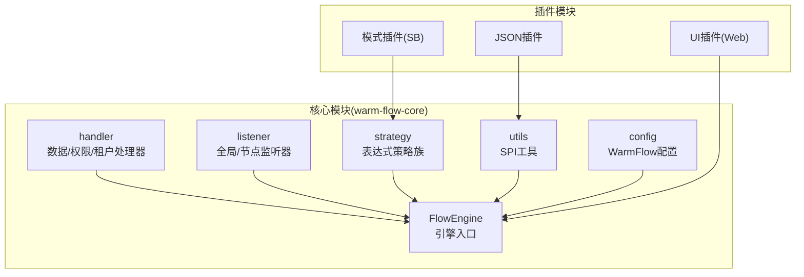
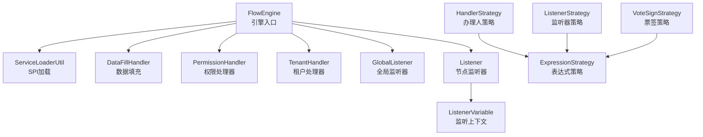
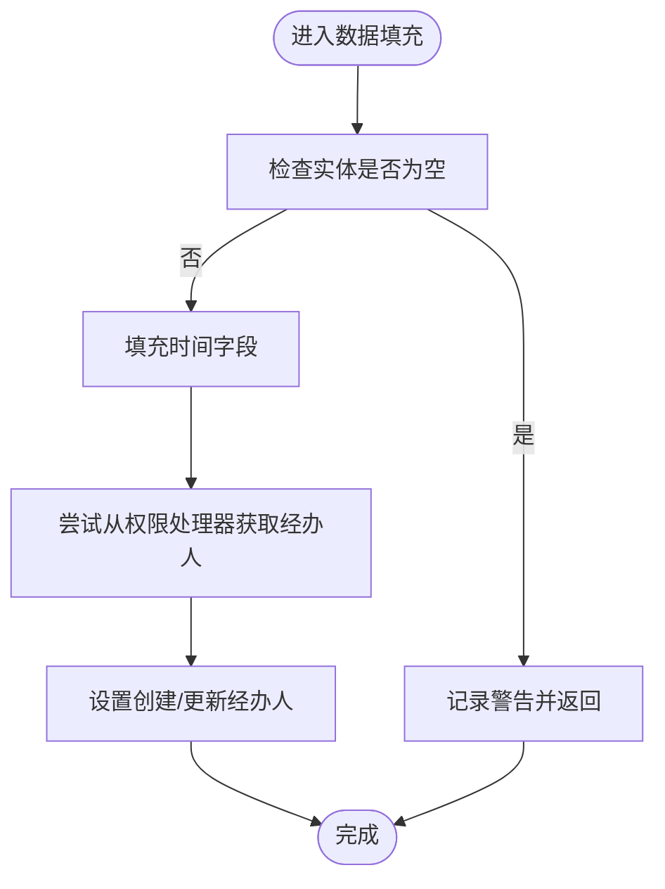
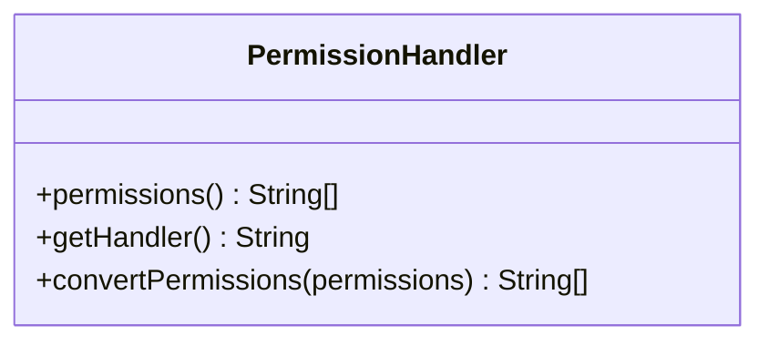
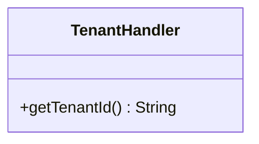
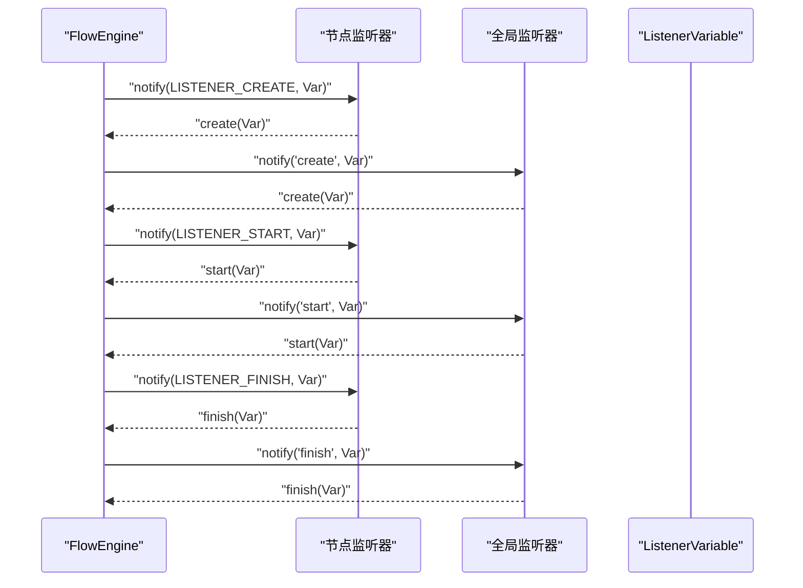
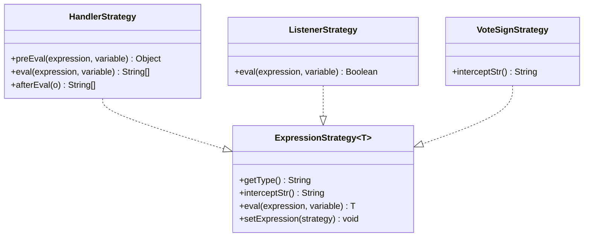
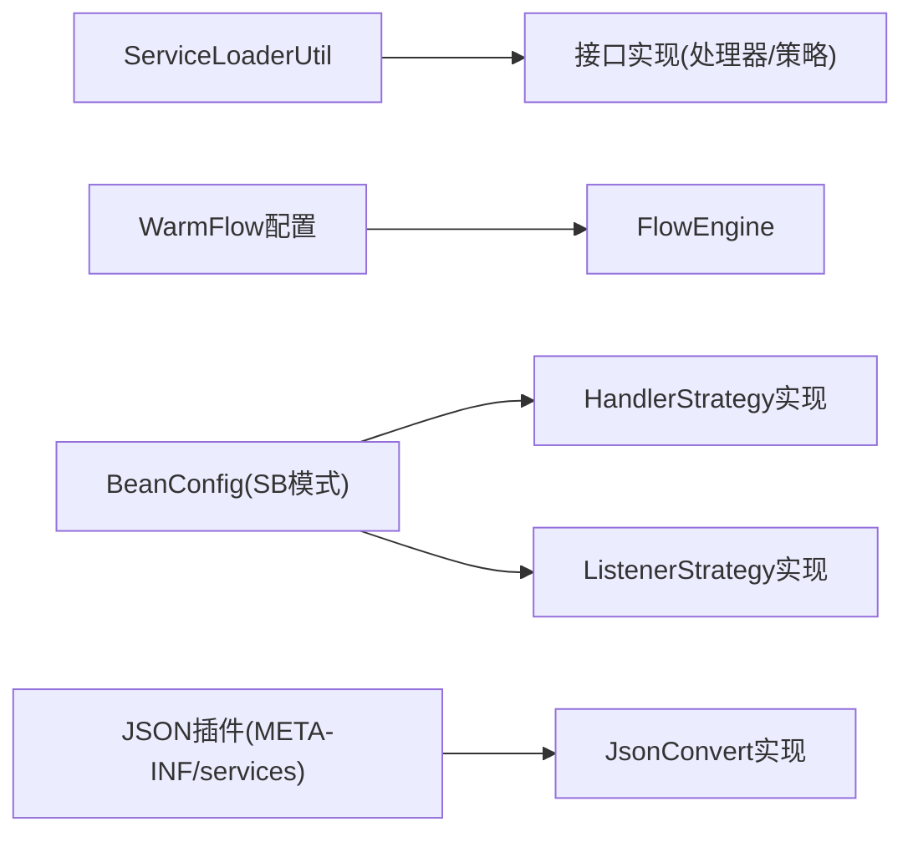

# 自定义扩展开发

<cite>
**本文引用的文件**   
- [DataFillHandler.java](file://warm-flow-core/src/main/java/org/dromara/warm/flow/core/handler/DataFillHandler.java)
- [PermissionHandler.java](file://warm-flow-core/src/main/java/org/dromara/warm/flow/core/handler/PermissionHandler.java)
- [TenantHandler.java](file://warm-flow-core/src/main/java/org/dromara/warm/flow/core/handler/TenantHandler.java)
- [GlobalListener.java](file://warm-flow-core/src/main/java/org/dromara/warm/flow/core/listener/GlobalListener.java)
- [Listener.java](file://warm-flow-core/src/main/java/org/dromara/warm/flow/core/listener/Listener.java)
- [ListenerVariable.java](file://warm-flow-core/src/main/java/org/dromara/warm/flow/core/listener/ListenerVariable.java)
- [HandlerStrategy.java](file://warm-flow-core/src/main/java/org/dromara/warm/flow/core/strategy/HandlerStrategy.java)
- [ListenerStrategy.java](file://warm-flow-core/src/main/java/org/dromara/warm/flow/core/strategy/ListenerStrategy.java)
- [ExpressionStrategy.java](file://warm-flow-core/src/main/java/org/dromara/warm/flow/core/strategy/ExpressionStrategy.java)
- [VoteSignStrategy.java](file://warm-flow-core/src/main/java/org/dromara/warm/flow/core/strategy/VoteSignStrategy.java)
- [ServiceLoaderUtil.java](file://warm-flow-core/src/main/java/org/dromara/warm/flow/core/utils/ServiceLoaderUtil.java)
- [WarmFlow.java](file://warm-flow-core/src/main/java/org/dromara/warm/flow/core/config/WarmFlow.java)
- [FlowEngine.java](file://warm-flow-core/src/main/java/org/dromara/warm/flow/core/FlowEngine.java)
- [WarmFlowProperties.java](file://warm-flow-plugin/warm-flow-plugin-modes/warm-flow-plugin-modes-sb/src/main/java/org/dromara/warm/plugin/modes/sb/config/WarmFlowProperties.java)
- [BeanConfig.java](file://warm-flow-plugin/warm-flow-plugin-modes/warm-flow-plugin-modes-sb/src/main/java/org/dromara/warm/plugin/modes/sb/config/BeanConfig.java)
- [SpringUtil.java](file://warm-flow-plugin/warm-flow-plugin-modes/warm-flow-plugin-modes-sb/src/main/java/org/dromara/warm/plugin/modes/sb/utils/SpringUtil.java)
- [JsonConvertJackson3.java](file://warm-flow-plugin/warm-flow-plugin-json/warm-flow-plugin-json-jackson3/src/main/java/org/dromara/warm/plugin/json/JsonConvertJackson3.java)
- [JsonConvertFastJson.java](file://warm-flow-plugin/warm-flow-plugin-json/warm-flow-plugin-json-v1/src/main/java/org/dromara/warm/plugin/json/JsonConvertFastJson.java)
- [JsonConvertGson.java](file://warm-flow-plugin/warm-flow-plugin-json/warm-flow-plugin-json-v1/src/main/java/org/dromara/warm/plugin/json/JsonConvertGson.java)
- [JsonConvertJackson.java](file://warm-flow-plugin/warm-flow-plugin-json/warm-flow-plugin-json-v1/src/main/java/org/dromara/warm/plugin/json/JsonConvertJackson.java)
- [JsonConvertSnack.java](file://warm-flow-plugin/warm-flow-plugin-json/warm-flow-plugin-json-v1/src/main/java/org/dromara/warm/plugin/json/JsonConvertSnack.java)
- [JsonConvertSnack4.java](file://warm-flow-plugin/warm-flow-plugin-json/warm-flow-plugin-json-v1/src/main/java/org/dromara/warm/plugin/json/JsonConvertSnack4.java)
- [WarmFlowController.java](file://warm-flow-plugin/warm-flow-plugin-ui/warm-flow-plugin-ui-sb-web/src/main/java/org/dromara/warm/flow/ui/controller/WarmFlowController.java)
- [WarmFlowUiController.java](file://warm-flow-plugin/warm-flow-plugin-ui/warm-flow-plugin-ui-sb-web/src/main/java/org/dromara/warm/flow/ui/controller/WarmFlowUiController.java)
</cite>

## 目录
1. [简介](#简介)
2. [项目结构](#项目结构)
3. [核心扩展点与接口](#核心扩展点与接口)
4. [架构总览](#架构总览)
5. [详细组件分析](#详细组件分析)
6. [依赖关系分析](#依赖关系分析)
7. [性能考量](#性能考量)
8. [故障排查指南](#故障排查指南)
9. [结论](#结论)
10. [附录](#附录)

## 简介
本文件面向需要基于 Warm-Flow 进行自定义扩展的开发者，系统性说明扩展点与接口，包括数据填充处理器、权限处理器、租户处理器等核心扩展接口；监听器系统的扩展机制（全局监听器与节点监听器）；以及扩展点的注册与配置方式（SPI 机制、接口实现、配置文件设置等）。文末提供可直接落地的扩展开发示例路径，帮助快速完成自定义处理器、监听器与扩展点集成。

## 项目结构
Warm-Flow 的扩展能力主要集中在核心模块的 handler、listener、strategy 与 utils 包中，并通过 SPI 机制与配置类进行装配。插件模块提供了 JSON 序列化、表达式策略、UI 控制器等扩展样例。

**图示来源**
- [DataFillHandler.java:35-104](file://warm-flow-core/src/main/java/org/dromara/warm/flow/core/handler/DataFillHandler.java#L35-L104)
- [PermissionHandler.java:30-55](file://warm-flow-core/src/main/java/org/dromara/warm/flow/core/handler/PermissionHandler.java#L30-L55)
- [TenantHandler.java:23-32](file://warm-flow-core/src/main/java/org/dromara/warm/flow/core/handler/TenantHandler.java#L23-L32)
- [GlobalListener.java:26-80](file://warm-flow-core/src/main/java/org/dromara/warm/flow/core/listener/GlobalListener.java#L26-L80)
- [Listener.java:25-58](file://warm-flow-core/src/main/java/org/dromara/warm/flow/core/listener/Listener.java#L25-L58)
- [HandlerStrategy.java:29-60](file://warm-flow-core/src/main/java/org/dromara/warm/flow/core/strategy/HandlerStrategy.java#L29-L60)
- [ListenerStrategy.java:26-38](file://warm-flow-core/src/main/java/org/dromara/warm/flow/core/strategy/ListenerStrategy.java#L26-L38)
- [ExpressionStrategy.java:25-60](file://warm-flow-core/src/main/java/org/dromara/warm/flow/core/strategy/ExpressionStrategy.java#L25-L60)
- [VoteSignStrategy.java:28-44](file://warm-flow-core/src/main/java/org/dromara/warm/flow/core/strategy/VoteSignStrategy.java#L28-L44)
- [ServiceLoaderUtil.java:27-149](file://warm-flow-core/src/main/java/org/dromara/warm/flow/core/utils/ServiceLoaderUtil.java#L27-L149)
- [WarmFlow.java](file://warm-flow-core/src/main/java/org/dromara/warm/flow/core/config/WarmFlow.java)
- [FlowEngine.java](file://warm-flow-core/src/main/java/org/dromara/warm/flow/core/FlowEngine.java)

**章节来源**
- [DataFillHandler.java:35-104](file://warm-flow-core/src/main/java/org/dromara/warm/flow/core/handler/DataFillHandler.java#L35-L104)
- [PermissionHandler.java:30-55](file://warm-flow-core/src/main/java/org/dromara/warm/flow/core/handler/PermissionHandler.java#L30-L55)
- [TenantHandler.java:23-32](file://warm-flow-core/src/main/java/org/dromara/warm/flow/core/handler/TenantHandler.java#L23-L32)
- [GlobalListener.java:26-80](file://warm-flow-core/src/main/java/org/dromara/warm/flow/core/listener/GlobalListener.java#L26-L80)
- [Listener.java:25-58](file://warm-flow-core/src/main/java/org/dromara/warm/flow/core/listener/Listener.java#L25-L58)
- [HandlerStrategy.java:29-60](file://warm-flow-core/src/main/java/org/dromara/warm/flow/core/strategy/HandlerStrategy.java#L29-L60)
- [ListenerStrategy.java:26-38](file://warm-flow-core/src/main/java/org/dromara/warm/flow/core/strategy/ListenerStrategy.java#L26-L38)
- [ExpressionStrategy.java:25-60](file://warm-flow-core/src/main/java/org/dromara/warm/flow/core/strategy/ExpressionStrategy.java#L25-L60)
- [VoteSignStrategy.java:28-44](file://warm-flow-core/src/main/java/org/dromara/warm/flow/core/strategy/VoteSignStrategy.java#L28-L44)
- [ServiceLoaderUtil.java:27-149](file://warm-flow-core/src/main/java/org/dromara/warm/flow/core/utils/ServiceLoaderUtil.java#L27-L149)
- [WarmFlow.java](file://warm-flow-core/src/main/java/org/dromara/warm/flow/core/config/WarmFlow.java)
- [FlowEngine.java](file://warm-flow-core/src/main/java/org/dromara/warm/flow/core/FlowEngine.java)

## 核心扩展点与接口
本节聚焦四大核心扩展接口及其实现要点：

- 数据填充处理器 DataFillHandler
  - 职责：统一处理实体 ID 填充、新增/更新时间与经办人字段填充。
  - 关键点：默认方法按需覆盖；可读取 FlowEngine 中的权限处理器以获取经办人标识。
  - 参考路径：[DataFillHandler.java:35-104](file://warm-flow-core/src/main/java/org/dromara/warm/flow/core/handler/DataFillHandler.java#L35-L104)

- 权限处理器 PermissionHandler
  - 职责：提供当前经办人的权限标识集合与唯一标识（handler），支持权限转换。
  - 关键点：permissions() 返回权限集合；getHandler() 返回唯一标识；convertPermissions() 可将角色/部门等转换为用户 ID。
  - 参考路径：[PermissionHandler.java:30-55](file://warm-flow-core/src/main/java/org/dromara/warm/flow/core/handler/PermissionHandler.java#L30-L55)

- 租户处理器 TenantHandler
  - 职责：提供全局租户 ID，用于多租户隔离。
  - 关键点：getTenantId() 返回租户标识。
  - 参考路径：[TenantHandler.java:23-32](file://warm-flow-core/src/main/java/org/dromara/warm/flow/core/handler/TenantHandler.java#L23-L32)

- 监听器系统
  - 全局监听器 GlobalListener：在整个系统生命周期内生效，提供 start/assignment/finish/create 四类回调。
  - 节点监听器 Listener：节点级监听器，提供相同事件类型并通过 notify(variable) 触发。
  - 监听器变量 ListenerVariable：承载监听上下文数据。
  - 参考路径：
    - [GlobalListener.java:26-80](file://warm-flow-core/src/main/java/org/dromara/warm/flow/core/listener/GlobalListener.java#L26-L80)
    - [Listener.java:25-58](file://warm-flow-core/src/main/java/org/dromara/warm/flow/core/listener/Listener.java#L25-L58)
    - [ListenerVariable.java](file://warm-flow-core/src/main/java/org/dromara/warm/flow/core/listener/ListenerVariable.java)

- 表达式策略族
  - ExpressionStrategy<T>：表达式策略接口，定义 getType()/eval()/setExpression()。
  - HandlerStrategy：针对“办理人”表达式的策略，支持 preEval/afterEval。
  - ListenerStrategy：针对“监听器条件”的布尔表达式策略。
  - VoteSignStrategy：针对“票签/会签”场景的表达式策略，内置拦截符。
  - 参考路径：
    - [ExpressionStrategy.java:25-60](file://warm-flow-core/src/main/java/org/dromara/warm/flow/core/strategy/ExpressionStrategy.java#L25-L60)
    - [HandlerStrategy.java:29-60](file://warm-flow-core/src/main/java/org/dromara/warm/flow/core/strategy/HandlerStrategy.java#L29-L60)
    - [ListenerStrategy.java:26-38](file://warm-flow-core/src/main/java/org/dromara/warm/flow/core/strategy/ListenerStrategy.java#L26-L38)
    - [VoteSignStrategy.java:28-44](file://warm-flow-core/src/main/java/org/dromara/warm/flow/core/strategy/VoteSignStrategy.java#L28-L44)

**章节来源**
- [DataFillHandler.java:35-104](file://warm-flow-core/src/main/java/org/dromara/warm/flow/core/handler/DataFillHandler.java#L35-L104)
- [PermissionHandler.java:30-55](file://warm-flow-core/src/main/java/org/dromara/warm/flow/core/handler/PermissionHandler.java#L30-L55)
- [TenantHandler.java:23-32](file://warm-flow-core/src/main/java/org/dromara/warm/flow/core/handler/TenantHandler.java#L23-L32)
- [GlobalListener.java:26-80](file://warm-flow-core/src/main/java/org/dromara/warm/flow/core/listener/GlobalListener.java#L26-L80)
- [Listener.java:25-58](file://warm-flow-core/src/main/java/org/dromara/warm/flow/core/listener/Listener.java#L25-L58)
- [ListenerVariable.java](file://warm-flow-core/src/main/java/org/dromara/warm/flow/core/listener/ListenerVariable.java)
- [ExpressionStrategy.java:25-60](file://warm-flow-core/src/main/java/org/dromara/warm/flow/core/strategy/ExpressionStrategy.java#L25-L60)
- [HandlerStrategy.java:29-60](file://warm-flow-core/src/main/java/org/dromara/warm/flow/core/strategy/HandlerStrategy.java#L29-L60)
- [ListenerStrategy.java:26-38](file://warm-flow-core/src/main/java/org/dromara/warm/flow/core/strategy/ListenerStrategy.java#L26-L38)
- [VoteSignStrategy.java:28-44](file://warm-flow-core/src/main/java/org/dromara/warm/flow/core/strategy/VoteSignStrategy.java#L28-L44)

## 架构总览
下图展示了 Warm-Flow 扩展体系的总体交互：引擎通过 SPI 加载扩展实现，处理器与策略在流程执行的关键节点被调用，监听器贯穿任务生命周期。

**图示来源**
- [FlowEngine.java](file://warm-flow-core/src/main/java/org/dromara/warm/flow/core/FlowEngine.java)
- [ServiceLoaderUtil.java:27-149](file://warm-flow-core/src/main/java/org/dromara/warm/flow/core/utils/ServiceLoaderUtil.java#L27-L149)
- [DataFillHandler.java:35-104](file://warm-flow-core/src/main/java/org/dromara/warm/flow/core/handler/DataFillHandler.java#L35-L104)
- [PermissionHandler.java:30-55](file://warm-flow-core/src/main/java/org/dromara/warm/flow/core/handler/PermissionHandler.java#L30-L55)
- [TenantHandler.java:23-32](file://warm-flow-core/src/main/java/org/dromara/warm/flow/core/handler/TenantHandler.java#L23-L32)
- [GlobalListener.java:26-80](file://warm-flow-core/src/main/java/org/dromara/warm/flow/core/listener/GlobalListener.java#L26-L80)
- [Listener.java:25-58](file://warm-flow-core/src/main/java/org/dromara/warm/flow/core/listener/Listener.java#L25-L58)
- [ListenerVariable.java](file://warm-flow-core/src/main/java/org/dromara/warm/flow/core/listener/ListenerVariable.java)
- [ExpressionStrategy.java:25-60](file://warm-flow-core/src/main/java/org/dromara/warm/flow/core/strategy/ExpressionStrategy.java#L25-L60)
- [HandlerStrategy.java:29-60](file://warm-flow-core/src/main/java/org/dromara/warm/flow/core/strategy/HandlerStrategy.java#L29-L60)
- [ListenerStrategy.java:26-38](file://warm-flow-core/src/main/java/org/dromara/warm/flow/core/strategy/ListenerStrategy.java#L26-L38)
- [VoteSignStrategy.java:28-44](file://warm-flow-core/src/main/java/org/dromara/warm/flow/core/strategy/VoteSignStrategy.java#L28-L44)

## 详细组件分析

### 数据填充处理器 DataFillHandler
- 设计要点
  - 默认方法 idFill/insertFill/updateFill 提供通用填充逻辑，可按需重写。
  - 在填充过程中可读取 FlowEngine 的权限处理器，以 handler 字段作为创建/更新经办人。
- 典型流程
  - 插入前：自动补全 createTime/updateTime，经办人优先来自权限处理器，否则回退到实体已有值。
  - 更新前：自动补全 updateTime 与经办人。
- 复杂度与性能
  - 常量时间操作，无额外 IO。
- 错误处理
  - 对空实体进行日志告警并提前返回，避免空指针。

**图示来源**
- [DataFillHandler.java:44-103](file://warm-flow-core/src/main/java/org/dromara/warm/flow/core/handler/DataFillHandler.java#L44-L103)

**章节来源**
- [DataFillHandler.java:35-104](file://warm-flow-core/src/main/java/org/dromara/warm/flow/core/handler/DataFillHandler.java#L35-L104)

### 权限处理器 PermissionHandler
- 设计要点
  - permissions() 返回当前用户权限集合，供流程节点判断可办理性。
  - getHandler() 返回唯一标识，通常为用户 ID。
  - convertPermissions() 支持将角色/部门等转换为具体用户 ID。
- 集成位置
  - 数据填充阶段可读取 handler 作为经办人字段。
- 复杂度与性能
  - 仅内存计算，复杂度取决于权限转换逻辑。

**图示来源**
- [PermissionHandler.java:30-55](file://warm-flow-core/src/main/java/org/dromara/warm/flow/core/handler/PermissionHandler.java#L30-L55)

**章节来源**
- [PermissionHandler.java:30-55](file://warm-flow-core/src/main/java/org/dromara/warm/flow/core/handler/PermissionHandler.java#L30-L55)

### 租户处理器 TenantHandler
- 设计要点
  - getTenantId() 返回当前租户标识，用于多租户隔离。
- 使用场景
  - 数据查询/删除时结合租户过滤，确保数据隔离。
- 复杂度与性能
  - 常量时间，无 IO。

**图示来源**
- [TenantHandler.java:23-32](file://warm-flow-core/src/main/java/org/dromara/warm/flow/core/handler/TenantHandler.java#L23-L32)

**章节来源**
- [TenantHandler.java:23-32](file://warm-flow-core/src/main/java/org/dromara/warm/flow/core/handler/TenantHandler.java#L23-L32)

### 监听器系统
- 全局监听器 GlobalListener
  - 生命周期：start/assignment/finish/create。
  - 通过 notify(type, variable) 分发事件。
- 节点监听器 Listener
  - 事件常量：LISTENER_START/LISTENER_ASSIGNMENT/LISTENER_FINISH/LISTENER_CREATE/LISTENER_FORM_LOAD。
  - 通过 notify(variable) 触发对应事件。
- 监听器变量 ListenerVariable
  - 传递监听上下文数据（如流程实例、节点、变量等）。

**图示来源**
- [GlobalListener.java:64-79](file://warm-flow-core/src/main/java/org/dromara/warm/flow/core/listener/GlobalListener.java#L64-L79)
- [Listener.java:57-57](file://warm-flow-core/src/main/java/org/dromara/warm/flow/core/listener/Listener.java#L57-L57)
- [ListenerVariable.java](file://warm-flow-core/src/main/java/org/dromara/warm/flow/core/listener/ListenerVariable.java)

**章节来源**
- [GlobalListener.java:26-80](file://warm-flow-core/src/main/java/org/dromara/warm/flow/core/listener/GlobalListener.java#L26-L80)
- [Listener.java:25-58](file://warm-flow-core/src/main/java/org/dromara/warm/flow/core/listener/Listener.java#L25-L58)
- [ListenerVariable.java](file://warm-flow-core/src/main/java/org/dromara/warm/flow/core/listener/ListenerVariable.java)

### 表达式策略族
- ExpressionStrategy<T>
  - 定义 getType()/eval()/setExpression()。
- HandlerStrategy
  - 面向“办理人”表达式，支持 preEval/afterEval。
- ListenerStrategy
  - 面向“监听器条件”的布尔表达式。
- VoteSignStrategy
  - 面向“票签/会签”，内置拦截符。

**图示来源**
- [ExpressionStrategy.java:25-60](file://warm-flow-core/src/main/java/org/dromara/warm/flow/core/strategy/ExpressionStrategy.java#L25-L60)
- [HandlerStrategy.java:29-60](file://warm-flow-core/src/main/java/org/dromara/warm/flow/core/strategy/HandlerStrategy.java#L29-L60)
- [ListenerStrategy.java:26-38](file://warm-flow-core/src/main/java/org/dromara/warm/flow/core/strategy/ListenerStrategy.java#L26-L38)
- [VoteSignStrategy.java:28-44](file://warm-flow-core/src/main/java/org/dromara/warm/flow/core/strategy/VoteSignStrategy.java#L28-L44)

**章节来源**
- [ExpressionStrategy.java:25-60](file://warm-flow-core/src/main/java/org/dromara/warm/flow/core/strategy/ExpressionStrategy.java#L25-L60)
- [HandlerStrategy.java:29-60](file://warm-flow-core/src/main/java/org/dromara/warm/flow/core/strategy/HandlerStrategy.java#L29-L60)
- [ListenerStrategy.java:26-38](file://warm-flow-core/src/main/java/org/dromara/warm/flow/core/strategy/ListenerStrategy.java#L26-L38)
- [VoteSignStrategy.java:28-44](file://warm-flow-core/src/main/java/org/dromara/warm/flow/core/strategy/VoteSignStrategy.java#L28-L44)

## 依赖关系分析
- SPI 机制
  - 通过 ServiceLoaderUtil.load/loadList/loadFirst 实现服务发现与加载。
  - 支持多实现并容错加载，首个可用实现优先。
- 配置与装配
  - WarmFlow 配置类提供全局配置入口。
  - 模式插件（SB）通过 BeanConfig 注入策略实现，WarmFlowProperties 提供属性配置。
- JSON 插件
  - 通过 META-INF/services/org.dromara.warm.flow.core.json.JsonConvert 暴露序列化实现，便于替换不同 JSON 库。

**图示来源**
- [ServiceLoaderUtil.java:36-91](file://warm-flow-core/src/main/java/org/dromara/warm/flow/core/utils/ServiceLoaderUtil.java#L36-L91)
- [WarmFlow.java](file://warm-flow-core/src/main/java/org/dromara/warm/flow/core/config/WarmFlow.java)
- [BeanConfig.java](file://warm-flow-plugin/warm-flow-plugin-modes/warm-flow-plugin-modes-sb/src/main/java/org/dromara/warm/plugin/modes/sb/config/BeanConfig.java)
- [WarmFlowProperties.java](file://warm-flow-plugin/warm-flow-plugin-modes/warm-flow-plugin-modes-sb/src/main/java/org/dromara/warm/plugin/modes/sb/config/WarmFlowProperties.java)
- [JsonConvertJackson3.java](file://warm-flow-plugin/warm-flow-plugin-json/warm-flow-plugin-json-jackson3/src/main/java/org/dromara/warm/plugin/json/JsonConvertJackson3.java)

**章节来源**
- [ServiceLoaderUtil.java:27-149](file://warm-flow-core/src/main/java/org/dromara/warm/flow/core/utils/ServiceLoaderUtil.java#L27-L149)
- [WarmFlow.java](file://warm-flow-core/src/main/java/org/dromara/warm/flow/core/config/WarmFlow.java)
- [BeanConfig.java](file://warm-flow-plugin/warm-flow-plugin-modes/warm-flow-plugin-modes-sb/src/main/java/org/dromara/warm/plugin/modes/sb/config/BeanConfig.java)
- [WarmFlowProperties.java](file://warm-flow-plugin/warm-flow-plugin-modes/warm-flow-plugin-modes-sb/src/main/java/org/dromara/warm/plugin/modes/sb/config/WarmFlowProperties.java)
- [JsonConvertJackson3.java](file://warm-flow-plugin/warm-flow-plugin-json/warm-flow-plugin-json-jackson3/src/main/java/org/dromara/warm/plugin/json/JsonConvertJackson3.java)

## 性能考量
- 扩展实现应保持纯内存计算，避免阻塞与高延迟。
- 监听器回调尽量轻量，避免在回调中执行耗时 IO。
- 表达式策略建议缓存解析结果或复用上下文，减少重复计算。
- 多租户场景下的过滤应在数据库层实现，避免在 Java 层做全量扫描。

## 故障排查指南
- 扩展未生效
  - 检查 SPI 配置文件是否存在且指向正确实现类。
  - 使用 ServiceLoaderUtil.loadFirst/loadList 确认实现是否被加载。
- 监听器未触发
  - 确认节点监听器事件常量与 notify 调用一致。
  - 检查 ListenerVariable 是否正确传入。
- 权限处理器异常
  - 确保 getHandler() 返回稳定唯一标识；convertPermissions() 不应抛出异常。
- 数据填充失败
  - 检查实体是否为空；确认权限处理器可用。

**章节来源**
- [ServiceLoaderUtil.java:36-91](file://warm-flow-core/src/main/java/org/dromara/warm/flow/core/utils/ServiceLoaderUtil.java#L36-L91)
- [Listener.java:57-57](file://warm-flow-core/src/main/java/org/dromara/warm/flow/core/listener/Listener.java#L57-L57)
- [ListenerVariable.java](file://warm-flow-core/src/main/java/org/dromara/warm/flow/core/listener/ListenerVariable.java)
- [DataFillHandler.java:44-103](file://warm-flow-core/src/main/java/org/dromara/warm/flow/core/handler/DataFillHandler.java#L44-L103)
- [PermissionHandler.java:30-55](file://warm-flow-core/src/main/java/org/dromara/warm/flow/core/handler/PermissionHandler.java#L30-L55)

## 结论
Warm-Flow 通过清晰的扩展接口与 SPI 机制，为数据填充、权限控制、租户隔离、监听器与表达式策略提供了高度可定制的能力。遵循本文档的实现规范与最佳实践，可在不侵入核心代码的前提下完成复杂的业务扩展。

## 附录

### 扩展开发示例（步骤与路径）
- 自定义数据填充处理器
  - 实现 DataFillHandler 接口，按需重写 idFill/insertFill/updateFill。
  - 示例参考：[DataFillHandler.java:35-104](file://warm-flow-core/src/main/java/org/dromara/warm/flow/core/handler/DataFillHandler.java#L35-L104)
- 自定义权限处理器
  - 实现 PermissionHandler 接口，提供 permissions()/getHandler()，必要时重写 convertPermissions()。
  - 示例参考：[PermissionHandler.java:30-55](file://warm-flow-core/src/main/java/org/dromara/warm/flow/core/handler/PermissionHandler.java#L30-L55)
- 自定义租户处理器
  - 实现 TenantHandler 接口，提供 getTenantId()。
  - 示例参考：[TenantHandler.java:23-32](file://warm-flow-core/src/main/java/org/dromara/warm/flow/core/handler/TenantHandler.java#L23-L32)
- 自定义全局/节点监听器
  - 实现 GlobalListener 或 Listener 接口，按需实现 start/assignment/finish/create 或 notify(variable)。
  - 示例参考：
    - [GlobalListener.java:26-80](file://warm-flow-core/src/main/java/org/dromara/warm/flow/core/listener/GlobalListener.java#L26-L80)
    - [Listener.java:25-58](file://warm-flow-core/src/main/java/org/dromara/warm/flow/core/listener/Listener.java#L25-L58)
    - [ListenerVariable.java](file://warm-flow-core/src/main/java/org/dromara/warm/flow/core/listener/ListenerVariable.java)
- 自定义表达式策略
  - 实现 ExpressionStrategy<T> 或其子接口（HandlerStrategy/ListenerStrategy/VoteSignStrategy），并在 BeanConfig 中注册。
  - 示例参考：
    - [ExpressionStrategy.java:25-60](file://warm-flow-core/src/main/java/org/dromara/warm/flow/core/strategy/ExpressionStrategy.java#L25-L60)
    - [HandlerStrategy.java:29-60](file://warm-flow-core/src/main/java/org/dromara/warm/flow/core/strategy/HandlerStrategy.java#L29-L60)
    - [ListenerStrategy.java:26-38](file://warm-flow-core/src/main/java/org/dromara/warm/flow/core/strategy/ListenerStrategy.java#L26-L38)
    - [VoteSignStrategy.java:28-44](file://warm-flow-core/src/main/java/org/dromara/warm/flow/core/strategy/VoteSignStrategy.java#L28-L44)
    - Bean 注册参考：[BeanConfig.java](file://warm-flow-plugin/warm-flow-plugin-modes/warm-flow-plugin-modes-sb/src/main/java/org/dromara/warm/plugin/modes/sb/config/BeanConfig.java)
- 替换 JSON 序列化实现
  - 在 META-INF/services/org.dromara.warm.flow.core.json.JsonConvert 下添加实现类全名。
  - 示例参考：
    - [JsonConvertJackson3.java](file://warm-flow-plugin/warm-flow-plugin-json/warm-flow-plugin-json-jackson3/src/main/java/org/dromara/warm/plugin/json/JsonConvertJackson3.java)
    - [JsonConvertFastJson.java](file://warm-flow-plugin/warm-flow-plugin-json/warm-flow-plugin-json-v1/src/main/java/org/dromara/warm/plugin/json/JsonConvertFastJson.java)
    - [JsonConvertGson.java](file://warm-flow-plugin/warm-flow-plugin-json/warm-flow-plugin-json-v1/src/main/java/org/dromara/warm/plugin/json/JsonConvertGson.java)
    - [JsonConvertJackson.java](file://warm-flow-plugin/warm-flow-plugin-json/warm-flow-plugin-json-v1/src/main/java/org/dromara/warm/plugin/json/JsonConvertJackson.java)
    - [JsonConvertSnack.java](file://warm-flow-plugin/warm-flow-plugin-json/warm-flow-plugin-json-v1/src/main/java/org/dromara/warm/plugin/json/JsonConvertSnack.java)
    - [JsonConvertSnack4.java](file://warm-flow-plugin/warm-flow-plugin-json/warm-flow-plugin-json-v1/src/main/java/org/dromara/warm/plugin/json/JsonConvertSnack4.java)
- 配置与启动
  - WarmFlow 配置入口：[WarmFlow.java](file://warm-flow-core/src/main/java/org/dromara/warm/flow/core/config/WarmFlow.java)
  - Spring Boot 模式配置：[WarmFlowProperties.java](file://warm-flow-plugin/warm-flow-plugin-modes/warm-flow-plugin-modes-sb/src/main/java/org/dromara/warm/plugin/modes/sb/config/WarmFlowProperties.java)
  - Spring 工具类：[SpringUtil.java](file://warm-flow-plugin/warm-flow-plugin-modes/warm-flow-plugin-modes-sb/src/main/java/org/dromara/warm/plugin/modes/sb/utils/SpringUtil.java)
- UI 控制器（如需扩展前端交互）
  - 参考控制器类：
    - [WarmFlowController.java](file://warm-flow-plugin/warm-flow-plugin-ui/warm-flow-plugin-ui-sb-web/src/main/java/org/dromara/warm/flow/ui/controller/WarmFlowController.java)
    - [WarmFlowUiController.java](file://warm-flow-plugin/warm-flow-plugin-ui/warm-flow-plugin-ui-sb-web/src/main/java/org/dromara/warm/flow/ui/controller/WarmFlowUiController.java)