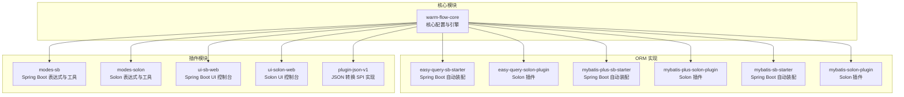
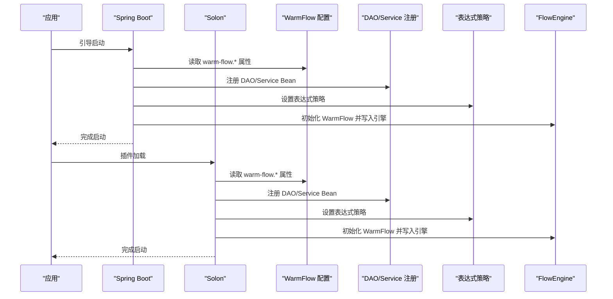
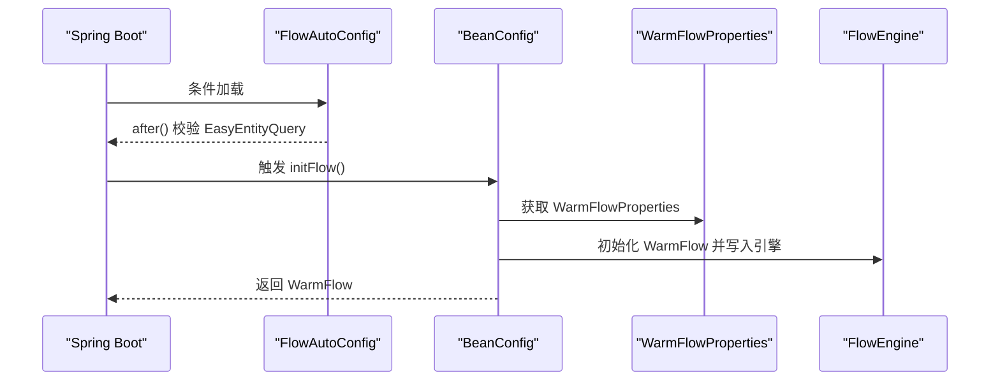
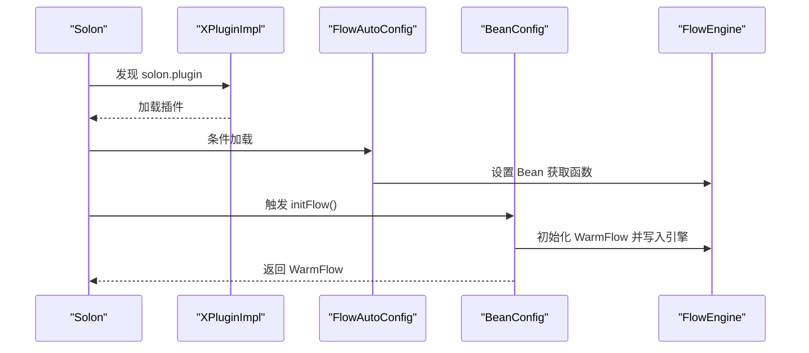
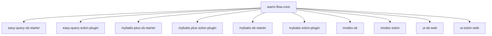

# 集成指南

<cite>
**本文引用的文件**
- [warm-flow-core/pom.xml](file://warm-flow-core/pom.xml)
- [warm-flow-orm/warm-flow-easy-query/warm-flow-easy-query-sb-starter/pom.xml](file://warm-flow-orm/warm-flow-easy-query/warm-flow-easy-query-sb-starter/pom.xml)
- [warm-flow-orm/warm-flow-easy-query/warm-flow-easy-query-solon-plugin/pom.xml](file://warm-flow-orm/warm-flow-easy-query/warm-flow-easy-query-solon-plugin/pom.xml)
- [warm-flow-plugin/warm-flow-plugin-modes/warm-flow-plugin-modes-sb/pom.xml](file://warm-flow-plugin/warm-flow-plugin-modes/warm-flow-plugin-modes-sb/pom.xml)
- [warm-flow-plugin/warm-flow-plugin-modes/warm-flow-plugin-modes-solon/pom.xml](file://warm-flow-plugin/warm-flow-plugin-modes/warm-flow-plugin-modes-solon/pom.xml)
- [warm-flow-orm/warm-flow-easy-query/warm-flow-easy-query-sb-starter/src/main/java/org/dromara/warm/flow/spring/boot/config/FlowAutoConfig.java](file://warm-flow-orm/warm-flow-easy-query/warm-flow-easy-query-sb-starter/src/main/java/org/dromara/warm/flow/spring/boot/config/FlowAutoConfig.java)
- [warm-flow-orm/warm-flow-easy-query/warm-flow-easy-query-solon-plugin/src/main/java/org/dromara/warm/flow/solon/config/FlowAutoConfig.java](file://warm-flow-orm/warm-flow-easy-query/warm-flow-easy-query-solon-plugin/src/main/java/org/dromara/warm/flow/solon/config/FlowAutoConfig.java)
- [warm-flow-plugin/warm-flow-plugin-modes/warm-flow-plugin-modes-sb/src/main/java/org/dromara/warm/plugin/modes/sb/config/WarmFlowProperties.java](file://warm-flow-plugin/warm-flow-plugin-modes/warm-flow-plugin-modes-sb/src/main/java/org/dromara/warm/plugin/modes/sb/config/WarmFlowProperties.java)
- [warm-flow-plugin/warm-flow-plugin-modes/warm-flow-plugin-modes-sb/src/main/java/org/dromara/warm/plugin/modes/sb/config/BeanConfig.java](file://warm-flow-plugin/warm-flow-plugin-modes/warm-flow-plugin-modes-sb/src/main/java/org/dromara/warm/plugin/modes/sb/config/BeanConfig.java)
- [warm-flow-plugin/warm-flow-plugin-modes/warm-flow-plugin-modes-solon/src/main/java/org/dromara/warm/plugin/modes/solon/config/BeanConfig.java](file://warm-flow-plugin/warm-flow-plugin-modes/warm-flow-plugin-modes-solon/src/main/java/org/dromara/warm/plugin/modes/solon/config/BeanConfig.java)
- [warm-flow-core/src/main/java/org/dromara/warm/flow/core/config/WarmFlow.java](file://warm-flow-core/src/main/java/org/dromara/warm/flow/core/config/WarmFlow.java)
- [warm-flow-orm/warm-flow-easy-query/warm-flow-easy-query-solon-plugin/src/main/resources/META-INF/solon/org.dromara.warm.flow.solon.properties](file://warm-flow-orm/warm-flow-easy-query/warm-flow-easy-query-solon-plugin/src/main/resources/META-INF/solon/org.dromara.warm.flow.solon.properties)
- [warm-flow-plugin/warm-flow-plugin-ui/warm-flow-plugin-ui-solon-web/src/main/resources/META-INF/solon/org.dromara.warm.flow.ui.properties](file://warm-flow-plugin/warm-flow-plugin-ui/warm-flow-plugin-ui-solon-web/src/main/resources/META-INF/solon/org.dromara.warm.flow.ui.properties)
</cite>

## 目录
1. [简介](#简介)
2. [项目结构](#项目结构)
3. [核心组件](#核心组件)
4. [架构总览](#架构总览)
5. [详细组件分析](#详细组件分析)
6. [依赖分析](#依赖分析)
7. [性能考虑](#性能考虑)
8. [故障排查指南](#故障排查指南)
9. [结论](#结论)
10. [附录](#附录)

## 简介
本指南面向希望在 Spring Boot 与 Solon 框架中集成 Warm-Flow 的开发者，覆盖以下内容：
- 与 Spring Boot 的集成：依赖引入、自动配置、属性设置与启动流程
- 与 Solon 框架的集成：插件配置、依赖注入、运行机制
- 自定义扩展开发：接口实现、配置注册、扩展点使用
- 第三方系统集成最佳实践：系统对接、数据同步、接口设计
- 常见集成问题排查与解决方案

## 项目结构
Warm-Flow 采用多模块结构，核心能力集中在 core 模块，ORM 层提供多种实现（MyBatis、MyBatis-Plus、Easy-Query），并通过 Spring Boot Starter 与 Solon 插件提供自动装配与插件化支持；插件模块提供表达式引擎、UI 控制台等扩展。

图表来源
- [warm-flow-core/pom.xml:1-35](file://warm-flow-core/pom.xml#L1-L35)
- [warm-flow-orm/warm-flow-easy-query/warm-flow-easy-query-sb-starter/pom.xml:1-43](file://warm-flow-orm/warm-flow-easy-query/warm-flow-easy-query-sb-starter/pom.xml#L1-L43)
- [warm-flow-orm/warm-flow-easy-query/warm-flow-easy-query-solon-plugin/pom.xml:1-44](file://warm-flow-orm/warm-flow-easy-query/warm-flow-easy-query-solon-plugin/pom.xml#L1-L44)
- [warm-flow-plugin/warm-flow-plugin-modes/warm-flow-plugin-modes-sb/pom.xml:1-64](file://warm-flow-plugin/warm-flow-plugin-modes/warm-flow-plugin-modes-sb/pom.xml#L1-L64)
- [warm-flow-plugin/warm-flow-plugin-modes/warm-flow-plugin-modes-solon/pom.xml:1-46](file://warm-flow-plugin/warm-flow-plugin-modes/warm-flow-plugin-modes-solon/pom.xml#L1-L46)

章节来源
- [warm-flow-core/pom.xml:1-35](file://warm-flow-core/pom.xml#L1-L35)
- [warm-flow-orm/warm-flow-easy-query/warm-flow-easy-query-sb-starter/pom.xml:1-43](file://warm-flow-orm/warm-flow-easy-query/warm-flow-easy-query-sb-starter/pom.xml#L1-L43)
- [warm-flow-orm/warm-flow-easy-query/warm-flow-easy-query-solon-plugin/pom.xml:1-44](file://warm-flow-orm/warm-flow-easy-query/warm-flow-easy-query-solon-plugin/pom.xml#L1-L44)
- [warm-flow-plugin/warm-flow-plugin-modes/warm-flow-plugin-modes-sb/pom.xml:1-64](file://warm-flow-plugin/warm-flow-plugin-modes/warm-flow-plugin-modes-sb/pom.xml#L1-L64)
- [warm-flow-plugin/warm-flow-plugin-modes/warm-flow-plugin-modes-solon/pom.xml:1-46](file://warm-flow-plugin/warm-flow-plugin-modes/warm-flow-plugin-modes-solon/pom.xml#L1-L46)

## 核心组件
- WarmFlow 配置类：集中管理 Warm-Flow 的开关、框架类型、逻辑删除、处理器路径、UI 开关、令牌名、流程图颜色等属性，并负责初始化租户、数据填充、权限、全局监听器以及 SPI 加载 JSON 转换器。
- BeanConfig（Spring Boot）：注册 DAO 与 Service，设置表达式策略，初始化 WarmFlow 并写入 FlowEngine。
- BeanConfig（Solon）：注册 DAO 与 Service，设置表达式策略，初始化 WarmFlow 并写入 FlowEngine。
- FlowAutoConfig（Spring Boot/Easy-Query）：基于条件注解启用，校验 EasyEntityQuery 注入情况。
- FlowAutoConfig（Solon/Easy-Query）：基于条件注解启用，设置 Bean 获取函数并返回 FlowEngine 配置。

章节来源
- [warm-flow-core/src/main/java/org/dromara/warm/flow/core/config/WarmFlow.java:1-174](file://warm-flow-core/src/main/java/org/dromara/warm/flow/core/config/WarmFlow.java#L1-L174)
- [warm-flow-plugin/warm-flow-plugin-modes/warm-flow-plugin-modes-sb/src/main/java/org/dromara/warm/plugin/modes/sb/config/BeanConfig.java:1-178](file://warm-flow-plugin/warm-flow-plugin-modes/warm-flow-plugin-modes-sb/src/main/java/org/dromara/warm/plugin/modes/sb/config/BeanConfig.java#L1-L178)
- [warm-flow-plugin/warm-flow-plugin-modes/warm-flow-plugin-modes-solon/src/main/java/org/dromara/warm/plugin/modes/solon/config/BeanConfig.java:1-176](file://warm-flow-plugin/warm-flow-plugin-modes/warm-flow-plugin-modes-solon/src/main/java/org/dromara/warm/plugin/modes/solon/config/BeanConfig.java#L1-L176)
- [warm-flow-orm/warm-flow-easy-query/warm-flow-easy-query-sb-starter/src/main/java/org/dromara/warm/flow/spring/boot/config/FlowAutoConfig.java:1-45](file://warm-flow-orm/warm-flow-easy-query/warm-flow-easy-query-sb-starter/src/main/java/org/dromara/warm/flow/spring/boot/config/FlowAutoConfig.java#L1-L45)
- [warm-flow-orm/warm-flow-easy-query/warm-flow-easy-query-solon-plugin/src/main/java/org/dromara/warm/flow/solon/config/FlowAutoConfig.java:1-52](file://warm-flow-orm/warm-flow-easy-query/warm-flow-easy-query-solon-plugin/src/main/java/org/dromara/warm/flow/solon/config/FlowAutoConfig.java#L1-L52)

## 架构总览
Warm-Flow 在不同框架中的集成遵循“配置类 + DAO/Service 注册 + 表达式策略 + FlowEngine 初始化”的统一流程。Spring Boot 通过 @ConditionalOnProperty 与 @EnableConfigurationProperties 控制加载；Solon 通过 @Condition 控制加载，并通过插件入口与资源文件声明插件。

图表来源
- [warm-flow-plugin/warm-flow-plugin-modes/warm-flow-plugin-modes-sb/src/main/java/org/dromara/warm/plugin/modes/sb/config/BeanConfig.java:1-178](file://warm-flow-plugin/warm-flow-plugin-modes/warm-flow-plugin-modes-sb/src/main/java/org/dromara/warm/plugin/modes/sb/config/BeanConfig.java#L1-L178)
- [warm-flow-plugin/warm-flow-plugin-modes/warm-flow-plugin-modes-solon/src/main/java/org/dromara/warm/plugin/modes/solon/config/BeanConfig.java:1-176](file://warm-flow-plugin/warm-flow-plugin-modes/warm-flow-plugin-modes-solon/src/main/java/org/dromara/warm/plugin/modes/solon/config/BeanConfig.java#L1-L176)
- [warm-flow-core/src/main/java/org/dromara/warm/flow/core/config/WarmFlow.java:1-174](file://warm-flow-core/src/main/java/org/dromara/warm/flow/core/config/WarmFlow.java#L1-L174)

## 详细组件分析

### Spring Boot 集成
- 依赖引入
  - 使用 easy-query 或 mybatis/mybatis-plus 对应的 starter 模块，确保 ORM 与 Spring Boot 自动装配生效。
  - modes-sb 提供表达式与工具类，warm-flow-core 提供核心配置。
- 自动配置
  - BeanConfig 通过 @ConditionalOnProperty 控制是否加载，@EnableConfigurationProperties 启用 WarmFlowProperties。
  - 初始化 WarmFlow，设置表达式策略，调用 after 钩子（可由子类重写）。
- 属性设置
  - 通过 @ConfigurationProperties("warm-flow") 绑定属性，WarmFlow 提供开关、逻辑删除、处理器路径、UI 开关、令牌名、颜色等配置项。
- 启动流程
  - 读取环境变量，设置 Bean 获取函数，初始化 WarmFlow 并写入 FlowEngine。

图表来源
- [warm-flow-orm/warm-flow-easy-query/warm-flow-easy-query-sb-starter/src/main/java/org/dromara/warm/flow/spring/boot/config/FlowAutoConfig.java:1-45](file://warm-flow-orm/warm-flow-easy-query/warm-flow-easy-query-sb-starter/src/main/java/org/dromara/warm/flow/spring/boot/config/FlowAutoConfig.java#L1-L45)
- [warm-flow-plugin/warm-flow-plugin-modes/warm-flow-plugin-modes-sb/src/main/java/org/dromara/warm/plugin/modes/sb/config/BeanConfig.java:1-178](file://warm-flow-plugin/warm-flow-plugin-modes/warm-flow-plugin-modes-sb/src/main/java/org/dromara/warm/plugin/modes/sb/config/BeanConfig.java#L1-L178)
- [warm-flow-plugin/warm-flow-plugin-modes/warm-flow-plugin-modes-sb/src/main/java/org/dromara/warm/plugin/modes/sb/config/WarmFlowProperties.java:1-27](file://warm-flow-plugin/warm-flow-plugin-modes/warm-flow-plugin-modes-sb/src/main/java/org/dromara/warm/plugin/modes/sb/config/WarmFlowProperties.java#L1-L27)

章节来源
- [warm-flow-orm/warm-flow-easy-query/warm-flow-easy-query-sb-starter/pom.xml:1-43](file://warm-flow-orm/warm-flow-easy-query/warm-flow-easy-query-sb-starter/pom.xml#L1-L43)
- [warm-flow-plugin/warm-flow-plugin-modes/warm-flow-plugin-modes-sb/pom.xml:1-64](file://warm-flow-plugin/warm-flow-plugin-modes/warm-flow-plugin-modes-sb/pom.xml#L1-L64)
- [warm-flow-orm/warm-flow-easy-query/warm-flow-easy-query-sb-starter/src/main/java/org/dromara/warm/flow/spring/boot/config/FlowAutoConfig.java:1-45](file://warm-flow-orm/warm-flow-easy-query/warm-flow-easy-query-sb-starter/src/main/java/org/dromara/warm/flow/spring/boot/config/FlowAutoConfig.java#L1-L45)
- [warm-flow-plugin/warm-flow-plugin-modes/warm-flow-plugin-modes-sb/src/main/java/org/dromara/warm/plugin/modes/sb/config/BeanConfig.java:1-178](file://warm-flow-plugin/warm-flow-plugin-modes/warm-flow-plugin-modes-sb/src/main/java/org/dromara/warm/plugin/modes/sb/config/BeanConfig.java#L1-L178)
- [warm-flow-plugin/warm-flow-plugin-modes/warm-flow-plugin-modes-sb/src/main/java/org/dromara/warm/plugin/modes/sb/config/WarmFlowProperties.java:1-27](file://warm-flow-plugin/warm-flow-plugin-modes/warm-flow-plugin-modes-sb/src/main/java/org/dromara/warm/plugin/modes/sb/config/WarmFlowProperties.java#L1-L27)
- [warm-flow-core/src/main/java/org/dromara/warm/flow/core/config/WarmFlow.java:1-174](file://warm-flow-core/src/main/java/org/dromara/warm/flow/core/config/WarmFlow.java#L1-L174)

### Solon 集成
- 插件配置
  - 通过 META-INF/solon 资源文件声明插件入口类，实现自动发现与加载。
- 依赖注入
  - BeanConfig 中使用 @Bean、@Inject、@Condition 控制加载，设置 Bean 获取函数与配置函数。
- 运行机制
  - FlowAutoConfig 设置 FrameInvoker 的 Bean 获取函数，返回 FlowEngine 的配置实例，确保 EasyEntityQuery 可用。

图表来源
- [warm-flow-orm/warm-flow-easy-query/warm-flow-easy-query-solon-plugin/src/main/resources/META-INF/solon/org.dromara.warm.flow.solon.properties:1-2](file://warm-flow-orm/warm-flow-easy-query/warm-flow-easy-query-solon-plugin/src/main/resources/META-INF/solon/org.dromara.warm.flow.solon.properties#L1-L2)
- [warm-flow-orm/warm-flow-easy-query/warm-flow-easy-query-solon-plugin/src/main/java/org/dromara/warm/flow/solon/config/FlowAutoConfig.java:1-52](file://warm-flow-orm/warm-flow-easy-query/warm-flow-easy-query-solon-plugin/src/main/java/org/dromara/warm/flow/solon/config/FlowAutoConfig.java#L1-L52)
- [warm-flow-plugin/warm-flow-plugin-modes/warm-flow-plugin-modes-solon/src/main/java/org/dromara/warm/plugin/modes/solon/config/BeanConfig.java:1-176](file://warm-flow-plugin/warm-flow-plugin-modes/warm-flow-plugin-modes-solon/src/main/java/org/dromara/warm/plugin/modes/solon/config/BeanConfig.java#L1-L176)
- [warm-flow-core/src/main/java/org/dromara/warm/flow/core/config/WarmFlow.java:1-174](file://warm-flow-core/src/main/java/org/dromara/warm/flow/core/config/WarmFlow.java#L1-L174)

章节来源
- [warm-flow-orm/warm-flow-easy-query/warm-flow-easy-query-solon-plugin/pom.xml:1-44](file://warm-flow-orm/warm-flow-easy-query/warm-flow-easy-query-solon-plugin/pom.xml#L1-L44)
- [warm-flow-plugin/warm-flow-plugin-modes/warm-flow-plugin-modes-solon/pom.xml:1-46](file://warm-flow-plugin/warm-flow-plugin-modes/warm-flow-plugin-modes-solon/pom.xml#L1-L46)
- [warm-flow-orm/warm-flow-easy-query/warm-flow-easy-query-solon-plugin/src/main/resources/META-INF/solon/org.dromara.warm.flow.solon.properties:1-2](file://warm-flow-orm/warm-flow-easy-query/warm-flow-easy-query-solon-plugin/src/main/resources/META-INF/solon/org.dromara.warm.flow.solon.properties#L1-L2)
- [warm-flow-orm/warm-flow-easy-query/warm-flow-easy-query-solon-plugin/src/main/java/org/dromara/warm/flow/solon/config/FlowAutoConfig.java:1-52](file://warm-flow-orm/warm-flow-easy-query/warm-flow-easy-query-solon-plugin/src/main/java/org/dromara/warm/flow/solon/config/FlowAutoConfig.java#L1-L52)
- [warm-flow-plugin/warm-flow-plugin-modes/warm-flow-plugin-modes-solon/src/main/java/org/dromara/warm/plugin/modes/solon/config/BeanConfig.java:1-176](file://warm-flow-plugin/warm-flow-plugin-modes/warm-flow-plugin-modes-solon/src/main/java/org/dromara/warm/plugin/modes/solon/config/BeanConfig.java#L1-L176)
- [warm-flow-core/src/main/java/org/dromara/warm/flow/core/config/WarmFlow.java:1-174](file://warm-flow-core/src/main/java/org/dromara/warm/flow/core/config/WarmFlow.java#L1-L174)

### 自定义扩展开发
- 接口实现
  - 租户模式：实现 TenantHandler 接口，通过 WarmFlow.tenantHandlerPath 注入。
  - 数据填充：实现 DataFillHandler 接口，通过 WarmFlow.dataFillHandlerPath 注入。
  - 权限处理：实现 PermissionHandler 接口，通过 WarmFlow.permissionHandlerPath 注入。
  - 全局监听：实现 GlobalListener 接口，通过 WarmFlow.globalListenerPath 注入。
- 配置注册
  - Spring Boot：通过 WarmFlowProperties 绑定属性，BeanConfig 初始化时调用 WarmFlow.init() 完成注册。
  - Solon：通过 @Inject 注入 WarmFlow，BeanConfig 初始化时调用 WarmFlow.init() 完成注册。
- 扩展点使用
  - WarmFlow.init() 内部会根据路径初始化对应处理器，并通过 SPI 加载 JSON 转换器。
  - 表达式策略：Spring Boot 默认与 SPeL 相关策略，Solon 默认与 SnEL 相关策略，可通过扩展替换。

章节来源
- [warm-flow-core/src/main/java/org/dromara/warm/flow/core/config/WarmFlow.java:1-174](file://warm-flow-core/src/main/java/org/dromara/warm/flow/core/config/WarmFlow.java#L1-L174)
- [warm-flow-plugin/warm-flow-plugin-modes/warm-flow-plugin-modes-sb/src/main/java/org/dromara/warm/plugin/modes/sb/config/BeanConfig.java:1-178](file://warm-flow-plugin/warm-flow-plugin-modes/warm-flow-plugin-modes-sb/src/main/java/org/dromara/warm/plugin/modes/sb/config/BeanConfig.java#L1-L178)
- [warm-flow-plugin/warm-flow-plugin-modes/warm-flow-plugin-modes-solon/src/main/java/org/dromara/warm/plugin/modes/solon/config/BeanConfig.java:1-176](file://warm-flow-plugin/warm-flow-plugin-modes/warm-flow-plugin-modes-solon/src/main/java/org/dromara/warm/plugin/modes/solon/config/BeanConfig.java#L1-L176)

### 第三方系统集成最佳实践
- 系统对接
  - 通过 WarmFlowProperties 配置 tokenName 以适配第三方系统的鉴权头名称。
  - 通过 WarmFlow.dataSourceType 指定数据源类型，确保分页 SQL 与目标数据库兼容。
- 数据同步
  - 使用 WarmFlow.logicDelete、logicDeleteValue、logicNotDeleteValue 配置逻辑删除策略，避免误删业务数据。
  - 通过 DataFillHandler 在流程节点执行前后注入或更新业务字段，保证数据一致性。
- 接口设计
  - UI 开关：WarmFlow.ui 控制是否启用内置 UI 控制台；如需独立部署 UI，可关闭内置 UI 并通过外部接口访问。
  - 流程状态颜色：通过 chartStatusColor、chartStatusColorClassics、chartStatusColorMimic 配置不同模式下的流程状态颜色，提升可视化体验。

章节来源
- [warm-flow-core/src/main/java/org/dromara/warm/flow/core/config/WarmFlow.java:1-174](file://warm-flow-core/src/main/java/org/dromara/warm/flow/core/config/WarmFlow.java#L1-L174)

## 依赖分析
Warm-Flow 在不同框架中的依赖关系如下：

图表来源
- [warm-flow-core/pom.xml:1-35](file://warm-flow-core/pom.xml#L1-L35)
- [warm-flow-orm/warm-flow-easy-query/warm-flow-easy-query-sb-starter/pom.xml:1-43](file://warm-flow-orm/warm-flow-easy-query/warm-flow-easy-query-sb-starter/pom.xml#L1-L43)
- [warm-flow-orm/warm-flow-easy-query/warm-flow-easy-query-solon-plugin/pom.xml:1-44](file://warm-flow-orm/warm-flow-easy-query/warm-flow-easy-query-solon-plugin/pom.xml#L1-L44)
- [warm-flow-plugin/warm-flow-plugin-modes/warm-flow-plugin-modes-sb/pom.xml:1-64](file://warm-flow-plugin/warm-flow-plugin-modes/warm-flow-plugin-modes-sb/pom.xml#L1-L64)
- [warm-flow-plugin/warm-flow-plugin-modes/warm-flow-plugin-modes-solon/pom.xml:1-46](file://warm-flow-plugin/warm-flow-plugin-modes/warm-flow-plugin-modes-solon/pom.xml#L1-L46)

章节来源
- [warm-flow-core/pom.xml:1-35](file://warm-flow-core/pom.xml#L1-L35)
- [warm-flow-orm/warm-flow-easy-query/warm-flow-easy-query-sb-starter/pom.xml:1-43](file://warm-flow-orm/warm-flow-easy-query/warm-flow-easy-query-sb-starter/pom.xml#L1-L43)
- [warm-flow-orm/warm-flow-easy-query/warm-flow-easy-query-solon-plugin/pom.xml:1-44](file://warm-flow-orm/warm-flow-easy-query/warm-flow-easy-query-solon-plugin/pom.xml#L1-L44)
- [warm-flow-plugin/warm-flow-plugin-modes/warm-flow-plugin-modes-sb/pom.xml:1-64](file://warm-flow-plugin/warm-flow-plugin-modes/warm-flow-plugin-modes-sb/pom.xml#L1-L64)
- [warm-flow-plugin/warm-flow-plugin-modes/warm-flow-plugin-modes-solon/pom.xml:1-46](file://warm-flow-plugin/warm-flow-plugin-modes/warm-flow-plugin-modes-solon/pom.xml#L1-L46)

## 性能考虑
- 表达式策略选择：SPeL（Spring Boot）与 SnEL（Solon）在不同框架下具备良好性能表现，建议根据框架特性选择对应策略。
- 逻辑删除：合理配置逻辑删除字段与值，减少全表扫描与误删风险。
- UI 开关：在生产环境可关闭内置 UI，降低额外依赖与资源消耗。
- ID 生成器：根据业务吞吐量选择合适的 SnowFlake 实现，避免热点与冲突。

## 故障排查指南
- EasyEntityQuery 未找到（Spring Boot）
  - 现象：启动时报错提示 EasyEntityQuery 未找到。
  - 处理：确认已引入 easy-query 对应的 starter，并检查 FlowAutoConfig 的条件注解是否满足。
  - 参考
    - [warm-flow-orm/warm-flow-easy-query/warm-flow-easy-query-sb-starter/src/main/java/org/dromara/warm/flow/spring/boot/config/FlowAutoConfig.java:1-45](file://warm-flow-orm/warm-flow-easy-query/warm-flow-easy-query-sb-starter/src/main/java/org/dromara/warm/flow/spring/boot/config/FlowAutoConfig.java#L1-L45)
- Bean 创建异常（Solon）
  - 现象：FlowAutoConfig 中抛出 BeanCreationException。
  - 处理：确认 EasyEntityQuery 注入成功，检查 @Db 注解与 Easy-Query 插件是否正确加载。
  - 参考
    - [warm-flow-orm/warm-flow-easy-query/warm-flow-easy-query-solon-plugin/src/main/java/org/dromara/warm/flow/solon/config/FlowAutoConfig.java:1-52](file://warm-flow-orm/warm-flow-easy-query/warm-flow-easy-query-solon-plugin/src/main/java/org/dromara/warm/flow/solon/config/FlowAutoConfig.java#L1-L52)
- WarmFlow 未加载
  - 现象：WarmFlowProperties 未生效或 WarmFlow 未写入 FlowEngine。
  - 处理：检查 @ConditionalOnProperty/@Condition 是否满足；确认 BeanConfig 的 initFlow 方法被调用。
  - 参考
    - [warm-flow-plugin/warm-flow-plugin-modes/warm-flow-plugin-modes-sb/src/main/java/org/dromara/warm/plugin/modes/sb/config/BeanConfig.java:1-178](file://warm-flow-plugin/warm-flow-plugin-modes/warm-flow-plugin-modes-sb/src/main/java/org/dromara/warm/plugin/modes/sb/config/BeanConfig.java#L1-L178)
    - [warm-flow-plugin/warm-flow-plugin-modes/warm-flow-plugin-modes-solon/src/main/java/org/dromara/warm/plugin/modes/solon/config/BeanConfig.java:1-176](file://warm-flow-plugin/warm-flow-plugin-modes/warm-flow-plugin-modes-solon/src/main/java/org/dromara/warm/plugin/modes/solon/config/BeanConfig.java#L1-L176)
- UI 插件未加载
  - 现象：UI 控制台不可用。
  - 处理：确认 solon.plugin 资源文件已正确声明插件入口。
  - 参考
    - [warm-flow-plugin/warm-flow-plugin-ui/warm-flow-plugin-ui-solon-web/src/main/resources/META-INF/solon/org.dromara.warm.flow.ui.properties:1-2](file://warm-flow-plugin/warm-flow-plugin-ui/warm-flow-plugin-ui-solon-web/src/main/resources/META-INF/solon/org.dromara.warm.flow.ui.properties#L1-L2)

## 结论
Warm-Flow 提供了在 Spring Boot 与 Solon 下的一致集成体验：通过配置类与自动装配完成 WarmFlow 初始化，通过 BeanConfig 注册 DAO/Service 与表达式策略，并支持丰富的扩展点与属性配置。按本文档进行依赖引入、属性设置与插件配置，即可快速完成系统集成。

## 附录
- WarmFlow 属性清单（节选）
  - enabled：开关
  - framework：框架类型
  - banner：启动横幅
  - keyType：ID 生成器类型
  - logicDelete、logicDeleteValue、logicNotDeleteValue：逻辑删除配置
  - dataFillHandlerPath、tenantHandlerPath、permissionHandlerPath、globalListenerPath：处理器路径
  - dataSourceType：数据源类型
  - ui：UI 开关
  - tokenName：令牌名
  - chartStatusColor、chartStatusColorClassics、chartStatusColorMimic：流程图颜色
- Spring Boot 与 Solon 的关键类
  - BeanConfig（Spring Boot）：注册 Bean、设置表达式策略、初始化 WarmFlow
  - BeanConfig（Solon）：注册 Bean、设置表达式策略、初始化 WarmFlow
  - FlowAutoConfig（Spring Boot/Easy-Query）：条件加载、校验 EasyEntityQuery
  - FlowAutoConfig（Solon/Easy-Query）：条件加载、设置 Bean 获取函数

章节来源
- [warm-flow-core/src/main/java/org/dromara/warm/flow/core/config/WarmFlow.java:1-174](file://warm-flow-core/src/main/java/org/dromara/warm/flow/core/config/WarmFlow.java#L1-L174)
- [warm-flow-plugin/warm-flow-plugin-modes/warm-flow-plugin-modes-sb/src/main/java/org/dromara/warm/plugin/modes/sb/config/BeanConfig.java:1-178](file://warm-flow-plugin/warm-flow-plugin-modes/warm-flow-plugin-modes-sb/src/main/java/org/dromara/warm/plugin/modes/sb/config/BeanConfig.java#L1-L178)
- [warm-flow-plugin/warm-flow-plugin-modes/warm-flow-plugin-modes-solon/src/main/java/org/dromara/warm/plugin/modes/solon/config/BeanConfig.java:1-176](file://warm-flow-plugin/warm-flow-plugin-modes/warm-flow-plugin-modes-solon/src/main/java/org/dromara/warm/plugin/modes/solon/config/BeanConfig.java#L1-L176)
- [warm-flow-orm/warm-flow-easy-query/warm-flow-easy-query-sb-starter/src/main/java/org/dromara/warm/flow/spring/boot/config/FlowAutoConfig.java:1-45](file://warm-flow-orm/warm-flow-easy-query/warm-flow-easy-query-sb-starter/src/main/java/org/dromara/warm/flow/spring/boot/config/FlowAutoConfig.java#L1-L45)
- [warm-flow-orm/warm-flow-easy-query/warm-flow-easy-query-solon-plugin/src/main/java/org/dromara/warm/flow/solon/config/FlowAutoConfig.java:1-52](file://warm-flow-orm/warm-flow-easy-query/warm-flow-easy-query-solon-plugin/src/main/java/org/dromara/warm/flow/solon/config/FlowAutoConfig.java#L1-L52)