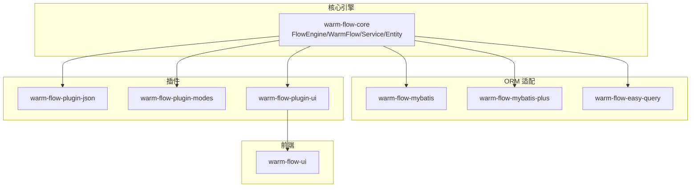
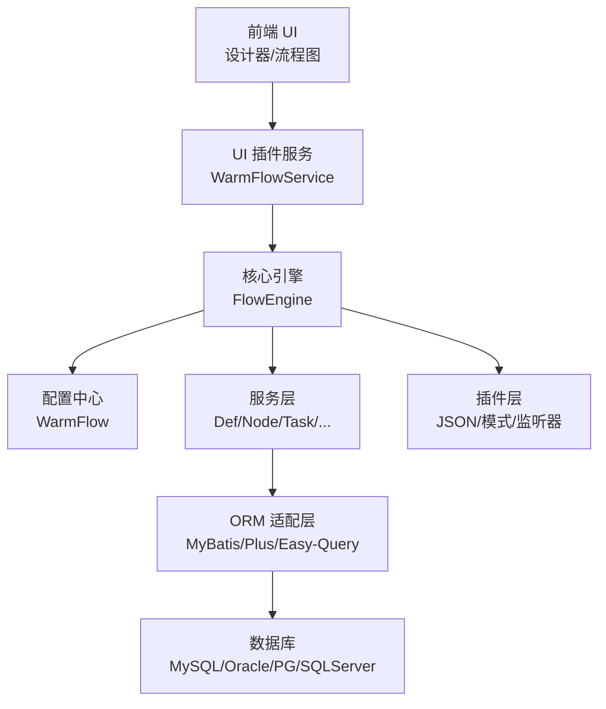
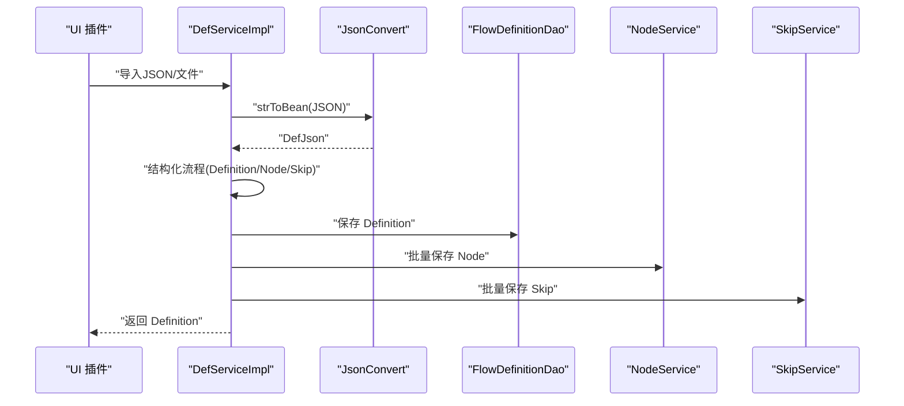
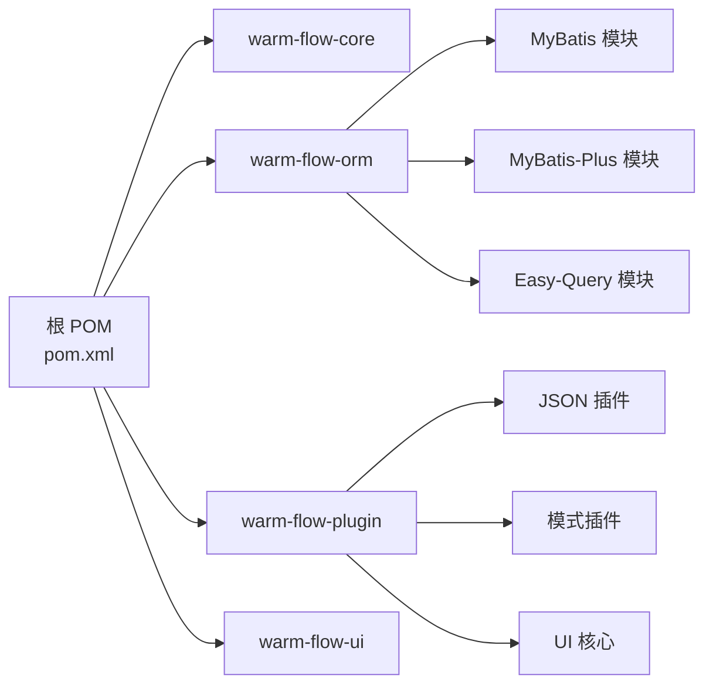

# 项目概述

<cite>
**本文引用的文件**
- [README.md](file://README.md)
- [pom.xml](file://pom.xml)
- [FlowEngine.java](file://warm-flow-core/src/main/java/org/dromara/warm/flow/core/FlowEngine.java)
- [WarmFlow.java](file://warm-flow-core/src/main/java/org/dromara/warm/flow/core/config/WarmFlow.java)
- [Definition.java](file://warm-flow-core/src/main/java/org/dromara/warm/flow/core/entity/Definition.java)
- [DefServiceImpl.java](file://warm-flow-core/src/main/java/org/dromara/warm/flow/core/service/impl/DefServiceImpl.java)
- [NodeType.java](file://warm-flow-core/src/main/java/org/dromara/warm/flow/core/enums/NodeType.java)
- [FlowCons.java](file://warm-flow-core/src/main/java/org/dromara/warm/flow/core/constant/FlowCons.java)
- [JsonConvert.java](file://warm-flow-core/src/main/java/org/dromara/warm/flow/core/json/JsonConvert.java)
- [DataFillHandler.java](file://warm-flow-core/src/main/java/org/dromara/warm/flow/core/handler/DataFillHandler.java)
- [WarmFlowService.java](file://warm-flow-plugin/warm-flow-plugin-ui/warm-flow-plugin-ui-core/src/main/java/org/dromara/warm/flow/ui/service/WarmFlowService.java)
- [warm-flow-all.sql](file://sql/mysql/warm-flow-all.sql)
- [CommonUtil.java](file://warm-flow-orm/warm-flow-mybatis/warm-flow-mybatis-core/src/main/java/org/dromara/warm/flow/orm/utils/CommonUtil.java)
- [FrameworkType.java](file://warm-flow-core/src/main/java/org/dromara/warm/flow/core/enums/FrameworkType.java)
- [BeanConfig.java](file://warm-flow-plugin/warm-flow-plugin-modes/warm-flow-plugin-modes-solon/src/main/java/org/dromara/warm/plugin/modes/solon/config/BeanConfig.java)
- [SpringUtil.java](file://warm-flow-plugin/warm-flow-plugin-modes/warm-flow-plugin-modes-sb/src/main/java/org/dromara/warm/plugin/modes/sb/utils/SpringUtil.java)
- [WarmFlowModesSolonPlugin.java](file://warm-flow-plugin/warm-flow-plugin-modes/warm-flow-plugin-modes-solon/src/main/java/org/dromara/warm/plugin/modes/solon/WarmFlowModesSolonPlugin.java)
</cite>

## 目录
1. [引言](#引言)
2. [项目结构](#项目结构)
3. [核心组件](#核心组件)
4. [架构总览](#架构总览)
5. [详细组件分析](#详细组件分析)
6. [依赖分析](#依赖分析)
7. [性能考虑](#性能考虑)
8. [故障排查指南](#故障排查指南)
9. [结论](#结论)
10. [附录](#附录)

## 引言
Warm-Flow 是一款国产工作流引擎，强调“简洁轻量、功能全面、灵活扩展”。项目以极简表结构（仅7张核心表）、多 ORM 框架适配、多数据库支持、多框架生态兼容（Spring Boot、Solon）为核心优势，并提供原生流程设计器与流程图能力，支持经典与仿钉钉双模式。项目在审批场景下具备完备的节点类型、监听器、变量表达式、动态权限与多租户/软删除能力，适合快速落地的中大型审批与流程编排项目。

与 Activiti、Flowable 等主流引擎相比，Warm-Flow 的差异化优势体现在：
- 表结构极简（仅7张核心表），维护成本低
- 原生支持流程设计器与流程图，通过 Jar 包快速集成
- 多 ORM 框架与多数据库支持，易于迁移与扩展
- 原生支持多租户与软删除，兼顾业务隔离与审计
- 支持经典与仿钉钉双模式，满足不同业务形态

## 项目结构
项目采用多模块聚合结构，核心模块包括：
- warm-flow-core：引擎核心、实体、服务、配置、工具与常量
- warm-flow-orm：ORM 适配层，覆盖 MyBatis、MyBatis-Plus、Easy-Query 等
- warm-flow-plugin：插件层，包含 JSON 插件、模式插件（表达式/监听器/投票）、UI 插件
- warm-flow-ui：前端设计器与流程图资源（Vue3）

图表来源
- [pom.xml:58-62](file://pom.xml#L58-L62)
- [warm-flow-orm/pom.xml:17-21](file://warm-flow-orm/pom.xml#L17-L21)
- [warm-flow-plugin/pom.xml:17-21](file://warm-flow-plugin/pom.xml#L17-L21)

章节来源
- [pom.xml:58-62](file://pom.xml#L58-L62)
- [warm-flow-orm/pom.xml:17-21](file://warm-flow-orm/pom.xml#L17-L21)
- [warm-flow-plugin/pom.xml:17-21](file://warm-flow-plugin/pom.xml#L17-L21)

## 核心组件
- 流程引擎入口：FlowEngine 提供统一的服务获取与扩展点初始化（数据填充、权限、租户、全局监听器）
- 配置中心：WarmFlow 提供框架类型、逻辑删除、UI 开关、数据源类型、颜色配置等属性
- 实体与服务：Definition、Node、Skip、Instance、Task、HisTask、User 等核心实体与对应服务
- 表达式与常量：FlowCons 定义表达式标识、雪花 ID 类型、表单标记等；NodeType 定义节点类型枚举
- JSON 转换：JsonConvert 抽象 JSON 与对象互转策略，通过 SPI 加载具体实现
- 数据填充：DataFillHandler 提供 ID、新增、更新阶段的通用填充策略

章节来源
- [FlowEngine.java:39-270](file://warm-flow-core/src/main/java/org/dromara/warm/flow/core/FlowEngine.java#L39-L270)
- [WarmFlow.java:34-174](file://warm-flow-core/src/main/java/org/dromara/warm/flow/core/config/WarmFlow.java#L34-L174)
- [Definition.java:29-196](file://warm-flow-core/src/main/java/org/dromara/warm/flow/core/entity/Definition.java#L29-L196)
- [NodeType.java:28-161](file://warm-flow-core/src/main/java/org/dromara/warm/flow/core/enums/NodeType.java#L28-L161)
- [FlowCons.java:25-85](file://warm-flow-core/src/main/java/org/dromara/warm/flow/core/constant/FlowCons.java#L25-L85)
- [JsonConvert.java:26-62](file://warm-flow-core/src/main/java/org/dromara/warm/flow/core/json/JsonConvert.java#L26-L62)
- [DataFillHandler.java:35-105](file://warm-flow-core/src/main/java/org/dromara/warm/flow/core/handler/DataFillHandler.java#L35-L105)

## 架构总览
Warm-Flow 的整体架构围绕“核心引擎 + ORM 适配 + 插件扩展 + UI 集成”展开。核心引擎通过 FlowEngine 统一对外暴露服务，WarmFlow 作为配置中心贯穿生命周期；ORM 层通过 DAO/Service 解耦不同持久化框架；插件层通过 SPI 与表达式/监听器/JSON 等扩展点实现灵活装配；UI 插件提供设计器与流程图能力。

图表来源
- [WarmFlowService.java:44-376](file://warm-flow-plugin/warm-flow-plugin-ui/warm-flow-plugin-ui-core/src/main/java/org/dromara/warm/flow/ui/service/WarmFlowService.java#L44-L376)
- [FlowEngine.java:39-270](file://warm-flow-core/src/main/java/org/dromara/warm/flow/core/FlowEngine.java#L39-L270)
- [WarmFlow.java:34-174](file://warm-flow-core/src/main/java/org/dromara/warm/flow/core/config/WarmFlow.java#L34-L174)
- [pom.xml:104-433](file://pom.xml#L104-L433)

## 详细组件分析

### 流程定义与导入导出（Definition/DefServiceImpl）
- 导入：支持从 JSON 字符串或 InputStream 导入流程定义，解析后结构化为 Definition、Node、Skip，并入库
- 导出：将 Definition 与其节点/连线组装为 DefJson，再序列化为 JSON
- 发布/复制/激活/版本控制：提供版本号生成策略与发布状态切换逻辑
- 合法性校验：对开始节点、连线、目标节点存在性进行校验

图表来源
- [DefServiceImpl.java:64-100](file://warm-flow-core/src/main/java/org/dromara/warm/flow/core/service/impl/DefServiceImpl.java#L64-L100)
- [JsonConvert.java:26-62](file://warm-flow-core/src/main/java/org/dromara/warm/flow/core/json/JsonConvert.java#L26-L62)

章节来源
- [DefServiceImpl.java:53-374](file://warm-flow-core/src/main/java/org/dromara/warm/flow/core/service/impl/DefServiceImpl.java#L53-L374)
- [Definition.java:29-196](file://warm-flow-core/src/main/java/org/dromara/warm/flow/core/entity/Definition.java#L29-L196)

### 节点类型与流程网关（NodeType）
- 支持开始/中间/结束节点，以及互斥/并行/包容网关
- 提供类型判断与映射工具方法，便于流程合法性校验与渲染

章节来源
- [NodeType.java:28-161](file://warm-flow-core/src/main/java/org/dromara/warm/flow/core/enums/NodeType.java#L28-L161)

### 表达式与常量（FlowCons）
- 定义表达式标识（如 spel/snEl）、权限占位符、雪花 ID 类型、表单标记、参数键等
- 为监听器、变量、权限注入提供统一常量支撑

章节来源
- [FlowCons.java:25-85](file://warm-flow-core/src/main/java/org/dromara/warm/flow/core/constant/FlowCons.java#L25-L85)

### JSON 转换策略（JsonConvert）
- 通过 SPI 自动加载具体实现（Jackson/FastJson/Gson/Snack 等）
- 保证跨平台与可替换的序列化策略

章节来源
- [JsonConvert.java:26-62](file://warm-flow-core/src/main/java/org/dromara/warm/flow/core/json/JsonConvert.java#L26-L62)
- [WarmFlow.java:154-157](file://warm-flow-core/src/main/java/org/dromara/warm/flow/core/config/WarmFlow.java#L154-L157)

### 数据填充与权限注入（DataFillHandler）
- 默认提供 ID、新增/更新时间与经办人填充策略
- 可通过 FlowEngine 注入自定义实现，统一业务数据生命周期

章节来源
- [DataFillHandler.java:35-105](file://warm-flow-core/src/main/java/org/dromara/warm/flow/core/handler/DataFillHandler.java#L35-L105)
- [FlowEngine.java:180-222](file://warm-flow-core/src/main/java/org/dromara/warm/flow/core/FlowEngine.java#L180-L222)

### UI 插件与流程图（WarmFlowService）
- 提供流程配置、流程定义查询/保存、流程图渲染、表单读写、任务加载与审批等接口
- 支持业务系统扩展：节点扩展属性、监听器列表、办理人字典、图表扩展等

章节来源
- [WarmFlowService.java:44-376](file://warm-flow-plugin/warm-flow-plugin-ui/warm-flow-plugin-ui-core/src/main/java/org/dromara/warm/flow/ui/service/WarmFlowService.java#L44-L376)

### 数据库与 ORM 适配
- 核心表结构（7张）：flow_definition、flow_node、flow_skip、flow_instance、flow_task、flow_his_task、flow_user
- ORM 支持：MyBatis、MyBatis-Plus、Easy-Query 等，配套 Spring Boot 与 Solon 启动器/插件
- 数据源类型推断：根据连接元数据自动识别数据库类型，兜底为 MySQL

章节来源
- [warm-flow-all.sql:1-160](file://sql/mysql/warm-flow-all.sql#L1-L160)
- [CommonUtil.java:34-61](file://warm-flow-orm/warm-flow-mybatis/warm-flow-mybatis-core/src/main/java/org/dromara/warm/flow/orm/utils/CommonUtil.java#L34-L61)
- [pom.xml:146-433](file://pom.xml#L146-L433)

### 框架生态与兼容性
- 框架类型：Spring Boot、Solon
- Java 版本：兼容 Java 8/17/21
- UI 集成：通过 Jar 包快速接入，支持经典与仿钉钉双模式

章节来源
- [FrameworkType.java:27-35](file://warm-flow-core/src/main/java/org/dromara/warm/flow/core/enums/FrameworkType.java#L27-L35)
- [BeanConfig.java:18-30](file://warm-flow-plugin/warm-flow-plugin-modes/warm-flow-plugin-modes-solon/src/main/java/org/dromara/warm/plugin/modes/solon/config/BeanConfig.java#L18-L30)
- [SpringUtil.java:27-41](file://warm-flow-plugin/warm-flow-plugin-modes/warm-flow-plugin-modes-sb/src/main/java/org/dromara/warm/plugin/modes/sb/utils/SpringUtil.java#L27-L41)
- [WarmFlowModesSolonPlugin.java:27-35](file://warm-flow-plugin/warm-flow-plugin-modes/warm-flow-plugin-modes-solon/src/main/java/org/dromara/warm/plugin/modes/solon/WarmFlowModesSolonPlugin.java#L27-L35)

## 依赖分析
- 顶层 POM 管理模块聚合与依赖版本，集中声明 Spring Boot、Solon、MyBatis/Plus、Easy-Query、Jackson/Gson/FastJson 等生态组件
- 通过 dependencyManagement 统一版本，避免冲突
- 模块间通过 artifactId 引用，如 warm-flow-mybatis-core、warm-flow-plugin-ui-core 等

图表来源
- [pom.xml:58-62](file://pom.xml#L58-L62)
- [warm-flow-orm/pom.xml:17-21](file://warm-flow-orm/pom.xml#L17-L21)
- [warm-flow-plugin/pom.xml:17-21](file://warm-flow-plugin/pom.xml#L17-L21)

章节来源
- [pom.xml:104-433](file://pom.xml#L104-L433)

## 性能考虑
- ORM 层支持批量插入与方言适配，减少 SQL 差异带来的性能损耗
- 数据源类型自动识别，避免因方言不一致导致的分页/函数差异
- 通过 WarmFlow 配置启用逻辑删除与自定义三原色，降低无效数据扫描成本
- UI 插件按需加载节点扩展与监听器列表，避免不必要的网络与计算开销

## 故障排查指南
- JSON 解析失败：检查 JsonConvert SPI 实现是否正确加载，确认 JSON 字符串格式与 DefJson 结构匹配
- 数据填充异常：确认 DataFillHandler 实现与 FlowEngine 注入路径正确，关注空对象与权限处理器异常
- 发布状态冲突：当存在已使用流程定义时，发布逻辑会将其置为“失效”，需检查实例占用情况
- 数据源类型识别失败：若未显式配置 dataSourceType，将尝试从连接元数据获取，失败则兜底为 MySQL

章节来源
- [JsonConvert.java:26-62](file://warm-flow-core/src/main/java/org/dromara/warm/flow/core/json/JsonConvert.java#L26-L62)
- [DataFillHandler.java:35-105](file://warm-flow-core/src/main/java/org/dromara/warm/flow/core/handler/DataFillHandler.java#L35-L105)
- [DefServiceImpl.java:220-262](file://warm-flow-core/src/main/java/org/dromara/warm/flow/core/service/impl/DefServiceImpl.java#L220-L262)
- [CommonUtil.java:34-61](file://warm-flow-orm/warm-flow-mybatis/warm-flow-mybatis-core/src/main/java/org/dromara/warm/flow/orm/utils/CommonUtil.java#L34-L61)

## 结论
Warm-Flow 以“极简表结构 + 多 ORM/多数据库 + 多框架生态 + 原生设计器/流程图”的组合，形成面向国内项目的高性价比工作流解决方案。其在审批场景下的功能完备性、扩展灵活性与工程落地效率，使其成为替代 Activiti/Flowable 在国内项目中的优选方案之一。

## 附录
- 应用场景建议：企业内部审批（请假/报销/采购）、项目管理、客户服务、人力资源、财务与 IT 服务管理、合规与风控流程等
- 快速上手：参考 README 的演示地址与使用文档，按模块引入 warm-flow-core 与所需 ORM/插件，按需启用 UI 插件与启动器

章节来源
- [README.md:98-118](file://README.md#L98-L118)
- [README.md:111-118](file://README.md#L111-L118)
- [README.md:121-128](file://README.md#L121-L128)